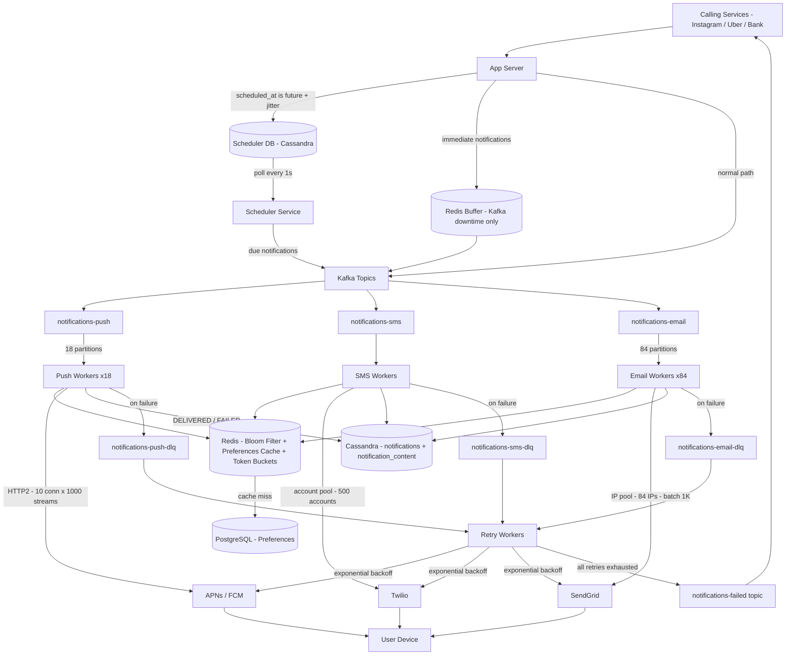

# Notification System Architecture

## Architecture Diagram



---

## Every Decision Explained

### Intake — App Server

The app server is the single entry point for all calling services. It validates incoming requests, checks `scheduled_at`, and routes accordingly:

- `scheduled_at = null` → publish directly to Kafka (immediate path)
- `scheduled_at = future` → write to Scheduler DB with jitter applied (low-priority) or exact time (OTPs, alerts)
- Kafka temporarily down → buffer critical notifications in Redis, drain when Kafka recovers

The app server returns `201 Accepted` immediately — it never waits for delivery. The `notification_id` in the response is the idempotency key for deduplication.

---

### Scheduling — Scheduler DB + Scheduler Service

Scheduled notifications go to Cassandra with `minute_bucket` as partition key and `scheduled_at ASC` as clustering key. The Scheduler Service polls every second, queries the current minute bucket for due notifications, and publishes them to Kafka.

Only one Scheduler Service instance dispatches at a time — controlled by a Redis distributed lock with 5-second TTL. Standby instances take over within 5 seconds of leader failure. Scheduled notifications are late on failure, never lost.

---

### Kafka — Three Topics, Per-Channel Isolation

One topic per channel prevents the slowest channel from poisoning the fastest:

| Topic | Partitions | Partition Key | Consumer Group |
|---|---|---|---|
| notifications-push | 18 | receiver user_id | push-workers |
| notifications-sms | varies | receiver user_id | sms-workers |
| notifications-email | 84 | receiver user_id | email-workers |

`user_id` (receiver) as partition key guarantees per-user ordering — comment notification never arrives before the post notification for the same user. Partitioning by sender_id would create hot partitions (all 400M Kylie Jenner follower notifications on one partition).

---

### Redis — Three Jobs

Redis serves three distinct purposes:

1. **Preferences cache** — user opt-out settings, populated lazily from PostgreSQL. Cache miss falls back to PostgreSQL. On Redis failure, fallback default (assume opted-in).

2. **Bloom filter** — deduplication on `notification_id`. False positives (skip a valid notification) are acceptable. False negatives (miss a duplicate) never happen. On Redis failure, skip deduplication and accept duplicates — delivery beats dedup.

3. **Token buckets** — per-Twilio-account and per-SendGrid-IP rate limiting. On Redis failure, circuit breaker handles 429s.

---

### Push Workers — 18 Instances

Derived from APNs math:
```
APNs latency: 50ms
HTTP/2: 1000 concurrent streams per connection
10 connections per worker: 200K push/sec per worker
3.5M push/sec ÷ 200K = 18 workers
```

Each worker: consume batch of 10K → bloom filter check → preference check → async HTTP/2 to APNs/FCM → write DELIVERED to Cassandra → commit Kafka offset.

---

### SMS Workers — Account Pool

Twilio caps at 1K/sec per account. 500K SMS/sec would need 500 accounts — but intake filtering means only high-priority SMS (OTPs, fraud alerts) enters the SMS topic. Real volume is a small fraction of 500K/sec.

Workers round-robin across the Twilio account pool. On 429 → read `Retry-After` header, mark account blocked in Redis, route to next account. Load shedding: never overload healthy accounts to compensate for blocked ones.

---

### Email Workers — 84 Instances + IP Pool

Email's 2-minute SLO enables batching:
```
1M emails/sec × 20% = 1M/sec intake
1M/sec ÷ 120s = 8,333 emails/sec sustained
8,333 ÷ 100 emails/sec per IP = 84 IPs
```

Workers batch 1,000 emails per SendGrid API call — 9 API calls/sec total. Marketing and digest emails are filtered at intake — only transactional email enters the real-time pipeline.

---

### Cassandra — Two Tables

| Table | Partition Key | Clustering Key | Purpose |
|---|---|---|---|
| notifications | user_id | created_at DESC | Status tracking, hot queries |
| notification_content | notification_id | — | Full content, cold queries |

300 nodes (100 shards × 3 replicas) for 10M writes/sec (5M inserts + 5M status updates).

---

### PostgreSQL — Preferences

Preferences need strong consistency — opt-out must be immediately visible. Low write volume (users rarely change settings). ACID guarantees. Cached in Redis; PostgreSQL only sees cache-miss reads.

---

### DLQ + Retry Workers

Workers publish failures explicitly to channel-specific DLQ topics — Kafka has no built-in DLQ unlike SQS/RabbitMQ. Retry workers consume from DLQs with exponential backoff (1s, 2s, 4s — 3 retries). After all retries exhausted: mark `FAILED` in Cassandra, publish to `notifications-failed` topic. Calling services subscribe to `notifications-failed` and react — fallback channel, alert, or log.

---

## Scale Summary

| Component | Count | Throughput |
|---|---|---|
| App Servers | Horizontally scaled | 5M intake/sec |
| Kafka Brokers | ~10 | 5M messages/sec |
| Push Workers | 18 | 3.5M push/sec |
| SMS Workers | Twilio-bound | 500K SMS/sec (intake filtered) |
| Email Workers | 84 | 8,333 emails/sec sustained |
| Cassandra Nodes | 300 | 10M writes/sec |
| Redis | Clustered | Preferences + bloom filter + token buckets |
| PostgreSQL | Replicated | Preferences (low write) |
| Twilio Accounts | 500 | 500K SMS/sec aggregate |
| SendGrid IPs | 84 | 8,333 emails/sec |
