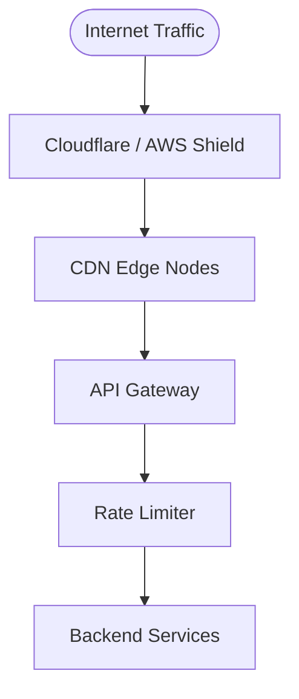

## DDoS and the Defense Layer Architecture

A DDoS attack — millions of requests per second from thousands of different IPs — is not a rate limiter problem. Trying to handle volumetric DDoS at the rate limiter level is the wrong layer. By the time traffic reaches your rate limiter, the damage is already done.

---

## Why Rate Limiter Cannot Stop DDoS Alone

A volumetric DDoS generates traffic at terabit scale — millions of requests per second from thousands of rotating IPs. The rate limiter blocks by user_id or IP. But:

- New IPs appear constantly — by the time you block one, ten more appear
- The rate limiter itself needs to process each request to make a decision — at DDoS scale, the rate limiter is overwhelmed just making allow/block decisions
- Each unique IP under the global limit gets through — with 10,000 attacking IPs each making 4 requests per minute, that's 40,000 req/min passing through cleanly

The rate limiter is designed for **legitimate-looking abuse** — a real user hammering an endpoint, a bot with valid auth tokens, credential stuffing on `/login`. It is not designed for volumetric DDoS.

---

## The Layered Defense Architecture

Protection happens at multiple layers, each filtering different threat types:



**Layer 1 — DDoS Protection (Cloudflare / AWS Shield)**

Sits at the very edge of the internet. Absorbs volumetric attacks before they touch your infrastructure:
- Anycast network absorbs terabits of traffic at edge PoPs globally
- Blocks known malicious IP ranges and botnets
- Rate limits at IP + ASN level before packets reach your servers
- Challenge pages (CAPTCHA) for suspicious traffic patterns
- Only clean traffic passes to the next layer

**Layer 2 — CDN Edge**

Absorbs static content requests — CSS, JS, images, cached API responses. A large fraction of traffic never reaches origin. Geographic filtering can block traffic from regions with no legitimate users.

**Layer 3 — API Gateway**

Connection pool cap limits how many concurrent connections can reach the rate limiter. TLS termination happens here — malformed TLS packets are dropped. Even if a flood reaches here, the connection limit prevents it from overwhelming downstream.

**Layer 4 — Rate Limiter**

By this point, traffic has been filtered through three layers. What reaches the rate limiter is legitimate-looking traffic. The rate limiter handles:
- A single authenticated user hammering an endpoint
- A bot with valid auth tokens making automated requests
- Credential stuffing attacks on `/login`
- Scrapers hitting `/search` in rapid succession

**Layer 5 — Backend Services**

Last resort. Circuit breakers trip if error rate spikes. Thread pool limits cap concurrent requests. Autoscaling adds capacity (with lag). These exist independently of the rate limiter — they protect the backend even if every layer above them fails.

---

## What Each Layer Filters

```
Layer                 Filters
──────────────────────────────────────────────────────────────
DDoS Protection       Volumetric floods, known malicious IPs,
                      botnet traffic, protocol attacks

CDN Edge              Static content (never reaches origin),
                      geographic blocks, cached responses

API Gateway           Malformed requests, connection floods,
                      TLS issues, connection pool overflow

Rate Limiter          Per-user abuse, per-endpoint hammering,
                      credential stuffing, scraping, API misuse

Backend               Cascading failures, slow downstream,
                      resource exhaustion
```

---

## The Rate Limiter's Actual Scope

The rate limiter protects against **intentional or unintentional abuse by otherwise legitimate traffic** — traffic that has already passed through DDoS filtering and looks like real user behavior.

It is not designed to absorb raw internet flood traffic. Routing a terabit DDoS attack to your rate limiter layer means the rate limiter itself becomes the victim. The fix is never "make the rate limiter handle more traffic" — it is "filter the attack before it reaches the rate limiter."

> [!tip] Interview framing
> "DDoS protection sits at the edge — Cloudflare or AWS Shield absorbs volumetric attacks before they reach our infrastructure. By the time a request reaches the rate limiter, it's already passed through DDoS filtering, CDN, and the API gateway's connection cap. The rate limiter's job is protecting against legitimate-looking abuse — a real user hammering an endpoint, a bot with valid tokens, credential stuffing on /login. Those are very different threat models from volumetric DDoS, and each layer handles its own threat type."

---

## Summary

```
DDoS at rate limiter : wrong layer — rate limiter gets overwhelmed
                       making allow/block decisions at terabit scale

Correct approach     : layered defense
  Edge (Cloudflare)  : volumetric floods, known malicious IPs
  CDN                : static content, geographic filtering
  API Gateway        : connection cap, TLS, malformed requests
  Rate Limiter       : per-user abuse, legitimate-looking misuse
  Backend            : circuit breakers, concurrency limits

Rate limiter scope   : legitimate abuse, not volumetric attacks
```
