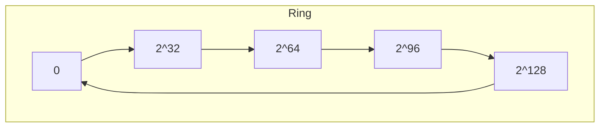
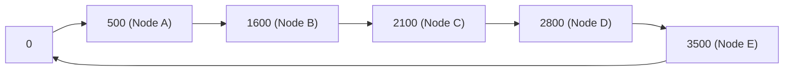
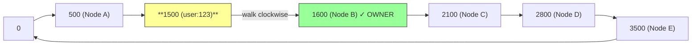
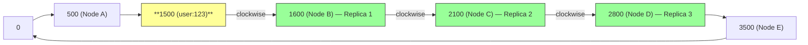
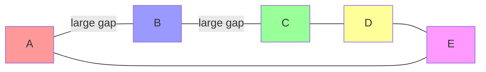

## The Problem — How Does the Coordinator Find the Right Nodes?

A request `put("user:123", value)` arrives at the coordinator. There are 1,200 nodes in the cluster. The coordinator needs to know **exactly** which 3 nodes store this key — without asking all 1,200. How?

The answer is a **consistent hashing ring**. Every node in the cluster has a copy of this ring, which is why any node can be a coordinator.

---

## Step 1 — The Ring

Imagine the output range of a hash function as a circle (ring) from 0 to some maximum value — say 0 to 2^128.



Every position on this ring is a number. When you hash a key like `"user:123"`, you get a number — say 1500. That's a position on the ring.

---

## Step 2 — Place Nodes on the Ring

Each node in the cluster is also assigned a position on the ring by hashing some identifier (like the node's IP address or hostname):

```
hash("node-A-ip") → position 500
hash("node-B-ip") → position 1600
hash("node-C-ip") → position 2100
hash("node-D-ip") → position 2800
hash("node-E-ip") → position 3500
```

Now both keys and nodes live on the same ring:



---

## Step 3 — Finding the Owner

To find which node owns a key, hash the key and **walk clockwise** until you hit the first node.

```
hash("user:123") → position 1500

Walk clockwise from 1500:
  → first node hit: Node B (position 1600)

Node B owns "user:123"
```



This means Node B is responsible for all keys that hash into the range (500, 1600] — everything between Node A's position and Node B's position.

```
Node A owns range: (3500, 500]    ← wraps around the ring
Node B owns range: (500, 1600]
Node C owns range: (1600, 2100]
Node D owns range: (2100, 2800]
Node E owns range: (2800, 3500]
```

---

## Step 4 — Finding the Replica Set (N=3)

We don't store the data on just one node — we replicate to N=3 nodes for durability. How do we find the other 2?

**Hash the key once. Walk clockwise. Pick the next N distinct physical nodes.**

```
hash("user:123") → position 1500

Walk clockwise:
  → first node:   Node B (position 1600)  ← replica 1
  → keep walking:  Node C (position 2100)  ← replica 2
  → keep walking:  Node D (position 2800)  ← replica 3

Replica set for "user:123" = { Node B, Node C, Node D }
```



The coordinator sends the write to all 3 nodes, waits for W=2 acks, and responds. On a read, it contacts these same 3 nodes (or a subset, depending on consistency level).

This is simple and elegant — one hash, one clockwise walk, done. No lookup table, no central registry.

---

## The Problem with Basic Consistent Hashing — Uneven Distribution

With only 5 nodes on the ring, the ranges are wildly uneven:

```
Node A owns: (3500, 500]   → range size: 1000 + (wrap)
Node B owns: (500, 1600]   → range size: 1100
Node C owns: (1600, 2100]  → range size: 500   ← tiny!
Node D owns: (2100, 2800]  → range size: 700
Node E owns: (2800, 3500]  → range size: 700
```

Node B's range is 1100 units while Node C's range is only 500 units. Since the hash function distributes keys uniformly, a bigger range catches more keys. Node B holds roughly **twice as many keys** as Node C. That's a load imbalance — Node B gets hammered while Node C sits half-idle.

**Why are the ranges uneven?** Because node positions are determined by hashing — `hash("node-B-ip")` happened to land at 1600, `hash("node-C-ip")` at 2100. Those positions are essentially random. And random doesn't mean evenly spaced.

Think of it like throwing 5 darts at a circular dartboard. Would they land perfectly evenly spaced? Almost never. Some darts cluster together (small gaps between them), others land far apart (big gaps). With only 5 darts, the randomness dominates and you get big imbalances.

With 1,200 nodes, it's still only 1,200 darts on a massive ring — some nodes will inevitably get much bigger ranges than others. The only way to fix this is to throw **many more darts** — which is exactly what vnodes do. 256 vnodes per node means 307,200 positions on the ring. At that density, the law of large numbers kicks in and each physical node's total range averages out to roughly equal.

Even worse without vnodes: when a node dies, its entire contiguous range gets absorbed by the **single next node** clockwise. That node suddenly handles double the load — a hotspot that could cascade into failure. (How the system handles node failures — hinted handoff, read repair, re-replication — is covered in the Replication deep dive.)

---

## The Solution — Virtual Nodes (Vnodes)

Instead of placing each physical node at one position on the ring, we place it at **many positions**. Each position is called a **virtual node (vnode)**.

### How to create virtual nodes

For each physical node, run the hash function multiple times with different inputs:

```
Physical Node A → create 256 vnodes:
  hash("node-A-vnode-0")   → position 200
  hash("node-A-vnode-1")   → position 1450
  hash("node-A-vnode-2")   → position 2950
  hash("node-A-vnode-3")   → position 3700
  ... 252 more positions for Node A

Physical Node B → create 256 vnodes:
  hash("node-B-vnode-0")   → position 650
  hash("node-B-vnode-1")   → position 1800
  hash("node-B-vnode-2")   → position 3100
  hash("node-B-vnode-3")   → position 4200
  ... 252 more positions for Node B
```

The trick is simple: append a suffix (`-vnode-0`, `-vnode-1`, etc.) to the node identifier and hash each one separately. Each hash gives a different position on the ring. So one physical node ends up scattered across **256 different positions** on the ring.

### What the ring looks like with vnodes

Without vnodes (5 nodes, 5 positions — big gaps, uneven ranges):



With vnodes (5 nodes, 256 positions each — interleaved, even distribution):

```mermaid
graph LR
    V1["A"] --- V2["B"] --- V3["A"] --- V4["C"] --- V5["B"] --- V6["D"] --- V7["A"] --- V8["E"] --- V9["C"] --- V10["B"] --- V11["D"] --- V12["A"] --- V13["..."]
    style V1 fill:#f99
    style V3 fill:#f99
    style V7 fill:#f99
    style V12 fill:#f99
    style V2 fill:#99f
    style V5 fill:#99f
    style V10 fill:#99f
    style V4 fill:#9f9
    style V9 fill:#9f9
    style V6 fill:#ff9
    style V11 fill:#ff9
    style V8 fill:#f9f
```



Now every physical node owns many small ranges instead of one big range. The total data each node holds is roughly equal — because with enough vnodes, the law of large numbers kicks in and the ranges average out.

### How many vnodes per node?

Cassandra defaults to **256 vnodes per physical node**. With 1,200 physical nodes, that's 1,200 × 256 = **307,200 positions** on the ring. At that density, the distribution is extremely even.

More vnodes = more even distribution, but also more metadata to maintain. 256 is the industry standard sweet spot.

### The routing logic doesn't change

The coordinator still does the same thing:

```
1. hash("user:123") → position 1500
2. Walk clockwise → first vnode hit: Node-A-vnode-47 (position 1510)
3. That vnode belongs to physical Node A → Node A is replica 1
4. Keep walking → next vnode: Node-B-vnode-12 (position 1530)
   → Physical Node B → replica 2
5. Keep walking → next vnode: Node-A-vnode-112 (position 1550)
   → Physical Node A → SKIP (already have Node A)
6. Keep walking → next vnode: Node-C-vnode-89 (position 1580)
   → Physical Node C → replica 3

Replica set = { Node A, Node C, Node D }
```

> [!important] Skip vnodes of the same physical node
> When walking clockwise to find N=3 replicas, you need 3 **distinct physical nodes**. If you hit two vnodes that both belong to Node A, you'd have two copies on the same physical machine. If that machine dies, both copies are lost — defeating the purpose of replication. So you skip vnodes belonging to a physical node you've already counted.

**What if many consecutive vnodes belong to the same physical node?**

It's possible. You could hit Node-A-vnode-47, then Node-A-vnode-112, then Node-A-vnode-203 — three vnodes of the same physical node in a row before reaching a different node. The system just keeps walking clockwise, skipping duplicates, until it collects N=3 distinct physical nodes.

In practice with 1,200 physical nodes and 256 vnodes each (307,200 ring positions), the interleaving is so dense that you'll almost always find 3 distinct physical nodes within a few hops. But the algorithm handles the worst case by simply walking further.

There's one hard rule: **N must be ≤ the number of physical nodes in the cluster.** If you only have 2 physical machines, you can't replicate to 3 distinct nodes — no matter how far you walk, you'll never find a third. The system rejects this configuration at startup.

---

## Putting It All Together

```
1. Ring: hash output space arranged as a circle (0 to 2^128)

2. Nodes on ring: each physical node has 256 vnodes (positions)
   created by hashing "node-id-vnode-N" for N = 0 to 255

3. Key lookup: hash the key → walk clockwise → first vnode = first replica's 
   physical node → keep walking → skip same physical node → collect N=3 
   distinct physical nodes

4. Write: coordinator sends to all 3 nodes, waits for W=2 acks
   Read:  coordinator sends to 1 (eventual) or 2 (strong) of the 3 nodes
```

Every node in the cluster holds a copy of this ring mapping — it's just a sorted list of (position → physical node) pairs. At 307,200 entries, it fits comfortably in memory on every node. That's why any node can be a coordinator — the ring is always available locally.

What happens when a node dies or joins — how the ring rebalances and how the data migrates — is covered in the Replication deep dive.

---

> [!tip] Interview framing
> "Consistent hashing ring with virtual nodes. Each physical node gets 256 positions on the ring by hashing the node ID with different suffixes. To find where a key lives: hash the key, walk clockwise, collect the next N=3 distinct physical nodes — that's the replica set. Vnodes solve the uneven distribution problem — 5 darts on a dartboard won't be evenly spaced, but 307,200 will. Every node has the ring in memory, so any node can be a coordinator."
