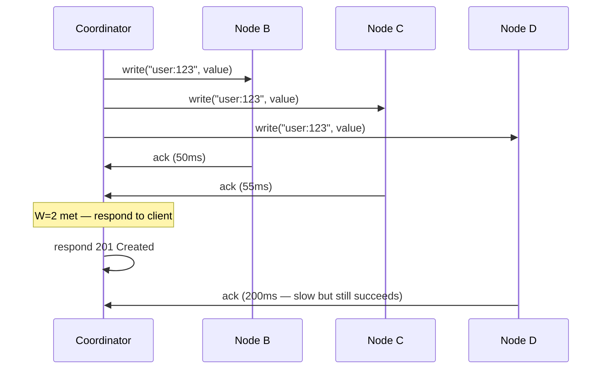

## The Write Flow — What Happens After the Coordinator Finds the Nodes

The consistent hashing deep dive answered *where* the data goes — the coordinator hashes the key, walks the ring, and finds N=3 nodes (say Node B, Node C, Node D). Now we need to answer: *how* does the data actually get to those nodes, and what happens when things go wrong?

---

## Quorum Writes — W=2 out of N=3

The coordinator sends the write to all 3 nodes **simultaneously**. It doesn't send to one and wait, then send to the next. All 3 get the request at the same time.



The coordinator waits for **any 2** acks (W=2). The moment the second ack arrives, it responds to the client. It doesn't wait for the third.

**Response latency = the second-fastest node**, not the slowest. If Node B responds in 50ms, Node C in 55ms, and Node D in 200ms — the client gets a response at 55ms. Node D's slowness doesn't affect the client.

---

## What Happens When Quorum Is NOT Met?

If the coordinator can't get W=2 acks, the write **fails**. The coordinator returns an error to the client.

```
put("user:123", "Alice") → Node B, Node C, Node D

Node B: ack ✓
Node C: no response ✗ (down)
Node D: no response ✗ (down)

W=2 needed, only got 1 ack → WRITE FAILS
Coordinator returns: 503 error to client
```

The client knows the write didn't go through — they got no success ack. They can retry later when more nodes are available.

But here's the tricky part: **Node B did store the data.** One replica has "Alice" even though the write officially failed. That's an orphaned write — data that exists on one node but was never acknowledged to the client.

This isn't a crisis. The orphaned data will either:
- Get **overwritten** when the client retries the write successfully
- Get **cleaned up** by anti-entropy in the background
- Stay harmlessly — if no one ever writes this key again, it just sits there on one node. A future read with R=1 might return it, but a quorum read (R=2) would see that only 1 of 2 nodes has it, which isn't a majority, so it wouldn't be trusted as the authoritative value.

> [!danger] Quorum failure doesn't mean zero writes happened
> The client got an error, so from their perspective the write failed. But one or more replicas may have stored the data. This is a fundamental property of distributed systems — you can't "unwrite" data that already reached a node. The system handles it through overwrite on retry and background cleanup.

---

## What Happens to the Third Node? (When Quorum IS Met)

The coordinator got W=2 acks and responded to the client. But what about the third node — the one whose ack we didn't wait for? There are three scenarios:

### Scenario 1 — Slow but succeeds

The third node (Node D) was just slow — under heavy load, busy disk, network congestion. The write was still in-flight. A few milliseconds later, Node D processes it and stores the data. All 3 nodes now have the value.

**No problem here.** The system is fully healthy. The replication factor of 3 is maintained.

### Scenario 2 — Node is down

Node D crashed before or during the write. The write never made it. Now only Node B and Node C have the data. The replication factor is **degraded from 3 to 2**.

This is a problem. If another node (B or C) also dies before we fix this, we're down to 1 copy. One more failure and the data is gone.

### Scenario 3 — Network failure

The write left the coordinator but never reached Node D due to a network partition or packet loss. Same outcome as Scenario 2 — only 2 copies exist.

---

## The Problem — Degraded Replication Factor

Scenarios 2 and 3 leave us with only 2 copies. The system still works (reads can still find the data on B or C), but we're running on thin ice. We need to get back to 3 copies.

How? Node D is down — we can't write to it. And we can't just wait and hope it comes back soon. What if it's down for hours?

---
