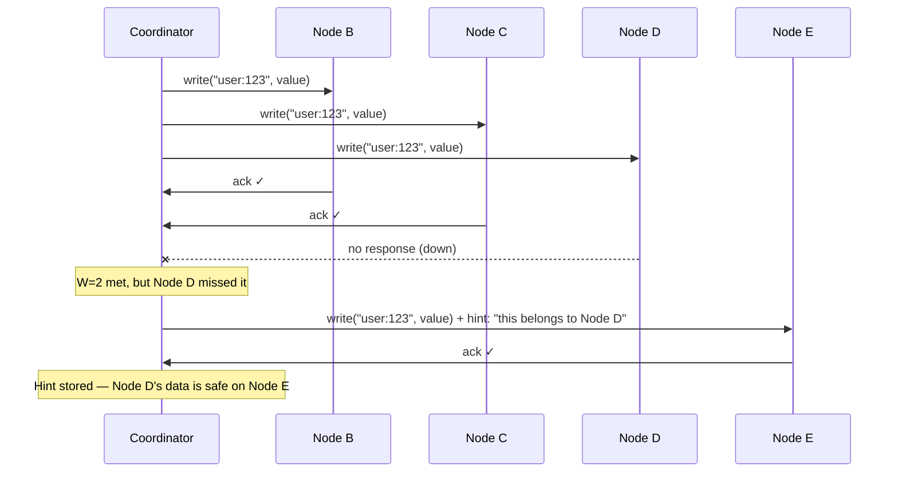
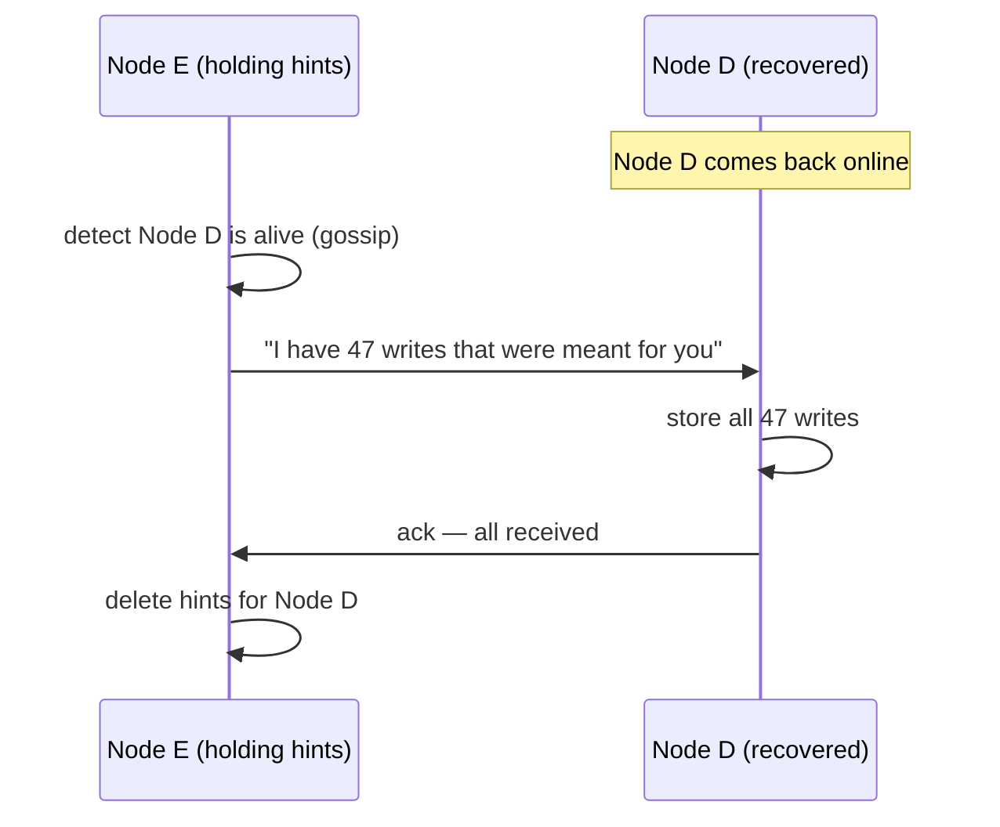

## Hinted Handoff — The Neighbor Holding Your Package

Think of it like home delivery. You ordered a package, but you're not home. The delivery driver gives it to your neighbor with a note: "This is for Node D at apartment 4B. Give it to them when they're back."

That's exactly how hinted handoff works.

### How it works

The coordinator knows Node D missed the write (no ack, or connection refused). Instead of giving up, the coordinator picks **another healthy node** — say Node E — and sends the write there with a **hint** attached.



The hint contains:
- The actual key-value data
- The target node (Node D) — who this data really belongs to
- A timestamp — when the write happened

Node E stores this data in a **separate hints directory**, not in its regular data store. Node E doesn't own this key on the ring. It's just holding it temporarily.

### What happens when Node D comes back

Node E detects that Node D is alive again (through gossip protocol or heartbeat). Node E then sends all hinted data to Node D:



Once Node D confirms it received everything, Node E deletes the hints. Node D is now caught up, and the replication factor is back to 3.

### Why not just write to Node E as a permanent replica?

Because Node E **doesn't own this key on the ring**. If we made it a permanent replica, the ring mapping would be wrong — future reads for `"user:123"` would go to B, C, D (based on the ring), and they'd never check Node E. The data would be orphaned.

Hinted handoff is a **temporary holding pattern**, not a change to the ring. Node E holds the data until the rightful owner (Node D) can take it.

### Choosing the hint target

Which node becomes the hint holder? The coordinator picks the **next healthy node clockwise on the ring** after the failed node. This is a simple, deterministic rule — no coordination needed.

```
Ring: ... → Node B → Node C → Node D (down) → Node E → ...

Node D is down → coordinator sends hint to Node E (next clockwise after D)
```

### Limitations of hinted handoff

Hinted handoff isn't a perfect solution. It has limits:

**The hint holder can also die.** If Node E dies before handing off to Node D, the hints are lost. Now you're back to 2 copies with no way to automatically recover the third. This is where anti-entropy (Merkle tree comparison) kicks in as a background safety net — covered in a later deep dive.

**Hints can't be held forever.** If Node D is down for days, Node E accumulates a massive backlog of hints. Systems typically set a **hint TTL** (e.g., Cassandra defaults to 3 hours). If Node D isn't back within 3 hours, the hints expire and are deleted. Again, anti-entropy handles the long-term recovery.

**Hinted handoff doesn't count toward quorum.** The hint on Node E doesn't satisfy W=2. The coordinator still needs 2 acks from actual replica nodes (B, C, D). The hint is extra insurance, not a quorum substitute. If only 1 of the 3 real replicas acks, the write fails even if a hint is stored.

```
Hinted handoff summary:

  ✓ Provides temporary durability when a replica is down
  ✓ Automatic — no human intervention
  ✓ Fast recovery when the node comes back
  
  ✗ Hint holder can also fail → hints lost
  ✗ Hints expire after TTL (typically 3 hours)
  ✗ Doesn't count toward quorum — can't replace a real replica
  ✗ Only helps with short-term outages, not permanent node loss
```

> [!important] Hinted handoff handles short-term failures
> It's the first line of defense — fast and automatic. For long-term failures (node gone for days) or cases where the hint holder also dies, the system needs anti-entropy repair using Merkle trees. That's a separate deep dive.

---

> [!tip] Interview framing
> "Writes go to all N=3 nodes simultaneously. Coordinator waits for W=2 acks — response latency is the second-fastest node, not the slowest. If the third node is down, we use hinted handoff: the coordinator sends the data to another healthy node with a tag saying 'this belongs to Node D.' When Node D recovers, the hint holder forwards the data and deletes the hint. It's like a neighbor holding your package. Limitations: hints expire after a TTL, the hint holder can also die, and hints don't count toward quorum. For long-term recovery, we rely on anti-entropy with Merkle trees."
