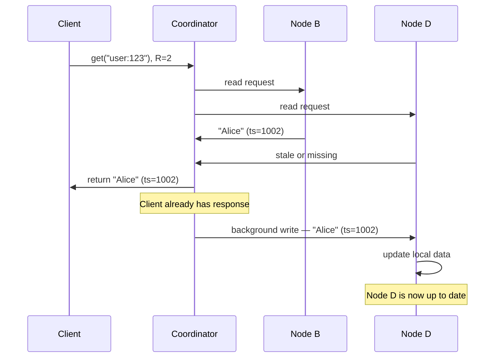

## The Problem — Stale Replicas After Hinted Handoff Expires

Read repair picks up where hinted handoff leaves off. Here's the timeline that creates the problem:

```
1. put("user:123", "Alice") 
   → Node B ✓, Node C ✓, Node D ✗ (down)
   
2. Hinted handoff kicks in
   → Node E stores the data with a hint: "this belongs to Node D"

3. 3 hours pass — Node D is still down
   → Hint expires on Node E (default TTL is ~3 hours)
   → Node E deletes the hint

4. Node D eventually comes back online
   → But it missed the write — it has old data or no data for "user:123"
   → Only Node B and Node C have the correct value
   → Replication factor degraded: 2 out of 3
```

Hinted handoff tried its best, but it couldn't hold the data forever. Now there's a stale replica in the cluster. How does it get fixed?

---

## Read Repair — Reads That Fix Writes

The fix happens when someone reads the key. A client calls `get("user:123")` with strong consistency (R=2). The coordinator contacts 2 of the 3 replicas.

Let's say the coordinator picks Node B and Node D:

```
Coordinator asks Node B: "Alice", timestamp 1002
Coordinator asks Node D: old value or "not found"
```

The coordinator compares the two responses, picks the one with the **higher timestamp** (Node B's value, "Alice"), and returns it to the client.

But it doesn't stop there. The coordinator just discovered that Node D is stale. So **after responding to the client**, it sends the correct value to Node D in the background:



The client doesn't wait for the repair — it gets its response immediately. The fix happens asynchronously. That's why it's called read **repair** — the act of reading triggers a repair of the stale node.

---

## What Read Repair Catches vs What It Doesn't

Read repair has one critical limitation: **it only fixes nodes that were contacted during the read.**

In our example, the coordinator asked Node B and Node D (R=2). It discovered Node D was stale and fixed it. But what about Node C?

```
Replica set for "user:123": Node B, Node C, Node D

Coordinator picked: Node B and Node D for this R=2 read
  → Node B: correct ✓
  → Node D: stale → FIXED by read repair ✓
  → Node C: never contacted → stale? who knows? NOT checked.
```

If Node C also happened to be stale (maybe it missed a different write), read repair wouldn't catch it. Node C stays stale until either:

1. **A future read includes Node C** — eventually some coordinator will pick Node C as one of the R=2 nodes, discover it's stale, and fix it
2. **Anti-entropy repair** — a background process that periodically compares all replicas and fixes any differences (covered in the Anti-Entropy deep dive)

### What about eventual consistency reads (R=1)?

With R=1, the coordinator only asks **one node**. If it happens to ask the stale node, the client gets stale data. And since only one node was contacted, there's no comparison — the coordinator doesn't even know it's stale. No read repair happens.

```
R=1 (eventual consistency):
  Coordinator asks Node D (stale) → gets old value
  No comparison possible → returns stale data to client
  No read repair triggered

R=2 (strong consistency):
  Coordinator asks Node B + Node D → compares timestamps
  Discovers Node D is stale → returns correct value
  Triggers read repair on Node D
```

This is another reason why strong consistency is more self-healing than eventual consistency — it naturally fixes stale replicas as a side effect of reads.

---

## The Three Lines of Defense

At this point we've covered two of the three mechanisms that keep replicas in sync. Here's how they layer together:

```
1. Hinted Handoff (write-time)
   → Immediate response to a failed write
   → "Neighbor holds your package"
   → Handles short outages (minutes to hours)
   → Limitation: hints expire, hint holder can also fail

2. Read Repair (read-time)
   → Piggybacks on client reads
   → "If we notice staleness during a read, fix it"
   → Handles cases where hinted handoff expired or missed
   → Limitation: only fixes nodes contacted during that read

3. Anti-Entropy / Merkle Trees (background)
   → Periodic full comparison between replicas
   → "Catch everything the first two mechanisms missed"
   → The safety net — covered in the next deep dive
```

Each mechanism covers a gap left by the previous one. Together, they ensure that replicas converge — even in the face of long outages, expired hints, and unlucky read patterns.

---

> [!tip] Interview framing
> "Read repair is the second line of defense after hinted handoff. When a quorum read contacts multiple replicas and discovers they disagree, the coordinator returns the newest value to the client and sends it to the stale replica in the background. The client doesn't wait for the repair. Limitation: it only fixes replicas that were part of that specific read — if a replica was never contacted, it stays stale until either a future read includes it or anti-entropy catches it. That's why we need all three mechanisms: hinted handoff at write time, read repair at read time, and Merkle tree anti-entropy in the background."
