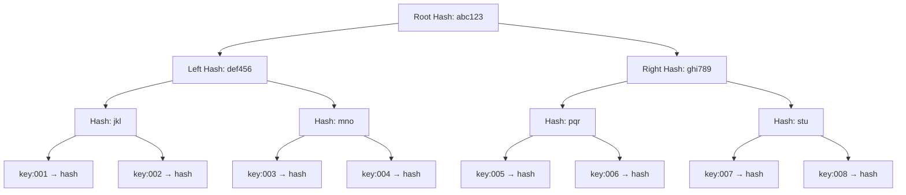
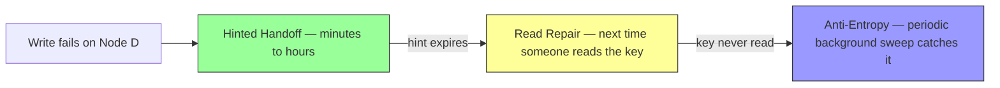

## The Problem — What Hinted Handoff and Read Repair Can't Catch

We have two repair mechanisms so far:

- **Hinted handoff** — fixes short-term failures at write time. But hints expire after ~3 hours. If the node is down longer, the hint is gone.
- **Read repair** — fixes stale replicas during reads. But it only fixes the nodes that were contacted in that specific read. If a node is never asked, it stays stale.

What about the keys that slipped through both? A node was down for a day, hints expired, and no one happened to read those specific keys. The replica is stale and nobody knows.

This is where **anti-entropy repair** comes in — a background process that periodically compares replicas and fixes **every** difference. It's the safety net that catches everything the first two mechanisms missed.

---

## The Brute Force Approach (Why It Doesn't Work)

The naive way to compare two replicas: go through every key-value pair on Node B, compare it with the same key on Node D. If they differ, fix it.

At our scale, each node holds data for multiple shards — potentially **billions of keys**. Comparing them one by one means:

```
Billions of keys × (network round trip per key) = hours or days to complete

During that time:
  → Massive network traffic between nodes
  → Both nodes under heavy load from the comparison
  → New writes are coming in, making the comparison a moving target
```

This is O(n) — linear in the number of keys. Completely impractical at scale. We need a way to find **just the keys that differ** without looking at every key.

---

## Merkle Trees — Find the Needle in O(log n)

A Merkle tree is a **hash tree**. Each leaf node is the hash of one key-value pair. Each parent node is the hash of its children combined. The root is a single hash that represents **all the data**.

Here's what it looks like for a node holding 8 keys:



The critical property: **if any single key changes, the root hash changes.** The change bubbles up through every parent to the root. So comparing two replicas starts by comparing just the root hashes.

---

## How Two Replicas Compare — Step by Step

Node B and Node D both hold replicas for the same shard. They each maintain a Merkle tree over their data. Here's how they find what's different:

### Step 1 — Compare root hashes

```
Node B root hash: abc123
Node D root hash: abc123

Match? → YES → Everything is identical. Done. No data transfer needed.
```

If the roots match, the two replicas are perfectly in sync. This is the **common case** — most of the time replicas agree, and the comparison costs just one hash exchange. Extremely cheap.

### Step 2 — If roots differ, drill down

```
Node B root hash: abc123
Node D root hash: xyz999

Match? → NO → Something differs. Go deeper.
```

Compare the left and right children:

```
             Node B          Node D
Left child:  def456          def456     ← MATCH (entire left half is identical)
Right child: ghi789          qqq111     ← MISMATCH (difference is in right half)
```

The left half matches — skip it entirely. No need to look at any keys in the left half. The difference is somewhere in the right half. Keep drilling into the right subtree only.

### Step 3 — Keep drilling into mismatched subtrees

```
Right subtree:
             Node B          Node D
Left child:  pqr             pqr        ← MATCH (skip this quarter)
Right child: stu             vwx        ← MISMATCH (drill deeper)
```

### Step 4 — Reach the leaf level

```
Right-right subtree:
             Node B          Node D
key:007      hash_a          hash_a     ← MATCH (key:007 is identical)
key:008      hash_b          hash_c     ← MISMATCH → THIS is the stale key
```

Out of 8 keys, we found the one that differs by comparing just **7 hashes** (root + 3 levels of 2 children each). With a million keys, the tree has ~20 levels — we'd find the diverged key in about **20 comparisons** instead of 1,000,000.

```
Brute force:  compare all N keys           → O(n)
Merkle tree:  drill down through the tree   → O(log n)

For 1 billion keys:
  Brute force: 1,000,000,000 comparisons
  Merkle tree: ~30 comparisons (log2 of 1 billion ≈ 30)
```

---

## Resolving the Difference — Timestamps Win

Once they find the keys that differ, how do they decide which replica has the correct value? **Timestamps.**

```
Node B has: "user:789" → "Alice" (timestamp 1002)
Node D has: "user:789" → "Bob"   (timestamp 1001)

1002 > 1001 → Node B's value is newer → Node D updates its copy to "Alice"
```

The node with the higher timestamp wins. The stale node copies the newer value. Simple.

### What if a key is missing entirely?

A missing key is just an extreme case of "different." The Merkle tree hash for that key's position will differ because one side has data and the other has nothing.

```
Node B has: "user:789" → "Alice" (timestamp 1002)
Node D has: "user:789" → (nothing)

Node B has data, Node D doesn't → Node D copies it from Node B
```

The fix is the same regardless of whether the value is stale or completely missing.

---

## The Tombstone Resurrection Problem

This is the most subtle and dangerous edge case in anti-entropy, and it's exactly why deletes use **tombstones** instead of physically erasing data.

### The setup

A client deletes `"user:789"`. The delete goes to Node A, Node C, and Node D (the replica set). Node A and Node C succeed, Node D misses it (was down).

### What if delete physically erased the data?

```
Node A: "user:789" → (erased, gone, nothing)
Node C: "user:789" → (erased, gone, nothing)
Node D: "user:789" → "Alice" (timestamp 1002)  ← still has the old value
```

Now anti-entropy runs between Node C and Node D. Node C has nothing for this key. Node D has "Alice." From anti-entropy's perspective, Node D has data that Node C is missing. So it **copies the data back to Node C.**

```
Anti-entropy: Node D has "Alice", Node C has nothing
  → Node C must be missing it → copy "Alice" to Node C
  → The deleted data is BACK. Resurrection. 💀
```

The delete was undone. The data came back from the dead. This is catastrophic — the user explicitly deleted their data, and the system brought it back.

### How tombstones prevent resurrection

Instead of erasing the data, the delete writes a **tombstone** — a special marker with a timestamp that says "this key was deleted at time X."

```
Delete("user:789") at timestamp 1005:
  Node A: tombstone (timestamp 1005) ✓
  Node C: tombstone (timestamp 1005) ✓
  Node D: "Alice"   (timestamp 1002) ← missed the delete
```

Now anti-entropy runs between Node C and Node D:

```
Node C has: tombstone (timestamp 1005)
Node D has: "Alice"  (timestamp 1002)

1005 > 1002 → tombstone wins → Node D applies the tombstone
Node D now knows: "user:789" was deleted
```

The tombstone is data. It has a timestamp. It participates in Merkle tree comparison and timestamp resolution just like any normal value. The tombstone's higher timestamp beats the old value, and the delete propagates correctly.

### Tombstones can't be cleaned up too early

If you delete the tombstone from Node C before anti-entropy has propagated it to Node D, you're back to the resurrection problem — Node D still has "Alice" and Node C has nothing.

That's why tombstones have a **grace period** — a minimum time they must exist before compaction can remove them. Cassandra calls this `gc_grace_seconds` and defaults to **10 days**. This gives anti-entropy plenty of time (multiple rounds of comparison) to propagate the tombstone to all replicas.

```
Tombstone lifecycle:

1. Delete request → tombstone written (timestamp 1005)
2. Anti-entropy propagates tombstone to all replicas (hours to days)
3. Grace period passes (10 days)
4. Compaction finally removes the tombstone from disk
```

> [!danger] If a node is down longer than the tombstone grace period, resurrection can still happen
> If Node D is down for 11 days and the tombstone grace period is 10 days, the tombstone gets cleaned up from Node A and Node C before Node D comes back. When Node D rejoins and anti-entropy runs, it still has the old value and no one has the tombstone anymore — resurrection. This is why long-dead nodes should be treated as **new nodes** that need a full data rebuild, not a normal anti-entropy sync.

---

## When Does Anti-Entropy Run?

Anti-entropy is a **periodic background process**. It's not triggered by failures or restarts — it runs on a schedule regardless of whether anything is wrong.

```
Every node periodically:
  1. Pick a replica partner (another node that shares a shard)
  2. Exchange Merkle tree root hashes for that shard
  3. If roots match → done, everything in sync
  4. If roots differ → drill down, find diverged keys, fix them
```

The frequency depends on the system's tolerance for inconsistency:
- **Every hour** — aggressive, catches differences quickly, but more network overhead
- **Every few hours** — balanced approach, what most systems use
- **Once a day** — conservative, less overhead, but stale replicas persist longer

Most of the time, the roots match and the comparison ends immediately — just one hash exchange. It only gets expensive when there are actual differences to drill down into.

---

## The Three Lines of Defense — Complete Picture

```
1. Hinted Handoff (write-time — immediate)
   → Coordinator stores data on a temporary node when the real target is down
   → Fast recovery when target comes back
   → Expires after ~3 hours

2. Read Repair (read-time — on demand)
   → Quorum reads discover staleness and fix it
   → Only fixes nodes contacted during that specific read
   → Doesn't help keys that are never read

3. Anti-Entropy (background — periodic)
   → Merkle tree comparison finds ALL differences
   → O(log n) to find diverged keys out of billions
   → The safety net — catches everything the first two missed
   → Handles tombstone propagation to prevent resurrection
```

Each mechanism covers a different failure window:



Together, they guarantee **eventual convergence** — given enough time and no permanent failures, all replicas will agree. That's what "eventually consistent" actually means.

---

> [!tip] Interview framing
> "Anti-entropy is the background safety net. Each node periodically compares Merkle trees with its replica partners. If the root hashes match — done, one hash exchange, very cheap. If they differ, drill down the tree to find exactly which keys diverged in O(log n) instead of comparing every key. Timestamps resolve who has the correct value. Critical detail: deletes use tombstones, not physical erasure, because anti-entropy would resurrect deleted data if it found one replica has the value and another doesn't. Tombstones have a grace period — typically 10 days — before compaction removes them, giving anti-entropy time to propagate the delete to all replicas."
