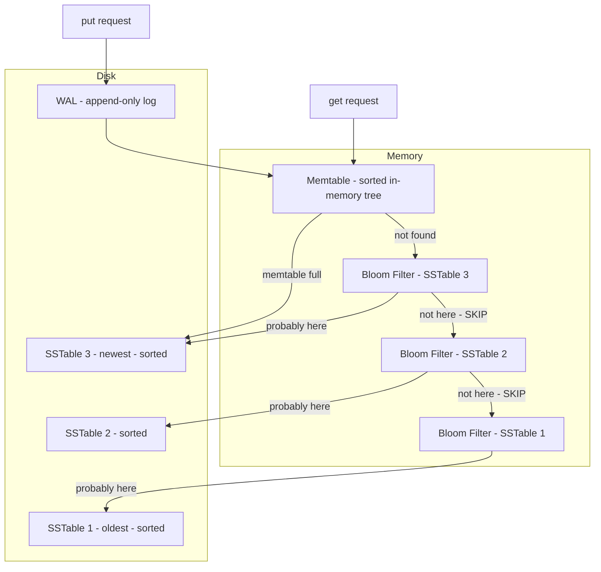
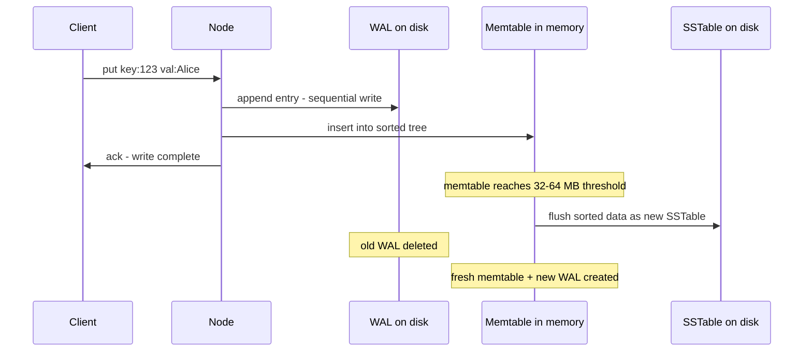
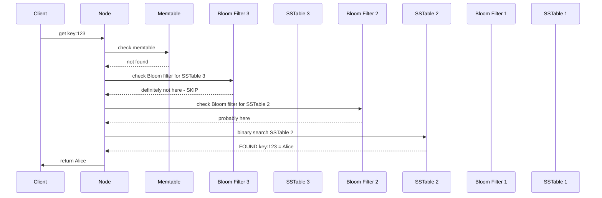

## LSM Tree — Full Architecture

This is how all the pieces connect inside a single node. The write path goes through the left side (WAL + Memtable), the read path goes through the right side (Memtable → Bloom Filters → SSTables).



---

## Write Path — End to End



1. **Append to WAL** — sequential write to disk. This is for crash recovery only.
2. **Insert into memtable** — O(log n) insert into an in-memory sorted tree (red-black tree or skip list).
3. **Ack to client** — done. The write is durable (WAL on disk) and queryable (memtable in memory).
4. **Background flush** — when the memtable reaches its size threshold, it's flushed to disk as a sorted SSTable. The old WAL is deleted and a fresh memtable + new WAL are created.

Every disk write in this path is **sequential** — appending to the WAL, flushing a sorted SSTable. No random I/O, no seeking, no page splits.

---

## Read Path — End to End



1. **Check memtable** — in-memory lookup, O(log n). If found, return immediately — this is the newest data.
2. **Check Bloom filter for newest SSTable** — a few bit checks in memory. If "definitely not here," skip the SSTable entirely. No disk read.
3. **If Bloom filter says "probably here"** — binary search the SSTable on disk. If found, return. If not found (false positive), move to the next SSTable.
4. **Repeat** for each SSTable, newest to oldest, until the key is found or all SSTables are exhausted.

The Bloom filters are the critical optimization. Without them, every SSTable check is a disk read. With them, most SSTables are skipped with just a few bit checks in memory. Only the SSTable that actually contains the key (or the rare false positive) triggers a disk read.

---

## What Happens to Deleted Keys?

A delete doesn't remove data — it writes a **tombstone** (a special marker that says "this key was deleted at timestamp X"). The tombstone flows through the same path as any write: WAL → memtable → eventually flushed to an SSTable.

During reads, if the node finds a tombstone, it returns "not found" to the client. During compaction, when the tombstone meets the old value for that key, the old value is discarded. After the tombstone's grace period expires (typically 10 days — needed for anti-entropy to propagate the delete to all replicas), compaction removes the tombstone itself.

---

## Summary — Why Each Piece Exists

```
Component        Purpose                              Lives in
─────────        ───────                              ────────
WAL              Crash recovery for memtable           Disk (append-only)
Memtable         Fast writes + sorted batching         Memory
SSTable          Persistent sorted data                Disk (immutable)
Bloom Filter     Skip SSTables that don't have the key Memory
Compaction       Reduce SSTable count + reclaim space   Background process
```

Each component exists because of a specific problem:
- **WAL** → memtable is in memory, crashes lose data → append to disk first
- **Memtable** → random writes to sorted files are slow → batch and sort in memory
- **SSTable** → memory is limited → flush sorted data to disk
- **Bloom filter** → too many SSTables to check per read → skip irrelevant ones cheaply
- **Compaction** → SSTables accumulate endlessly → merge them to reduce count and remove stale data

> [!tip] Interview framing
> "The LSM Tree write path is: append to WAL for durability, insert into an in-memory sorted memtable, ack to client. When the memtable fills up, flush it to disk as a sorted SSTable. Every disk write is sequential — no random I/O. The read path checks the memtable first, then each SSTable newest to oldest. Bloom filters sit in memory and let us skip SSTables that definitely don't contain the key — reducing read amplification from checking every SSTable to checking only the relevant ones. Compaction runs in the background, merging SSTables to reduce their count and discard stale values."
