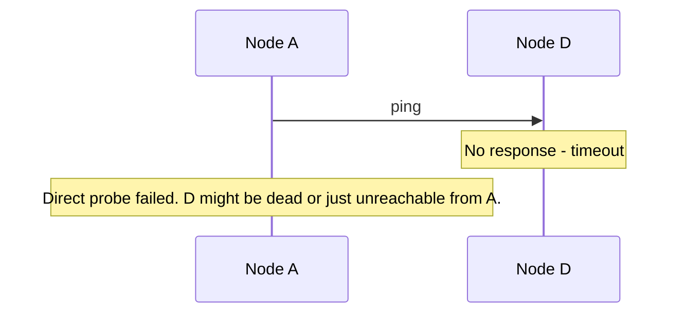
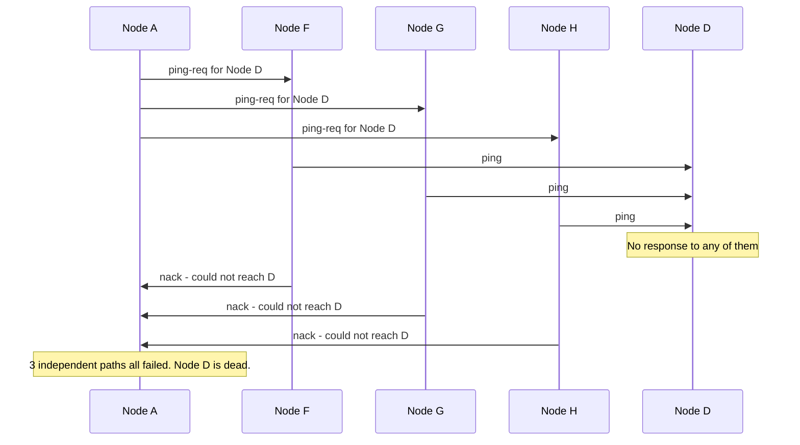
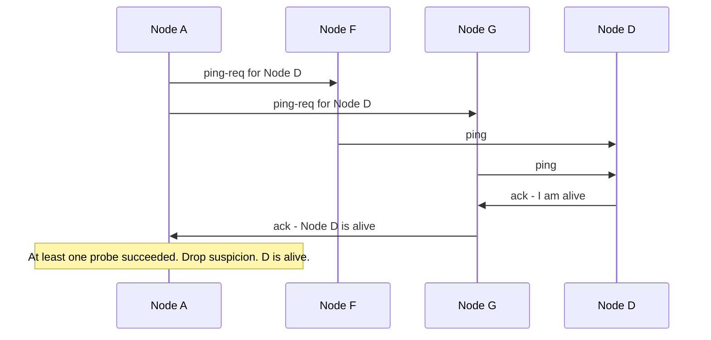

## From Suspicion to Confirmation — Indirect Probing

When Node A's view of Node D shows a frozen heartbeat counter for 8-10 seconds, Node A doesn't immediately declare Node D dead. It marks Node D as **suspected** and initiates indirect probing — asking a few random nodes to verify.

### Step 1 — Direct probe fails



### Step 2 — Indirect probes to verify

Node A picks 3 random nodes and asks them to ping Node D on its behalf:



If all 3 indirect probes fail, Node D is marked **dead**. This information is then gossiped out to the rest of the cluster.

### What if it was just a network issue between A and D?



Only one successful probe out of 3 is enough to clear the suspicion. The issue was between A and D specifically, not a real failure.

### Why 3-5 probes is enough (not a majority)

We're not voting on an opinion — we're testing reachability from different network paths. If Node D is truly dead, **nobody** can reach it, so all probes will fail regardless of how many we send. If only Node A has a network issue, even 1 out of 3 probes will succeed and clear the suspicion.

```
3 probes fail   → probability of coincidence is extremely low → D is dead
1 probe succeeds → D is alive, A just has a network issue with D
```

A majority vote (601 out of 1,200 nodes) would give the same answer but waste far more network traffic. 3-5 probes gives high confidence with minimal overhead.

---

## What the Gossip Message Looks Like

When two nodes gossip, they exchange their full membership table. Each entry contains everything a node needs to route requests and detect failures:

```
Gossip message from Node A to Node B:

{
  "sender": "node-A",
  "membership": [
    {
      "node":      "node-B",
      "heartbeat": 204,
      "status":    "alive",
      "ip":        "10.0.1.2",
      "port":      9042,
      "tokens":    ["hash-29a1", "hash-8f3c", "hash-e712", ...]
    },
    {
      "node":      "node-C",
      "heartbeat": 187,
      "status":    "alive",
      "ip":        "10.0.1.3",
      "port":      9042,
      "tokens":    ["hash-1b44", "hash-6d90", "hash-c3f1", ...]
    },
    {
      "node":      "node-D",
      "heartbeat": 101,
      "status":    "suspected",
      "ip":        "10.0.1.4",
      "port":      9042,
      "tokens":    ["hash-3e77", "hash-a2b0", "hash-f508", ...]
    }
  ]
}
```

Each entry carries:

```
Field       Purpose
─────       ───────
node        Unique identifier for the node
heartbeat   Counter that increments every gossip round (higher = fresher info)
status      alive, suspected, or dead
ip + port   Where to send requests to this node
tokens      The positions on the hash ring this node owns (its virtual nodes)
```

### How the receiver merges

When Node B receives this message, it compares each entry against its own table, field by field:

```
For each node in the incoming message:

  If incoming heartbeat > my heartbeat for this node:
    → Update my entry with the incoming data (it's fresher)
    
  If incoming heartbeat < my heartbeat for this node:
    → Ignore it (I have fresher info)
    
  If incoming heartbeat == my heartbeat for this node:
    → Keep whichever has the "worse" status
      (dead > suspected > alive — err on the side of caution)
```

After merging, both Node A and Node B have the same (latest) view of the cluster. In the next gossip round, they'll each pick another random node and spread this view further.

---

## The Full Lifecycle — Node Joins, Lives, Dies

### Node joins the cluster

A new node starts up and contacts any one existing node (a **seed node** — a well-known address configured at startup). It announces itself, and the seed node gossips the new member's existence to the rest of the cluster.

```
New Node X starts up:
  1. Contacts seed node (e.g. Node A) → "I'm node-X, here are my tokens"
  2. Node A adds node-X to its membership table with heartbeat 0
  3. Node A gossips this to a random neighbor in the next round
  4. ~11 rounds later → all 1,200 nodes know about node-X
```

### Node lives — steady state

Every gossip round (once per second), the node increments its own heartbeat counter and gossips with a random neighbor. As long as its counter keeps going up, everyone knows it's alive.

### Node dies

The node stops gossiping. Its heartbeat counter freezes. After 8-10 seconds of no increase, neighbors mark it as suspected. Indirect probes confirm it's unreachable. It's marked dead, and this status gossips out to the cluster.

```
alive → heartbeat stops increasing → suspected → indirect probes fail → dead
```

---

## How This Connects to Request Routing

The membership table **is** the routing table. When a coordinator needs to route `put("user:123")`:

```
1. Hash "user:123" → position on ring
2. Look up local membership table → find which nodes own tokens near that position
3. Filter to alive nodes only
4. Send the request to N=3 alive replica nodes
```

No central registry to query. No network hop to a coordination service. The information is right there in memory, kept fresh by gossip running in the background every second.

> [!tip] Interview framing
> "We use a gossip protocol for cluster membership — no central registry, which aligns with our leaderless architecture. Every second, each node picks a random neighbor and exchanges membership tables. Heartbeat counters (not timestamps) determine which information is fresher — higher counter wins. For failure detection, if a node's heartbeat stops increasing for 8-10 seconds, it's marked as suspected. We then send indirect probes through 3-5 random nodes to confirm — if all fail, the node is declared dead. This avoids false positives from temporary network issues between two specific nodes. The membership table doubles as the routing table — each entry has the node's tokens on the hash ring, so request routing is a local memory lookup with no external dependency."
