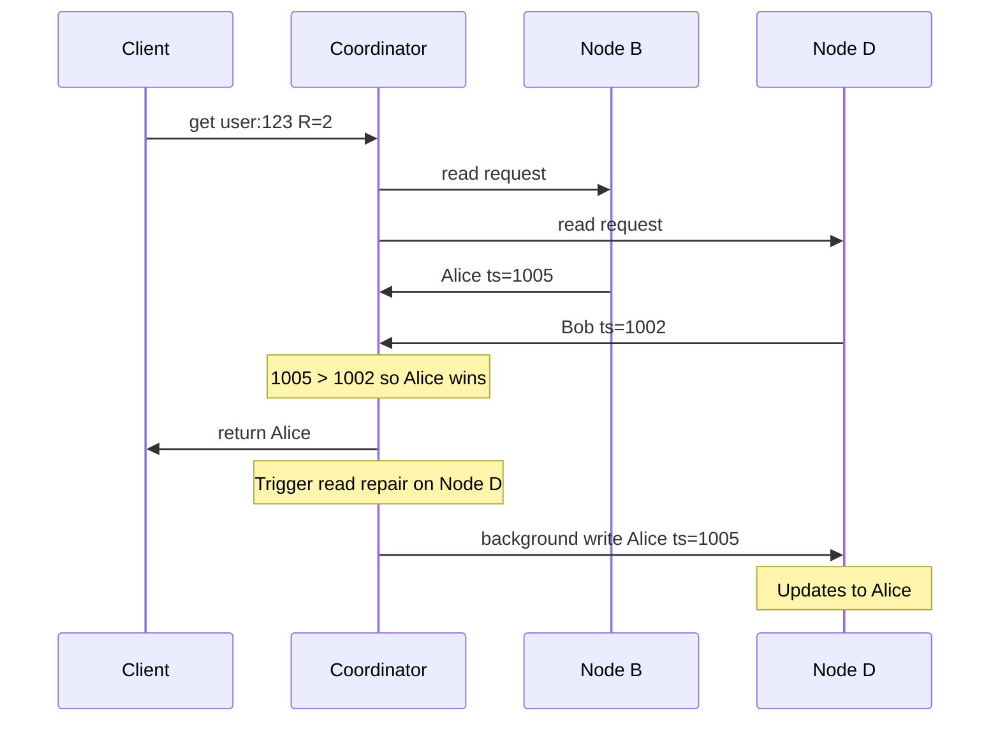
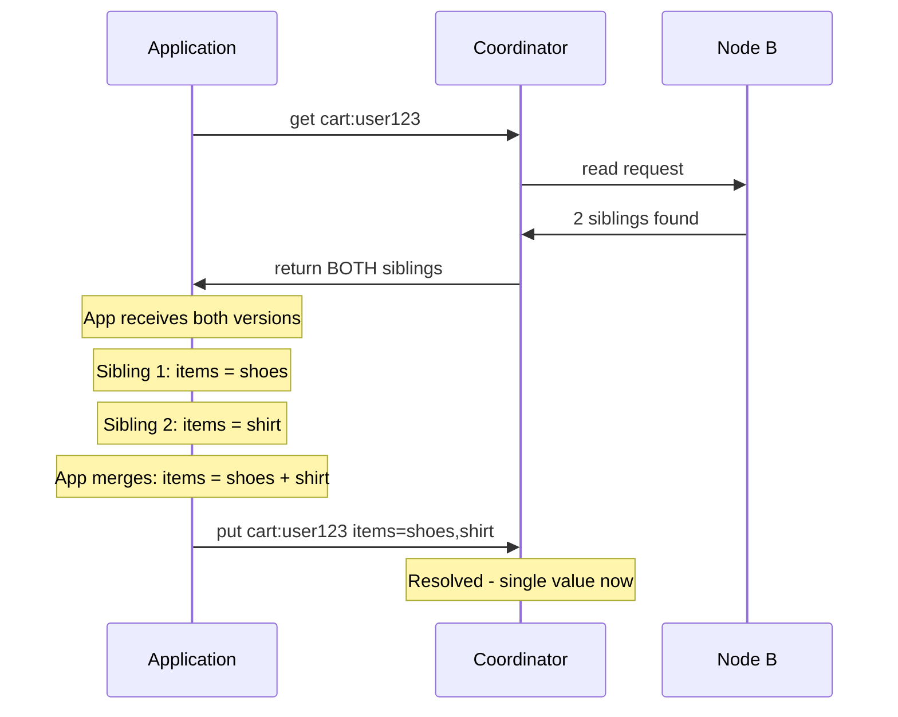

## Solution 1 — Last Writer Wins (LWW)

The simplest conflict resolution: every write carries a timestamp. When replicas disagree, the value with the **higher timestamp** wins. Every node applies this rule independently — no coordination needed.

### Full example — user profile update

Two clients update the same user's name at the same time. Client 1 is on a machine whose clock is slightly ahead.

```
Client 1: put("user:123", "Alice")  → coordinator assigns timestamp 1005
Client 2: put("user:123", "Bob")    → coordinator assigns timestamp 1002
```

Both writes succeed with W=2 acks. Due to network timing, the replicas end up inconsistent:

```
Node B: received Alice(1005), then Bob(1002) → compares → keeps "Alice" (1005 > 1002)
Node C: received Bob(1002), then Alice(1005) → compares → keeps "Alice" (1005 > 1002)
Node D: received only Bob(1002) so far       → stores "Bob" (hasn't seen Alice yet)
```

Now a quorum read (R=2) comes in for `"user:123"`:



The coordinator compares timestamps, returns "Alice" to the client, and triggers read repair on Node D. Eventually all three nodes converge to "Alice."

The key property: **every node independently arrives at the same winner** by comparing timestamps. No voting, no consensus, no coordination. This is why LWW is so simple and fast.

### The silent data loss trade-off

LWW's strength is also its weakness: it always picks **one** winner and silently discards the other. For a profile name update, this is fine — the user intended to overwrite the old name. But consider what happens when both writes are valid and should be kept:

```
User adds shoes from phone:  put("cart:user123", {items: ["shoes"]})    ts=1001
User adds shirt from laptop: put("cart:user123", {items: ["shirt"]})    ts=1002

LWW result: {items: ["shirt"]} wins (1002 > 1001)
  → "shoes" is silently dropped
  → User expected ["shoes", "shirt"] but only sees ["shirt"]
```

The user didn't intend to replace shoes with shirt — they intended to add shirt. But LWW doesn't know this. It sees two values for the same key and picks the higher timestamp. The other value is gone forever.

### When LWW is acceptable vs when it isn't

```
LWW is fine when one write replaces the other:
  → User profile: "Alice" → "Bob" → latest name wins
  → Session token: old token → new token → latest wins
  → Config flag: false → true → latest wins

LWW breaks when both writes should be merged:
  → Shopping cart: shoes + shirt → both should be in the cart
  → Collaborative edit: two users edit same doc → both edits matter
  → Counter: +1 from phone, +1 from laptop → should be +2, not +1
```

For most KV store operations, writes are explicit overwrites — the developer calls `put()` knowing it replaces the old value. LWW handles this perfectly. The merge problem is real but affects only specific use cases.

---

## Solution 2 — Return Siblings (Let the Application Decide)

For use cases where LWW's data loss is unacceptable, the KV store can take a different approach: instead of picking a winner, **store both conflicting values and return them both to the client**. These multiple versions are called **siblings**.

### Full example — shopping cart with siblings

Same scenario: user adds shoes from phone, shirt from laptop, at the same time.

```
Phone:  put("cart:user123", {items: ["shoes"]})    ts=1001  → W=2 ack ✓
Laptop: put("cart:user123", {items: ["shirt"]})    ts=1002  → W=2 ack ✓
```

With siblings enabled, the nodes don't pick a winner. They store both versions:

```
Node B: has both values → stores as siblings:
  sibling-1: {items: ["shoes"]}  ts=1001
  sibling-2: {items: ["shirt"]}  ts=1002

Node C: has both values → stores as siblings:
  sibling-1: {items: ["shoes"]}  ts=1001
  sibling-2: {items: ["shirt"]}  ts=1002
```

Now the client reads the cart:



The KV store doesn't know what's inside the value — it could be a shopping cart, a JPEG, or anything else. It just sees "two conflicting versions exist" and returns both. The **application**, which understands the data structure, decides how to merge them.

### Why the KV store can't merge on its own

Our KV store treats values as **opaque bytes**. It doesn't know that `{items: ["shoes"]}` is a shopping cart that should be merged with `{items: ["shirt"]}`. For all it knows, the value could be:

- A shopping cart → merge by combining items
- A user profile → merge by taking the latest field-by-field
- A JPEG image → can't merge at all, pick one

Each application knows its own data and its own merge rules. The KV store stays simple — store bytes, return bytes, let the application handle the semantics.

### The burden on the developer

Siblings push complexity to the application. The developer must:
1. Handle the case where a read returns **multiple values** instead of one
2. Write merge logic specific to their data type
3. Write the merged result back to the store to resolve the conflict

If the developer forgets to handle siblings, they accumulate — reads return 3, 5, 10 versions. This is called **sibling explosion** and it degrades performance. The application must always resolve siblings when it encounters them.

---

## Our Decision — LWW Default, Siblings Opt-In

For a general-purpose KV store, we support both:

- **LWW (default)** — zero work for the developer. Covers most use cases where writes are explicit overwrites. A tiny risk of silent data loss during concurrent writes, but for most applications this doesn't matter.

- **Siblings (opt-in per table)** — for applications that need merge semantics. The developer opts in knowing they'll need to write merge logic. More work, but no data loss.

This is exactly what DynamoDB does. LWW is the default, siblings are available when needed.

---

## What Real Systems Do

**Cassandra** — always uses LWW. No sibling support at all. If you need merge semantics, you design around it at the application layer. For example, instead of storing the entire shopping cart as one key, store each cart item as a **separate key**:

```
Instead of:  put("cart:user123", ["shoes", "shirt"])  ← LWW loses one

Do this:     put("cart:user123:shoes", "1")           ← separate key per item
             put("cart:user123:shirt", "1")           ← no conflict possible
```

No two clients write to the same key, so LWW never causes data loss. The trade-off: reads are more complex (scan all keys with prefix `cart:user123:`).

**DynamoDB** — LWW by default. Optionally returns conflicting versions as siblings. This is how Amazon originally solved the shopping cart problem — the app receives both versions and unions the item lists.

**Riak** — siblings by default. The application is expected to handle merges. Also supports CRDTs (counters, sets, maps) built into the store, which can auto-merge common patterns without application logic.

---

## What About CRDTs?

CRDTs (Conflict-free Replicated Data Types) are data structures designed to be **automatically merged** without any application logic. An add-only set CRDT would solve the shopping cart problem perfectly — both "shoes" and "shirt" get merged automatically, no data lost, no merge code needed.

But implementing CRDTs inside the KV store means the store needs to **understand the data structure** inside the value. Our store treats values as opaque bytes — adding CRDT support would mean the store needs to know "this value is a set" or "this value is a counter" and apply the right merge rules. That breaks the simplicity of our design.

For an SDE-2 interview, CRDTs are worth mentioning as an option — they show you know the space — but not something we'd build into the core KV store. The simpler approach (LWW default + siblings opt-in) gives applications flexibility without adding complexity to the storage layer.

> [!tip] Interview framing
> "For conflict resolution, we use Last Writer Wins by default — highest timestamp wins. This works for most KV store use cases where writes are explicit overwrites. For use cases like shopping carts where concurrent writes must both be preserved, we support an opt-in sibling mode — the store returns all conflicting versions, and the application merges them. This keeps the KV store simple — it treats values as opaque bytes and doesn't need to understand the data inside. Cassandra always uses LWW. DynamoDB supports both LWW and siblings. For an SDE-2 scope, LWW is the primary answer, with siblings as an advanced option to mention."
