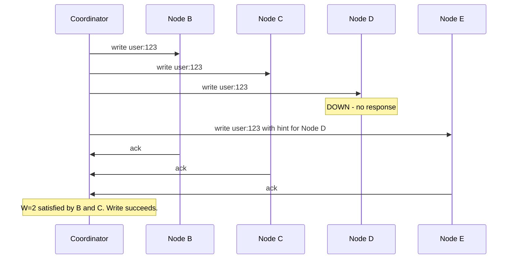

## Node Failure Is Routine at Scale

We have 1,200 nodes. At that scale, node failures aren't exceptional events that trigger alarms — they're routine, expected, and happening constantly. If each node has 99.9% uptime, on average **1-2 nodes are down at any given time**.

```
1,200 nodes × 0.1% failure rate = 1.2 nodes down on average

This isn't "what if a node dies" — it's "which node is down right now?"
```

The system must handle node failures without any human intervention, without data loss, and without clients even noticing. Every mechanism we've built so far — quorum writes, hinted handoff, read repair, anti-entropy — exists precisely for this.

---

## The Three Recovery Layers — Timeline

Node D goes down. A write comes in for a key whose replica set is Node B, Node C, and Node D (N=3). Here's what happens over time:

### First 3 hours — Hinted Handoff

The coordinator tries to send the write to Node B, Node C, and Node D. Node D doesn't respond. The coordinator picks the next available node on the ring (say Node E) and writes the data there with a hint: "this belongs to Node D."



Node E holds the data temporarily. When Node D comes back online, Node E detects it (via gossip) and forwards the hinted data to Node D. The write is recovered.

### 3 hours to 10 days — Read Repair + Anti-Entropy

Hints expire after ~3 hours. If Node D is still down when the hint expires, Node E deletes it. The data is now only on Node B and Node C — replication factor degraded from 3 to 2.

But two mechanisms catch this:

**Read repair** — whenever a client reads a key that Node D was supposed to hold, the coordinator contacts Node B and Node C (R=2 for quorum). When Node D eventually comes back and gets included in a read, the coordinator discovers it's stale and sends it the correct value in the background.

**Anti-entropy** — the periodic background process compares Merkle trees between Node D and its replica partners. It finds every key that Node D missed during its downtime and syncs them — not just the ones that happen to be read.

```
Down < 3 hours:
  → Hinted handoff covers all writes during the outage
  → Node D recovers fully when hints are forwarded

Down 3 hours - 10 days:
  → Hints expired, some writes may be missing from Node D
  → Read repair fixes keys as clients read them
  → Anti-entropy catches everything read repair missed
  → Node D eventually converges with Node B and Node C
```

### Beyond 10 days — Full Rebuild Required

If Node D has been down for longer than the **tombstone grace period** (typically 10 days), it can't be safely synced with anti-entropy. Here's why:

During those 10+ days, some keys may have been explicitly deleted. The delete wrote a tombstone on Node B and Node C. After 10 days, compaction cleaned up the tombstone — Node B and Node C no longer have any record that the key was deleted.

When Node D comes back, anti-entropy compares it with Node B:

```
Node B: "user:789" → (nothing — tombstone was cleaned up)
Node D: "user:789" → "Alice" (still has the old data, never saw the delete)

Anti-entropy: Node D has data, Node B doesn't
  → Copies "Alice" back to Node B
  → The deleted data is RESURRECTED
```

To prevent this, a node that's been down longer than the grace period must be treated as a **brand new node**. Its data is wiped completely, and a full copy is done from the healthy replicas. No incremental sync, no anti-entropy — start fresh.

```
Down < 3 hours:         Hinted handoff handles it
Down 3 hours - 10 days: Read repair + anti-entropy handles it
Down > 10 days:         DANGER — treat as new node, full data rebuild
```

---

## Can Data Be Permanently Lost?

Node D being down — for hours, days, or even months — doesn't risk data loss. The same data exists on Node B and Node C (N=3 replication). As long as **at least one replica** has the data, it can be recovered.

```
Node D down for 30 days    → data still on B and C → safe
Node D AND Node C both down → data still on B      → safe
Node B, C, AND D all down  → data lost             → catastrophic
```

The probability of all three replicas failing simultaneously (with independent failures):

```
Single node failure probability: 0.1%
All 3 replicas failing:          0.001 × 0.001 × 0.001 = 0.000000001
                                 = one in a billion chance
```

### The Real Danger — Correlated Failures

Independent failures are astronomically unlikely to take out all three replicas. But **correlated failures** can. If all three replicas happen to sit on the same physical rack:

```
Rack power failure → all 3 nodes on that rack lose power simultaneously
  → All 3 replicas for some keys are gone
  → Data loss
```

This is why real systems use **rack-aware** or **availability-zone-aware** replica placement. The three replicas for any key are spread across different racks (or different data centers), so a single physical failure can never take out all copies:

```
Node B: Rack 1
Node C: Rack 2
Node D: Rack 3

Rack 1 power failure → only Node B goes down
  → Node C (Rack 2) and Node D (Rack 3) still have the data
  → No data loss
```

> [!tip] Interview framing
> "At 1,200 nodes, node failure is routine — 1-2 nodes are down at any given time. We handle it with three layers: hinted handoff covers writes during short outages (under 3 hours), read repair fixes stale data as clients read it, and anti-entropy periodically syncs everything both missed. If a node is down longer than the tombstone grace period (10 days), it must do a full data rebuild to avoid resurrecting deleted data. Data is only permanently lost if all N=3 replicas fail simultaneously — we prevent this with rack-aware replica placement so a single physical failure can't take out all copies."
