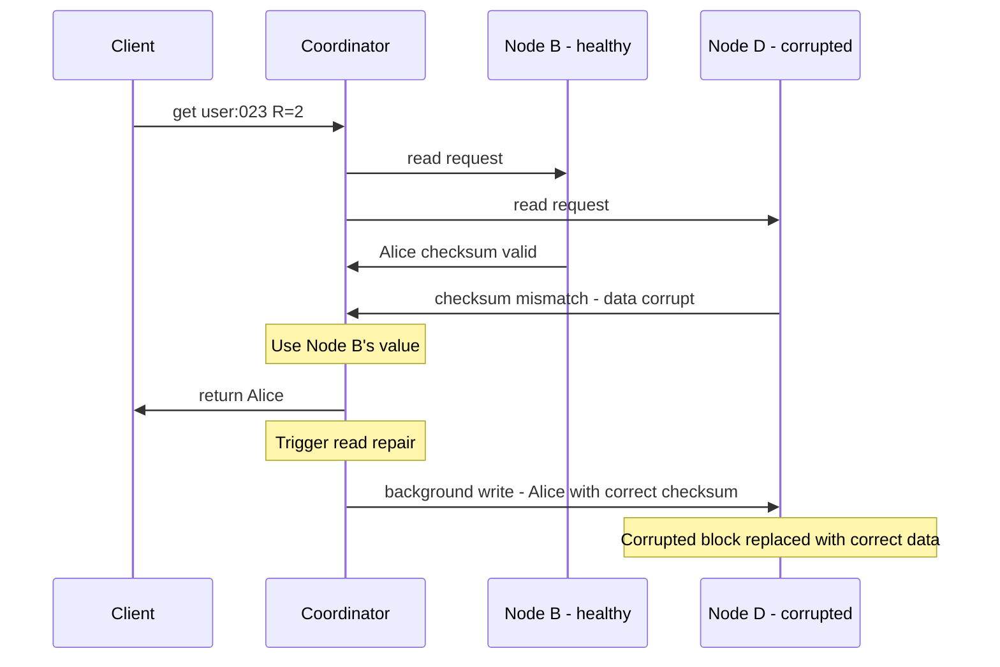

Silent corruption is the most dangerous disk failure because the node doesn't know it's broken. The data on disk has changed (bit flips, bad sectors), but the node reads it and serves it to clients as if everything is fine.

We need a way to verify that what we read from disk is exactly what was originally written. The solution: at write time, compute a **checksum** (a hash of the data) and store it alongside the data. At read time, recompute the checksum and compare.

### How it works — write time

When data is written to an SSTable, the system calculates a checksum for each block of data and stores it alongside:

```
Write time:
  Data block: contains keys "user:001" through "user:050"
  Checksum: SHA256(data block) = "abc123def456..."
  
  Stored on disk: [data block] [checksum: abc123def456...]
```

The checksum is calculated once at write time and never changes — SSTables are immutable, so the data should never change either.

### How it works — read time (healthy data)

```
Read: get("user:023")

  Step 1: Find the SSTable block containing "user:023"
  Step 2: Read the block from disk
  Step 3: Recalculate checksum of the block
  
  Stored checksum:      "abc123def456..."
  Recalculated checksum: "abc123def456..."
  
  Match? → YES → data is intact → binary search for "user:023" → return value
```

One extra hash computation per read — negligible CPU cost. The integrity of the data is verified before it's ever returned to a client.

### How it works — read time (corrupted data)

```
Read: get("user:023")

  Step 1: Find the SSTable block containing "user:023"
  Step 2: Read the block from disk
  Step 3: Recalculate checksum of the block

  Stored checksum:       "abc123def456..."
  Recalculated checksum: "f7d891bb2c03..."
  
  Match? → NO → DATA IS CORRUPTED → do NOT serve this to the client
```

The checksum catches the corruption before it reaches the client. Even a single bit flip in the data block will produce a completely different checksum — there's no way for corruption to sneak past.

---

## Recovery — Read Repair Handles It Naturally

Once corruption is detected, the node knows it can't serve this data. But the client is still waiting for a response. What happens next depends on the consistency level:

### Quorum read (R=2) — seamless recovery

The coordinator contacted two nodes. The corrupted node reports "I don't have valid data." The healthy node returns the correct value. The coordinator serves the client from the healthy node — the client never knows anything went wrong.



This is just **read repair** — the same mechanism we already use for stale replicas. The corrupted node behaves like a stale node — it doesn't have valid data, so the coordinator fixes it in the background. No new mechanism needed.

### Eventual consistency read (R=1) — hits the corrupted node

If the coordinator only contacts the corrupted node (R=1), it detects the checksum mismatch. It can't serve the corrupted data, so it has two options:

1. **Fail the read** — return an error to the client, who can retry (might hit a different node)
2. **Fallback to another replica** — the coordinator contacts a second node to get valid data

Option 2 is better for availability — the client gets correct data without retrying. The corrupted node still gets repaired in the background.

---

## Checksums at Multiple Levels

Checksums aren't just on SSTable data blocks. They're applied at multiple levels in the storage engine:

```
WAL entries     → each entry has a checksum
                  → detects corruption during crash recovery                        replay
                  → without this, replaying a corrupted WAL                          could write garbage into the memtable

SSTable blocks  → each block has a checksum
                  → detects corruption during reads
                  → this is the main protection against silent                      data corruption

SSTable metadata → the SSTable's index and Bloom filter have checksums
                   → detects corruption in the lookup structures themselves
```

If a WAL entry is corrupted, the node skips it during replay (that entry is lost, but the data exists on other replicas). If an SSTable block is corrupted, the node refuses to serve it and lets read repair fix it. If the Bloom filter is corrupted, the node rebuilds it from the SSTable data.

> [!tip] Interview framing
> "We use checksums at every level of the storage engine — WAL entries, SSTable data blocks, and SSTable metadata. On every read, the node recalculates the checksum and compares it with the stored value. If they don't match, the data is corrupted and won't be served. Recovery happens naturally through read repair — the corrupted node behaves like a stale replica. The coordinator gets correct data from a healthy node, returns it to the client, and repairs the corrupted node in the background. The client never sees corrupted data."
