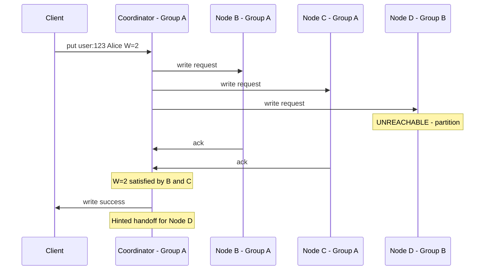
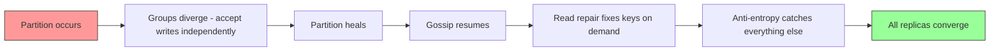

## Network Partition — Nodes Are Alive but Can't Talk

A network partition is fundamentally different from node failure or disk failure. Every node is alive, every disk is healthy — but a network switch or link fails, splitting the cluster into groups that can't communicate.

```
Network switch fails in the data center:

Group A: 700 nodes (can talk to each other)
Group B: 500 nodes (can talk to each other)

Group A ←✗→ Group B (cannot communicate)
```

Both groups are fully functional internally. Nodes within Group A can read, write, and gossip with each other. Same for Group B. But any request that needs a node in the other group will fail to reach it.

---

## What Happens to Writes During a Partition

A client connected to Group A sends `put("user:123", "Alice")`. The replica set for this key is Node B (Group A), Node C (Group A), and Node D (Group B).



W=2 is satisfied by Node B and Node C. The write succeeds. Node D is unreachable, so hinted handoff kicks in — exactly like a node failure. The client doesn't even know there's a partition.

---

## What Happens to Reads — The CAP Theorem Trade-off

Now flip it. A client connected to **Group B** sends `get("user:123")`. The replica set is still Node B (Group A), Node C (Group A), and Node D (Group B). The coordinator in Group B can only reach Node D.

### Strong consistency (R=2) — availability sacrificed

```
Coordinator in Group B asks for R=2:
  Node B (Group A) → unreachable
  Node C (Group A) → unreachable  
  Node D (Group B) → responds

  Only 1 response. Need 2. → ERROR returned to client.
```

The read fails. The client gets an error. But the system never returns wrong data — consistency is preserved at the cost of availability.

### Eventual consistency (R=1) — consistency sacrificed

```
Coordinator in Group B asks for R=1:
  Node D (Group B) → responds with whatever it has

  1 response. Need 1. → SUCCESS.
  But Node D may have missed recent writes that went to Group A.
  The value returned might be stale.
```

The read succeeds. The client gets a response — but it might be an old value. Availability is preserved at the cost of consistency.

---

## The CAP Theorem — Visualized in Our System

During a network partition, you **must** choose between consistency and availability. You can't have both. This is exactly why we made consistency **tunable per request** in our NFRs:

```
During a partition, the SAME KV store serves different trade-offs:

Banking app reading account balance:
  → get("balance:user123", R=2)
  → "I'd rather get an error than a wrong balance"
  → Request fails if quorum can't be reached
  → Consistency preserved ✓, Availability sacrificed ✗

Social media loading a feed:
  → get("feed:user456", R=1)
  → "I'd rather see a slightly stale feed than an error page"
  → Request succeeds even with one replica
  → Availability preserved ✓, Consistency sacrificed ✗
```

Both clients are hitting the same KV store, during the same partition, but getting different trade-offs based on their needs. This is the power of tunable consistency — the KV store doesn't pick a side. Each application decides per request.

---

## Writes During Partition — Both Sides Accept Writes

Here's where it gets interesting. During the partition, both groups can accept writes for the same key:

```
Group A client: put("user:123", "Alice")  → writes to Node B and Node C
Group B client: put("user:123", "Bob")    → writes to Node D and Node E (hinted)

Both writes succeed (W=2 in their respective groups).
Now the replicas have conflicting values:
  Node B: "Alice"
  Node C: "Alice"
  Node D: "Bob"
```

This is a **conflict** — the same key has different values on different replicas. During the partition, there's no way to prevent this. The writes are valid in their own groups.

This is exactly the conflict resolution problem we covered in the previous deep dive. When the partition heals, **LWW** resolves the conflict — the value with the higher timestamp wins.

---

## Partition Heals — Self-Healing Kicks In

When the network is restored and both groups can communicate again, the system **self-heals** using the same three mechanisms we've used throughout:

```
Partition heals:

  1. Gossip resumes
     → Nodes exchange membership tables across groups
     → Everyone updates their view: "all nodes are reachable again"

  2. Read repair
     → Reads start hitting nodes from both groups again
     → Coordinator discovers disagreements (e.g., "Alice" vs "Bob")
     → LWW picks the winner, repairs the stale node

  3. Anti-entropy
     → Background Merkle tree comparison catches every key that diverged
     → All differences resolved, even keys that are never read
```

No manual intervention needed. The system converges automatically. Given enough time after the partition heals, all replicas will agree — that's what "eventually consistent" means.



> [!tip] Interview framing
> "During a network partition, our tunable consistency lets each application choose its own trade-off. Strong consistency reads (R=2) will fail if quorum can't be reached — we sacrifice availability to guarantee correctness. Eventual consistency reads (R=1) will succeed with whatever replica is reachable — we sacrifice consistency for availability. This is the CAP theorem in practice, and tunable consistency means we don't pick one side globally. When the partition heals, the system self-heals: gossip resumes, read repair fixes stale data on reads, and anti-entropy catches everything else in the background. Conflicts from both sides accepting writes are resolved by LWW."
