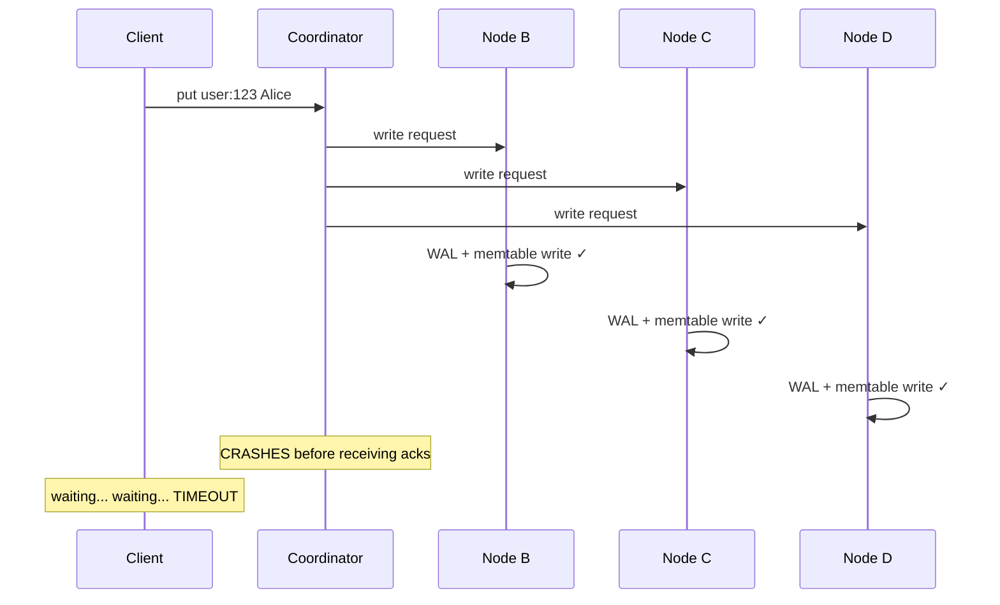

## Coordinator Failure — What Happens to In-Flight Requests

In our leaderless architecture, any node can be a coordinator. The coordinator receives the client's request, hashes the key, and forwards it to the correct replica nodes. But what if the coordinator **crashes mid-request** — after forwarding the write but before responding to the client?

---

## The Timeline — Write Succeeds but Client Doesn't Know

A client sends `put("user:123", "Alice")` through a coordinator. The coordinator forwards it to Node B, Node C, and Node D. All three receive it and write it to their WAL and memtable. Then the coordinator crashes.



The data is safely on all three replicas. It's durable. But the coordinator never lived long enough to collect the acks and tell the client "success." From the client's perspective, the request disappeared into a black hole.

---

## What the Client Sees — A Timeout

The client sent a request and never got a response. Eventually the connection times out. The client doesn't know what happened:

```
Possible outcomes from the client's perspective:
  1. Coordinator crashed BEFORE sending to any replica → write never happened
  2. Coordinator crashed AFTER sending to some replicas → partial write
  3. Coordinator crashed AFTER all replicas wrote → write fully succeeded

The client can't tell which one happened. All it knows is: timeout.
```

The correct response to a timeout is to **retry** — send the same request to a different coordinator. In our leaderless architecture, any other node can act as coordinator, so the client just picks another one.

```
Client: put("user:123", "Alice") → Coordinator A → TIMEOUT
Client: put("user:123", "Alice") → Coordinator B → SUCCESS ✓
```

---

## Why Retries Are Safe — Idempotency

But what if the first attempt actually succeeded? The data is already on all three replicas. Now the retry writes it again. Is that a problem?

No — because `put` is **idempotent**. Writing `put("user:123", "Alice")` twice produces the same result as writing it once. The second write just overwrites with the identical value. No harm done.

```
First attempt:   put("user:123", "Alice") → all replicas write it ✓ → coordinator dies
Retry:           put("user:123", "Alice") → all replicas write it again ✓ → same data

Result: "user:123" = "Alice" — same as if it was written once.
```

The same applies to deletes:

```
First attempt:   delete("user:123") → tombstone written → coordinator dies
Retry:           delete("user:123") → same tombstone written again → no harm

Result: "user:123" is deleted — same as if the delete happened once.
```

Both `put` and `delete` in our KV store are naturally idempotent. The client can retry on any timeout without worrying about corrupting data.

---

## When Idempotency Breaks — The Application's Problem

Our KV store does simple `put(key, value)` — it stores whatever bytes you give it. But what if the application is using the KV store to implement a **counter**?

```
Application logic: increment likes counter
  Step 1: get("counter:likes") → returns 5
  Step 2: put("counter:likes", 6)  → coordinator dies → timeout

Client retries:
  Step 1: get("counter:likes") → returns 6 (first attempt actually succeeded!)
  Step 2: put("counter:likes", 7)  → success

Result: counter went from 5 → 6 → 7 instead of 5 → 6. Double-counted!
```

The KV store did exactly what it was told — it stored the value 6, then stored the value 7. It doesn't know the application intended to increment only once. This is the **application's responsibility** to handle, not the KV store's.

Common solutions at the application layer:
- **Request ID deduplication** — attach a unique ID to each request. If the same ID arrives twice, the second one is ignored.
- **Use CRDTs** — a counter CRDT can handle duplicate increments correctly.
- **Design for idempotency** — structure operations so that repeating them is safe (e.g., "set likes to 6" instead of "increment likes by 1").

---

## Why Coordinator Failure Is the Simplest Failure

Coordinator failure is actually the least dangerous failure in our system because everything works in our favor:

```
1. No special node
   → Any node can be a coordinator (leaderless)
   → Client just picks another node and retries

2. Data may already be durable
   → Replicas write to WAL before acking
   → Even if coordinator dies, the data might be safely on disk

3. Retries are safe
   → put and delete are idempotent
   → Writing the same data twice causes no harm

4. No state lost on the coordinator
   → The coordinator doesn't store anything permanently
   → It's just a proxy that forwards requests
   → A new coordinator can handle the retry with no context needed
```

> [!tip] Interview framing
> "If the coordinator crashes mid-request, the client sees a timeout. It doesn't know if the write succeeded or not, so it retries on a different coordinator — any node can coordinate in our leaderless architecture. Retries are safe because put and delete are naturally idempotent — writing the same value twice produces the same result. The coordinator holds no permanent state, so losing it loses nothing. For non-idempotent operations like counter increments, the application is responsible for deduplication, typically using unique request IDs."
