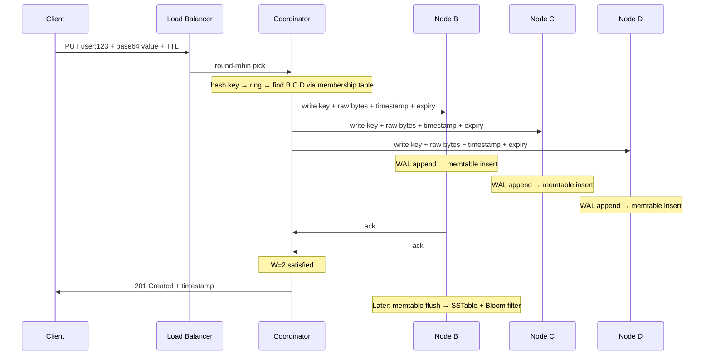
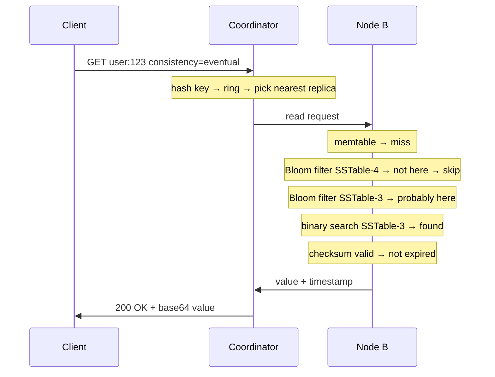
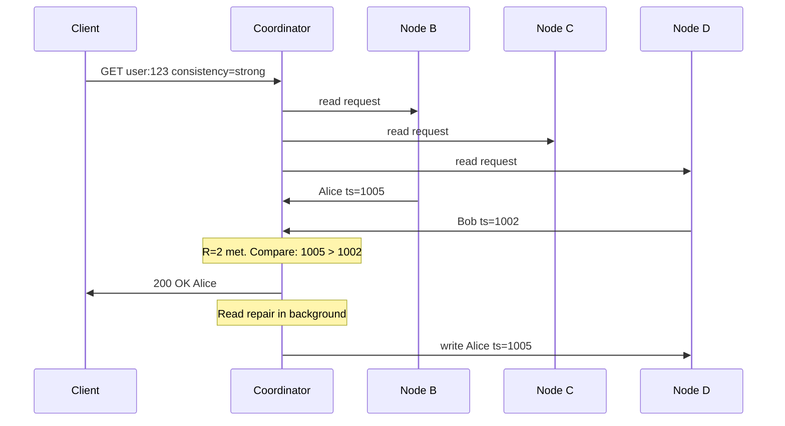

## Final Architecture — Everything Connected

This is the complete architecture reflecting every deep dive decision. The base design was: client → LB → coordinator → hash → replicas → quorum → respond. Now every component has depth behind it.

```mermaid
flowchart TD
    Client([Client])
    LB[Load Balancer]

    subgraph Cluster - 1200 Nodes
        subgraph Any Node = Coordinator
            Coord[Coordinator Logic]
            Ring[Consistent Hash Ring - 256 vnodes per node]
            Membership[Membership Table - via gossip]
        end

        subgraph Replica Set N=3
            subgraph Node B
                BF_B[Bloom Filters - in memory]
                MT_B[Memtable - sorted in memory]
                WAL_B[WAL - append only]
                SST_B[SSTables - sorted immutable files]
            end
            subgraph Node C
                BF_C[Bloom Filters]
                MT_C[Memtable]
                WAL_C[WAL]
                SST_C[SSTables]
            end
            subgraph Node D
                BF_D[Bloom Filters]
                MT_D[Memtable]
                WAL_D[WAL]
                SST_D[SSTables]
            end
        end
    end

    Client --> LB
    LB -->|round-robin| Coord
    Coord -->|hash key + lookup ring| Ring
    Ring -->|find replica set| Membership
    Coord --> MT_B
    Coord --> MT_C
    Coord --> MT_D
```

---

## Complete Write Path — End to End

Every decision we made is in this flow. Nothing is hand-waved.

```
1. Client sends:
   POST /api/v1/item
   Body: { "key": "user:123", "value": "base64(raw bytes)", "ttl": 86400 }

2. Load balancer picks any healthy node (round-robin) → Node A

3. Node A becomes the coordinator:
   a. Decodes base64 value back to raw bytes
   b. Hashes "user:123" → ring position 4500
   c. Looks up local membership table (populated by gossip)
   d. Walks the ring → finds Node B, C, D own this range (N=3, distinct physical nodes via vnodes)
   e. Checks membership table → all three are alive

4. Coordinator forwards write to Node B, Node C, Node D
   Each receiving node:
   a. Append to WAL on disk (sequential write — crash recovery)
   b. Insert into memtable (in-memory sorted tree — red-black tree or skip list)
   c. Store metadata: key + value + timestamp + expiry (current time + TTL)
   d. Ack back to coordinator

5. Coordinator waits for W=2 acks (quorum)
   → 2 of 3 nodes confirmed → write is durable

6. If Node D is down:
   → Coordinator writes to Node E (next on ring) with hint "belongs to Node D"
   → Hinted handoff — Node E forwards to Node D when it recovers
   → Hint expires after ~3 hours if Node D stays down

7. Coordinator responds to client:
   201 Created { "key": "user:123", "timestamp": 1713400000000 }

8. Background (on each replica node, independently):
   → Memtable fills up (32-64 MB) → flush to SSTable (sorted, immutable, sequential write)
   → Old WAL deleted, fresh memtable + new WAL created
   → Bloom filter built for the new SSTable
   → Compaction merges SSTables in background (size-tiered or leveled)
```



---

## Complete Read Path — Eventual Consistency (R=1)

Fastest path. One network hop to one replica. No comparison, no repair.

```
1. Client sends:
   GET /api/v1/item?key=user:123&consistency=eventual

2. Load balancer → Node A becomes coordinator

3. Coordinator hashes key → finds Node B, C, D on ring

4. Coordinator picks the NEAREST or least-loaded replica (say Node B)
   → Sends read to Node B only (R=1)

5. Node B read path:
   a. Check memtable → if found and not expired → return
   b. Check Bloom filter for SSTable-4 (newest)
      → "definitely not here" → SKIP
   c. Check Bloom filter for SSTable-3
      → "probably here" → binary search SSTable-3
      → Verify checksum → data intact
      → Check expiry: now < expiry → NOT expired
      → FOUND: return value + timestamp
   d. If expired: return "not found"

6. Coordinator responds:
   200 OK { "key": "user:123", "value": "base64(raw bytes)", "timestamp": ... }
```



### Making eventual consistency reads even faster

At R=1, the read already only hits one node. But we can make it faster:

**1. Nearest replica routing** — instead of picking a random replica, the coordinator picks the one with the **lowest network latency**. If the coordinator itself is one of the replicas, it reads from its own local storage — zero network hops.

```
Replica set: Node B, Node C, Node D
Coordinator is Node B

R=1 read → Node B reads from its OWN local storage
  → No network hop at all
  → Just memtable + Bloom filter + SSTable lookup
  → Sub-millisecond if data is in memtable or OS page cache
```

This happens naturally in our system — the load balancer can route the request to any node, and with 256 vnodes per node, every node owns a portion of the key space. There's a good chance the coordinator itself is one of the replicas.

**2. OS page cache** — frequently read SSTables stay in the operating system's page cache (RAM). The binary search in the SSTable doesn't actually hit the physical disk — it reads from cached pages in memory. At 500 reads/sec per node, hot data stays warm in the page cache.

```
Cold read (first time):  memtable miss → Bloom filter → SSTable from disk → 1-5ms
Warm read (cached):      memtable miss → Bloom filter → SSTable from page cache → <1ms
Hot read (in memtable):  memtable hit → <0.1ms
```

**3. Row cache (optional)** — a dedicated in-memory cache for the most frequently read keys. Before even checking the memtable, check the row cache. If the key is there, return immediately. Cassandra supports this as an opt-in feature per table.

```
With row cache:
  get("user:123")
    → Row cache: HIT → return immediately (microseconds)
    → Skip memtable, Bloom filters, SSTables entirely

Without row cache:
  get("user:123")
    → Memtable → Bloom filters → SSTable → disk read (milliseconds)
```

Row cache is only useful for **read-heavy keys** that are accessed repeatedly. For keys that are read once and never again, the cache entry just wastes memory.

```
Eventual consistency read performance stack:

  Row cache (if enabled)     → microseconds (pure memory lookup)
  Memtable hit               → <0.1ms (in-memory sorted tree)
  SSTable in page cache      → <1ms (OS-level caching)
  SSTable from disk          → 1-5ms (Bloom filter skips most SSTables)
  Coordinator is a replica   → zero network hop (reads local storage)
```

---

## Complete Read Path — Strong Consistency (R=2)

Slower but guarantees the latest value. Coordinator contacts multiple replicas and compares.

```
1. Client sends:
   GET /api/v1/item?key=user:123&consistency=strong

2. Coordinator hashes key → finds Node B, C, D on ring

3. Coordinator sends read to ALL THREE: Node B, C, D
   → Waits for R=2 responses (quorum)

4. Two responses come back:
   Node B: "Alice", timestamp=1005, checksum valid
   Node C: "Alice", timestamp=1005, checksum valid

   Both agree → return "Alice"

   OR:
   Node B: "Alice", timestamp=1005
   Node D: "Bob",   timestamp=1002

   Disagree → pick higher timestamp → return "Alice"
   → Trigger read repair: send "Alice" (ts=1005) to Node D in background

5. Coordinator responds:
   200 OK { "key": "user:123", "value": "base64...", "timestamp": 1005 }
```



### Why strong consistency is slower

```
Eventual (R=1):  1 network hop → 1 response → done
Strong (R=2):    3 network hops → wait for 2 responses → compare → done

The difference:
  → Extra network round trips (must wait for slowest of 2 responses)
  → Comparison logic at coordinator
  → Potential read repair write in background

Typical latency:
  Eventual: 1-5ms
  Strong:   5-20ms
```

The client chooses per request. Same KV store, same data, same nodes — just a different consistency parameter in the request.

---

## Complete Delete Path

Delete is just a write — a write of a tombstone. Same replication, same quorum, same flow.

```
1. Client sends: DELETE /api/v1/item?key=user:123

2. Coordinator hashes key → finds Node B, C, D

3. Coordinator sends TOMBSTONE write to all three:
   Key: "user:123"
   Value: TOMBSTONE marker
   Timestamp: current time
   
4. Each node: WAL append → memtable insert (tombstone entry)

5. W=2 acks → respond 200 OK { "deleted": true }

6. Future reads find the tombstone → return 404

7. Background:
   → Anti-entropy propagates tombstone to any replica that missed it
   → Tombstone grace period: 10 days
   → After grace period: compaction removes tombstone from disk
```

---

## Background Processes — Always Running

These processes run continuously on every node, independent of client requests:

```
Process              Frequency        Purpose
───────              ─────────        ───────
Gossip               Every 1 second   Exchange membership tables with random neighbor
                                      Heartbeat counter increment
                                      Failure detection (frozen heartbeats)

Compaction           Continuous       Merge SSTables (size-tiered or leveled)
                                      Drop expired entries (TTL cleanup)
                                      Remove tombstones past grace period
                                      Reclaim disk space

Anti-entropy         Every few hours  Merkle tree comparison with replica partners
                                      Fix ALL diverged keys (not just read ones)
                                      Propagate tombstones

Memtable flush       On threshold     When memtable hits 32-64 MB
                                      Flush to SSTable + build Bloom filter
                                      Delete old WAL, create fresh ones

Hinted handoff       On node recovery Forward stored hints to recovered node
```

---

## Fault Tolerance Summary — What Happens When Things Break

```
Failure                  What happens                         Recovery
───────                  ────────────                         ────────
Node dies                Quorum still met (W=2 of N=3)        Hinted handoff → read repair → anti-entropy
                         Hinted handoff on another node

Node down > 10 days      Tombstone grace period exceeded       Full data rebuild (treat as new node)

Disk corruption          Checksum detects bad data             Read repair from healthy replica
                         Node refuses to serve corrupt data

Disk full                Writes fail, reads still work         Monitoring + reserved space for compaction
                         Compaction death spiral risk

Network partition        Group A and B can't communicate       Tunable consistency per request
                         Strong reads may fail (R=2)           Self-heals when partition resolves
                         Eventual reads succeed (R=1)          Gossip + read repair + anti-entropy

Coordinator dies         Client sees timeout                   Retry on different coordinator
                         Data may already be on replicas       Safe because put/delete are idempotent

Traffic spike            All nodes overloaded                  Rate limiting + circuit breakers
                                                              Exponential backoff + jitter on retries

Concurrent writes        Same key written by two clients       LWW (highest timestamp wins)
                                                              Optional: siblings for merge use cases
```

---

## Decisions Made and Why

```
Decision                      Why
────────                      ───
Leaderless architecture       No SPOF, any node coordinates, tunable consistency on both reads AND writes

Consistent hashing + vnodes   Even load distribution, graceful scaling, node failure spreads load thinly

Quorum (W=2, R=2, N=3)       Strong consistency when W+R>N, eventual when R=1

LSM Tree storage engine       Sequential writes, handles any read/write ratio, general-purpose

Size-tiered compaction        Default for write-heavy. Leveled available for read-heavy tables

Bloom filters                 Skip irrelevant SSTables, critical for non-existent key lookups

Gossip protocol               Decentralised membership, no central registry, O(log n) propagation

Heartbeat counters            Failure detection without synchronized clocks

LWW conflict resolution       Simple, deterministic, covers 95% of use cases

Tombstones for deletes        Prevent resurrection during anti-entropy

TTL as entry metadata         Self-describing expiry, no tombstone needed, lazy cleanup in compaction

Checksums at every level      Detect silent disk corruption before serving bad data

Rack-aware replica placement  Prevent correlated failures from killing all replicas
```

> [!tip] Interview framing
> "The final architecture is a leaderless KV store with 1,200 nodes. Any node can coordinate any request. Consistent hashing with 256 vnodes per node distributes data evenly. Writes go to N=3 replicas with W=2 quorum — each node appends to a WAL and inserts into an in-memory memtable, which periodically flushes to sorted SSTables on disk. Reads are tunable: R=1 for eventual consistency (fast, single hop, can read from local storage if coordinator is a replica), R=2 for strong consistency (quorum, triggers read repair on stale nodes). Bloom filters skip irrelevant SSTables. Gossip protocol handles membership and failure detection. Three repair layers — hinted handoff, read repair, anti-entropy — guarantee eventual convergence. LWW resolves conflicts. Tombstones prevent resurrection. Rate limiting, circuit breakers, and exponential backoff protect against cascading failures."
