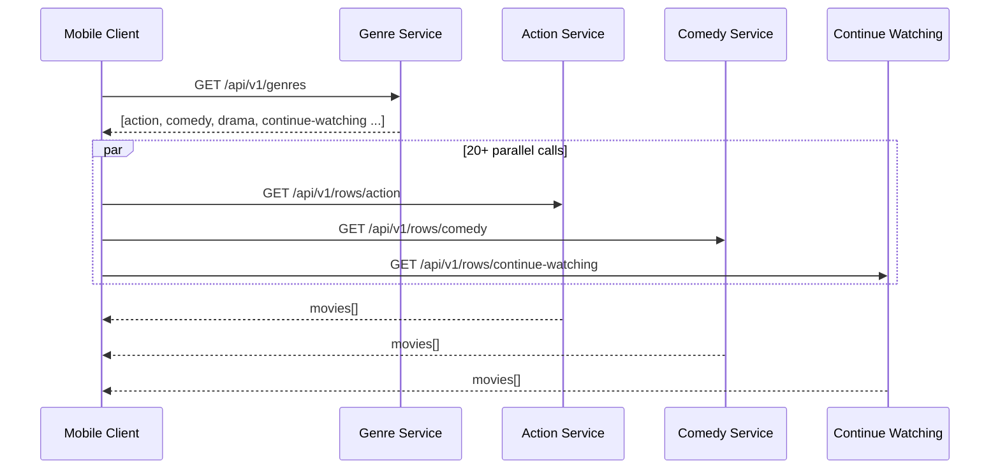
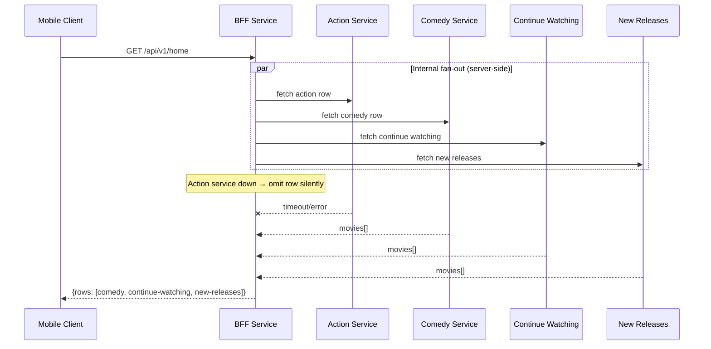
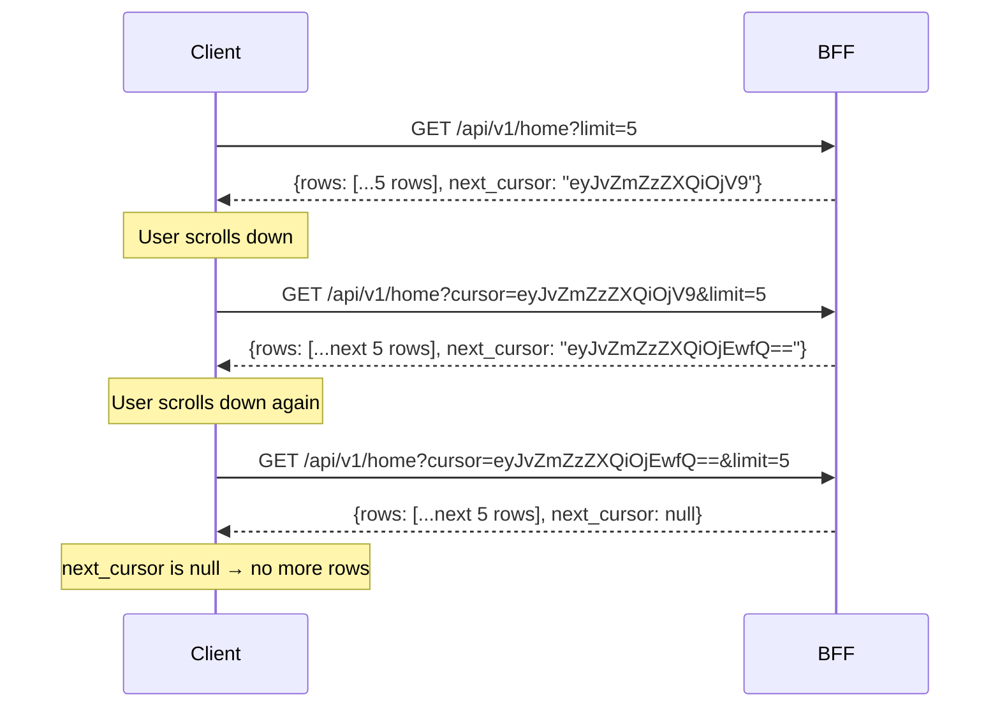
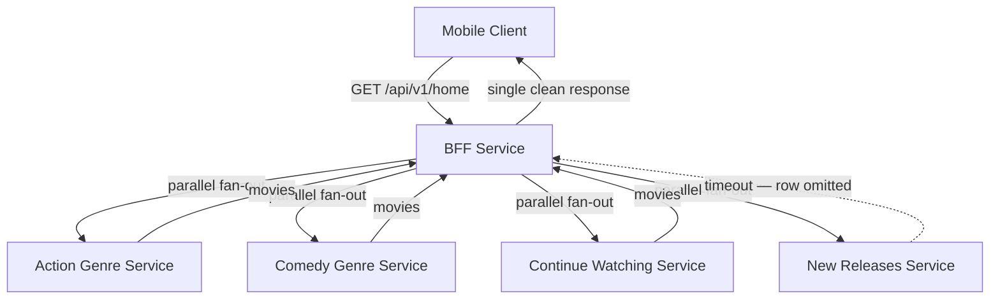

# API Design — Home Feed

## The Problem

When a user opens Netflix, they see a home page made up of multiple rows — "Top 10 in Action", "New Releases", "Continue Watching", "Because you watched Squid Game." Each row is a horizontally scrollable list of titles.

The question is: how does the client get this data? Specifically — what does the API look like, and who is responsible for handling failures when one of those rows can't be loaded?

This sounds simple. It isn't. The decision you make here has direct consequences on mobile performance, failure isolation, and how much logic lives on the client vs the server.

---

## Two Approaches

### Option A — Client drives everything

The client has no idea which rows to show until it asks. So it first calls a genres endpoint, then fires one call per row in parallel.



**Round trips before any content is visible: 2.**
The user opens Netflix and sees a blank screen while the genres list loads. Then waits again while 20+ parallel calls come back.

**The failure isolation argument for Option A** — if the Action service goes down, the client just skips rendering that row. One row failing cannot take down another. This is the **bulkhead pattern**.

**Why Option A still loses** — a Netflix home page has 20+ rows. A mobile client on a 3G connection making 20 parallel HTTP requests is brutal. Each request carries its own TCP handshake, its own headers, its own latency. Even in parallel, these requests compete for the same limited bandwidth. Plus the genres list adds an entire extra round trip before any content loads at all.

| | Option A |
|---|---|
| Round trips before content | 2 (genres list + row calls) |
| HTTP calls total | 1 + 20+ |
| Failure handling | Client |
| Mobile performance | Poor |

---

### Option B — BFF aggregates everything server-side

One call from the client. A **BFF (Backend for Frontend)** receives it, fans out internally to all genre services in parallel, handles failures silently, and returns one clean response.



**Round trips before content is visible: 1.**

The bulkhead isolation still exists — it has moved from between the client and the backend to **inside the backend**, between the BFF and the individual genre services. The client is completely insulated from any of this.

| | Option A | Option B |
|---|---|---|
| Round trips before content | 2 | 1 |
| HTTP calls from client | 1 + 20+ | 1 |
| Failure handling | Client | BFF (server) |
| Mobile performance | Poor | Good |
| Row ordering logic | Client | BFF |
| Failure isolation | ✅ Yes | ✅ Yes (server-side) |

**Option B wins.** One HTTP call from the client, failure isolation inside the BFF, row ordering controlled server-side.

---

## Pagination — The Right Way to Scroll

The home feed is infinite scroll. As the user scrolls down, more rows load. Before deciding *how* to paginate, it's worth asking *why* we paginate at all.

Netflix has hundreds of genre rows. Returning all of them in one response would be a massive payload — slow to transfer, slow to parse, most of it never seen. We need to load rows progressively as the user scrolls.

**Why not offset pagination?**

The instinct is `page=1`, `page=2`, `page=3`. This is wrong at scale for two reasons.

```
Offset pagination problem:

Page 1 loads rows 1-10.
Netflix adds 3 new rows to the catalog.
Page 2 now loads rows 11-20 — but rows 11-13 are the NEW rows.
User sees rows 11-13 twice, and original rows 11-13 are skipped entirely.
```

At Netflix scale, new content is added constantly. Offset pagination produces duplicates and gaps.

**Cursor pagination solves this.**

The server returns an opaque `next_cursor` token. The client knows nothing about what's inside it — it's a pointer to an exact position in the dataset, encoded as a base64 string. On the next scroll, the client passes it back:



The cursor is stable under concurrent writes. New rows being added to the catalog do not shift its position.

> [!danger] Never name the cursor "page"
> `page=3` implies the client knows what page it's on and can jump to any page. A cursor is opaque — the client never constructs it, never interprets it, never increments it. Calling it `page` leads engineers to treat it like an offset, which breaks the entire purpose of cursor pagination.

---

## Final Endpoint

```
GET /api/v1/home

Headers:
  Authorization: Bearer <JWT>

Query Parameters:
  cursor   — opaque token from previous response (omit on first request)
  limit    — number of rows to return (default: 10)

Response 200 OK:
{
  "rows": [
    {
      "genre": "action",
      "display_title": "Top 10 in Action",
      "movies": [
        {
          "movie_id": "m_123",
          "title": "Extraction 2",
          "thumbnail_url": "https://cdn.netflix.com/...",
          "duration_seconds": 7200,
          "match_percentage": 95
        }
      ],
      "next_cursor": "eyJnZW5yZSI6ImFjdGlvbiJ9"
    }
  ],
  "next_cursor": "eyJwYWdlIjoyfQ=="
}
```

> [!info] Two levels of pagination
> There are two cursors in this response. The outer `next_cursor` loads more rows as the user scrolls vertically. Each row also carries its own `next_cursor` for loading more movies within that row as the user scrolls horizontally. They are completely independent.

> [!important] JWT in the header, never the URL
> The JWT must go in the `Authorization: Bearer` header. Query string parameters are logged by every proxy, CDN, and load balancer between the client and server. A JWT in the URL is a credential sitting in every access log in plain text.

---

## Architecture Summary


