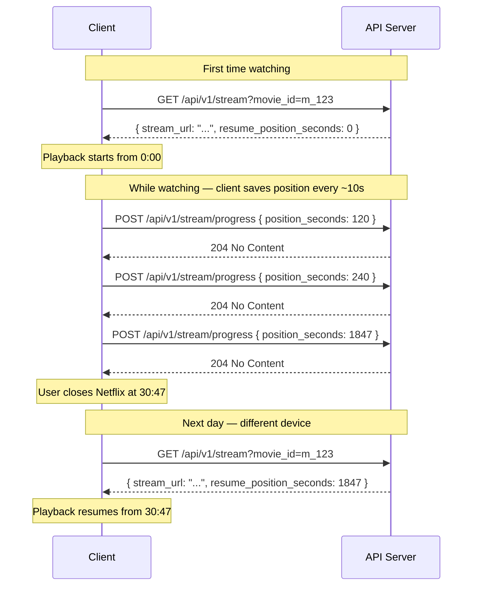
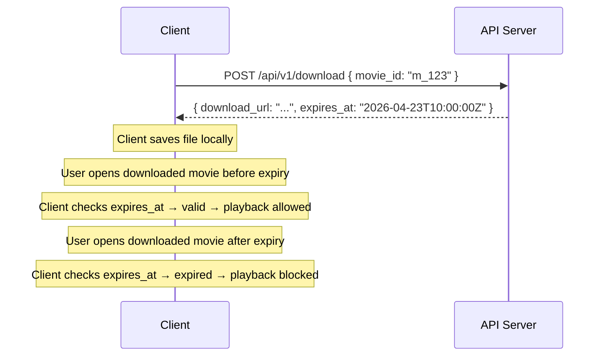

# API Design — Stream, Progress, and Download

## Starting Playback

When a user clicks **Play** on a movie, the client sends a single request:

```
GET /api/v1/stream?movie_id=m_123

Headers:
  Authorization: Bearer <JWT>

Response 200 OK:
{
  "stream_url": "https://...",
  "resume_position_seconds": 0
}
```

The server does **not** send video data directly. That would mean holding a gigabyte-scale connection open for every concurrent viewer — at Netflix scale with 200M+ subscribers, the API servers would collapse instantly. Instead, the server returns a URL pointing to where the video lives. The client uses that URL to fetch the actual video separately. How that URL is generated and what infrastructure backs it is a deep dive concern — at the API layer, the contract is just: *here is a URL, here is where to start.*

**`resume_position_seconds`** tells the client where to begin playback. On a first watch, this comes back as `0` — start from the beginning. On a returning watch, it comes back as however far the user got last time. The client seeks directly to that position — that's the "Continue Watching from 30:47" you see on Netflix.

---

## The Full Playback Loop

Here is the complete flow from first click to resuming on a different device.



---

## Saving Position — The Progress Endpoint

While you're watching, the client silently fires a progress update every few seconds in the background. The user never sees this — it just happens.

```
POST /api/v1/stream/progress

Headers:
  Authorization: Bearer <JWT>

Body:
{
  "movie_id": "m_123",
  "position_seconds": 1847
}

Response 204 No Content
```

**204** — there is nothing meaningful to return. The server saved the position and the client carries on. The reason this is a separate endpoint rather than bundled into the stream response is timing: the client doesn't know when the user will stop watching, so it has to keep reporting position continuously throughout playback.

> [!important] Why periodic updates and not just on-close?
> If the client only saved position when the app closed, a crash or lost connection would lose the user's place entirely. Saving every ~10 seconds means the worst case is losing 10 seconds of progress — acceptable.

---

## Downloading for Offline Viewing

Netflix lets users download content to watch without internet. The download endpoint looks similar to the stream endpoint — the client is still asking for a URL pointing to the video. The difference is what the client does with it: instead of opening a player, it saves the file to local storage.

```
POST /api/v1/download

Headers:
  Authorization: Bearer <JWT>

Body:
{
  "movie_id": "m_123"
}

Response 200 OK:
{
  "download_url": "https://...",
  "expires_at": "2026-04-23T10:00:00Z"
}
```

**`expires_at`** is not optional — it is a legal requirement. Netflix licenses content from studios. That license has an expiry window. When `expires_at` passes, the downloaded file must become unplayable. The client checks this timestamp before allowing offline playback.



> [!danger] Download ≠ permanent ownership
> The file on the user's device is not theirs forever. Once `expires_at` passes, the client must block playback. This is enforced client-side using the timestamp returned by the server — there is no second server call at playback time to check validity.

---

## Full API Surface

| Endpoint | Method | Purpose |
|---|---|---|
| `/api/v1/home` | GET | Home feed — paginated genre rows |
| `/api/v1/stream` | GET | Start or resume playback — returns stream URL and position |
| `/api/v1/stream/progress` | POST | Save current playback position every ~10 seconds |
| `/api/v1/download` | POST | Get a time-limited download URL for offline viewing |
