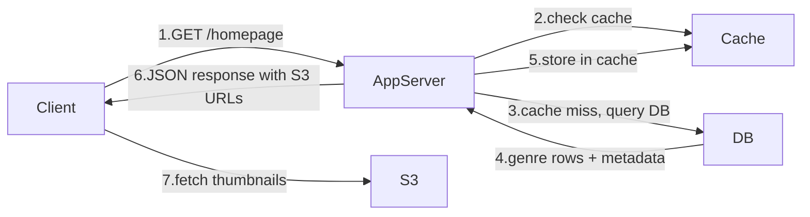
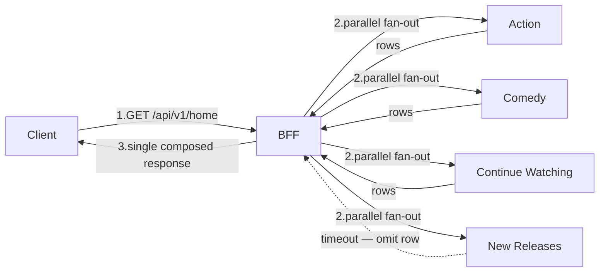
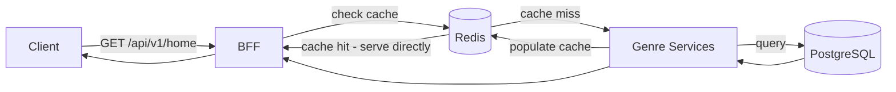

# Base Architecture — Browse & Homepage

When a user opens Netflix, they see a homepage made up of genre rows — Trending Now, Action, Comedy, Continue Watching — each showing roughly 10 titles with thumbnails. Every row is a separate slice of data. Action rows come from an Action service. Continue Watching comes from a service that knows this user's watch history. New Releases comes from a catalog service.

The question the base architecture has to answer is: who assembles all of this? How does the client get a fully composed homepage in one shot?

---

## Naive Approach — One App Server Does Everything

The first instinct is a single app server that the client calls directly. The app server handles caching, queries the database, and returns the full homepage response.



> [!info] What the DB stores
> Movie ID, title, description, cast, genre, S3 thumbnail URL — roughly 1 KB per title. No video bytes anywhere near the DB.

This works at toy scale. It breaks for two reasons.

---

## Problem 1 — One Server Cannot Know Everything

A Netflix homepage has 20+ genre rows. Each row is owned by a different internal service — Action, Comedy, Continue Watching, New Releases, Top 10 by Country, and so on. A single app server would have to know about and directly query every one of those services. Every time Netflix adds a new row type, the app server has to be updated. It becomes a monolith — every change to any genre service requires a change to the one central server.

---

## Problem 2 — One Service Failing Takes Down the Whole Page

Say the Action genre service crashes. In the naive single-server model, the app server is waiting for Action to respond. It waits until it times out — say 30 seconds. Meanwhile, the client sees a blank loading screen. Comedy was ready in 50ms. Continue Watching was ready in 60ms. But the user sees nothing because the single app server is blocked waiting on Action.

One service going down holds the entire homepage hostage.

---

## The Fix — BFF (Backend for Frontend)

The solution is a **BFF — Backend for Frontend**. Instead of a single app server that does everything, the BFF is a dedicated aggregation layer. Its only job is to receive one request from the client, fan out to all the genre services in parallel internally, handle any failures silently, and return one clean response.



The client makes exactly **one HTTP call**. The BFF handles all the fan-out internally, on fast server-to-server connections. If New Releases times out, the BFF omits that row silently and returns everything else. The client gets 19 rows instead of 20 — it never sees an error, never stalls, never shows a spinner waiting for one broken service.

> [!info] Why "Backend for Frontend"
> The BFF is shaped around what the client needs — one call, one composed response. It is not a general-purpose backend. It exists specifically to translate the client's single request into the multiple internal calls the system actually requires. Different client types (mobile, TV, web) can have separate BFFs optimised for their specific payload shapes.

---

## Adding a Cache Layer

Genre rows change infrequently — a new title gets added to the catalogue a few times a week at most. There is no reason for the BFF to fan out to genre services on every single request from 150M DAU. A cache layer sits between the BFF and the genre services.



The genre services check Redis before touching the database. On a hit, the row comes back in under 1ms — the DB is never contacted. On a miss, the genre service queries PostgreSQL, stores the result in Redis with a TTL, and returns it. Every subsequent request until TTL expiry comes straight from Redis.

At 150M DAU with a warm cache, the database sees a tiny fraction of total traffic — only the occasional cache miss, not every homepage load.

---

## What This Looks Like End to End

```
User opens Netflix

1. Client  → BFF: GET /api/v1/home?limit=10
2. BFF     → Redis: check action_row, comedy_row, continue_watching, new_releases (all parallel)
3. Redis   → BFF: cache hits for most rows
4. BFF     → Genre Services: fetch any rows that missed cache
5. Genre   → PostgreSQL: query on cache miss
6. Genre   → Redis: populate cache for next request
7. BFF     → Client: { rows: [action, comedy, continue_watching, ...], next_cursor: "..." }

Total round trips to client: 1
DB queries: 0 on a warm cache, 1 per missed row on cold start
```

> [!important] Failure isolation moved server-side
> In a naive client-driven approach, the client would make 20+ calls and skip rendering whatever failed. The BFF approach achieves the same failure isolation but keeps it entirely server-side. The client makes one call and always gets one clean response — whether 20 rows came back or 17.

> [!tip] What comes next
> The deep dives cover how the cache handles a 30M-user spike on Squid Game release night (Peak Traffic), what happens when Redis itself goes down (Fault Isolation), and the exact API shape of the home feed endpoint with cursor pagination (API Design).
