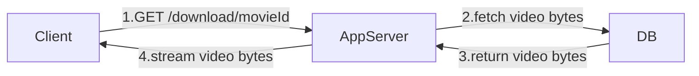
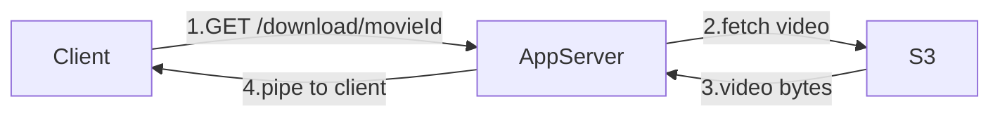
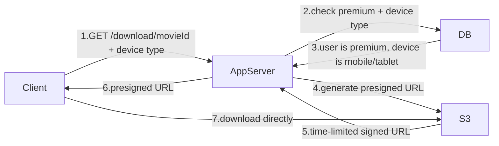

# Base Architecture — Download Flow

> [!important] DRM — The constraint that shapes everything
> Downloaded files are encrypted. The Netflix app saves them into its own private sandbox — not your phone's file manager. The decryption key is held by Netflix. When the 30-day expiry hits, Netflix stops providing the key. The file is still on your device but completely unreadable — like a locked box with no key. This is called **DRM (Digital Rights Management)**. In an interview, one line is enough: *"Downloaded content is DRM-encrypted so it's unplayable outside the Netflix app even after the file lands on the device."*

---

## Bad Approach 1 — Store Video in DB

The first instinct might be to treat video like any other data — store it in the database and serve it when the user requests it.



> [!danger] Why this fails
> Databases are built for structured, indexed, queryable data — not binary blobs. Storing a 20GB file as a DB row kills query performance, inflates backup sizes, and slows down replication for the entire DB. Every other query on the same DB slows down because the DB is busy reading massive binary objects off disk.

---

## Bad Approach 2 — Store in S3, Serve Through App Server

Okay so video bytes move out of the DB and into S3 where they belong. But the app server still fetches the file from S3 and pipes it to the client.



This feels better but the app server is now a pipe for every single video byte. Let's put numbers to it:

```
4K download speed      = 25 Mbps per user
App server NIC         = 10 Gbps = 10,000 Mbps

Max concurrent users   = 10,000 / 25 = 400 users
```

The 401st user gets a degraded or failed download. And this same NIC is supposed to be handling homepage loads, search requests, and auth for millions of users simultaneously. Video traffic completely starves every other request on the server.

> [!danger] Why this fails
> A standard 10 Gbps NIC saturates at just 400 concurrent 4K downloads. At Netflix scale of 20M concurrent users you would need 50,000 app server instances just to pipe video bytes — and none of them could handle any other traffic. The app server was never designed to be a video pipe.

---

## The Right Approach — S3 + Presigned URLs

Think of a presigned URL like a movie ticket. When you buy a ticket, the theatre gives you a piece of paper with the movie, the seat, and an expiry time. You walk in, show the ticket, and they let you in — the ticket seller is not standing at the door checking you every 5 minutes. The ticket itself carries all the permission needed.

A presigned URL works exactly the same way. Normally S3 files are private — you need credentials to access them. But the app server can generate a special URL that says:

```
"Anyone who has this URL can download this specific file
 — but only for the next 24 hours"
```

The URL carries the permission, the expiry, and a cryptographic signature so nobody can fake or modify it. The app server generates it in milliseconds and hands it to the client. The client takes it directly to S3 — the app server never sees a single video byte.



```
Check 1 — is user premium?       NO → return 403 Forbidden
Check 2 — is device mobile/tablet? NO (laptop) → return 403 Forbidden
Both pass → generate presigned URL

App server handles steps 1–6 in milliseconds
Step 7 — the actual 20GB transfer — bypasses the app server entirely
NIC saturation problem disappears
```

> [!info] What is a presigned URL
> A temporary S3 link signed with the server's credentials. It expires after a set time — say 24 hours. Anyone with the URL can download the file directly from S3 without any credentials. Once it expires, the link is dead and cannot be reused.

> [!important] Download expiry enforcement
> The 30-day expiry is stored in the DB alongside the download record. The client also stores the expiry locally — so it can block playback even when the device is completely offline, without making a network call.
