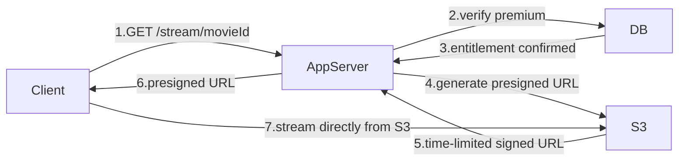
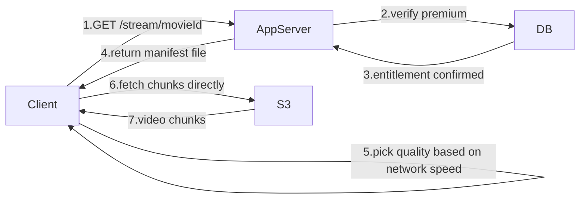

# Base Architecture — Streaming Flow

---

## Bad Approach — Presigned URL for Streaming

The first instinct is to reuse the same download flow for streaming — verify the user, generate a presigned URL for the video file, and let the client stream directly from S3.



This works for a single fixed quality — but streaming is not download. The user is watching right now. If their network drops from 4G to 2G at second 47, the video must adapt instantly or it freezes.

A presigned URL points to **one file** — one fixed quality, one fixed resolution. There is no way to switch from 4K to 480p mid-stream because the URL is locked to a single file.

> [!danger] Why this fails
> Download is forgiving — if the network is slow, the download just takes longer. You watch it later. Streaming is unforgiving — if the bitrate exceeds the network speed at any moment, the video freezes immediately. One presigned URL for one fixed file gives you zero ability to adapt quality on the fly.

---

## The Right Approach — Manifest File + Chunks

Instead of one presigned URL for one fixed file, the app server returns a **manifest file** — a playlist that lists all available qualities and the S3 URLs for every chunk at every resolution.

```
Manifest File for Inception
─────────────────────────────────────────────────
480p  → chunk_1_480p.ts, chunk_2_480p.ts, chunk_3_480p.ts ...
720p  → chunk_1_720p.ts, chunk_2_720p.ts, chunk_3_720p.ts ...
1080p → chunk_1_1080p.ts, chunk_2_1080p.ts, chunk_3_1080p.ts ...
4K    → chunk_1_4k.ts,   chunk_2_4k.ts,   chunk_3_4k.ts   ...
─────────────────────────────────────────────────
Each chunk = 4 seconds of video
```

The client fetches the manifest first, picks the best quality row for its current network speed, and starts downloading chunks one by one directly from S3. As network speed changes, the client simply switches to a different quality row for the next chunk — the video never stops, it just adjusts quality.



> [!info] What is a manifest file
> A text file that lists all available resolutions and the S3 URL for every chunk at every resolution. The client uses it as a menu — pick a quality, fetch that row's chunks. Switch quality anytime by switching rows.

> [!important] Why chunks and not the full file
> Each chunk is only 4 seconds of video. The client can switch quality between any two chunks. If the full file was one URL, you could never switch quality mid-stream.

> [!tip] More on this in the deep dive
> How the manifest file is structured, how the client picks resolution, how it switches quality mid-stream, and what HLS/DASH actually are — all covered in `03-Deep-Dives/02-Manifest-And-HLS/`.
