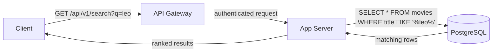

# Base Architecture — Search

When a user types into the Netflix search bar, the naive approach is straightforward — treat search like any other read query. The client sends the search term to the app server, the app server queries the PostgreSQL content database, and the results come back.

PostgreSQL holds all content metadata — titles, descriptions, cast names, genres. A `LIKE '%leo%'` query scans these fields and returns every row where the text matches. For a catalogue of 20,000 titles this is fast enough — the query runs in milliseconds and returns the right results.

The client gets back a list of matching titles with thumbnails, and the user sees results appear as they type.

> [!info] What the query searches
> At this stage, search runs against the movies and episodes tables in PostgreSQL — title, description, cast names, and genre fields. No separate system, no separate index. Just the same database that serves the homepage and movie detail pages.

> [!tip] What changes in the deep dive
> This approach works until traffic scales up. At 150M DAU, the `LIKE` query becomes a problem — not because of the 20,000 titles, but because of what `LIKE` actually does under the hood at scale, and what else that same PostgreSQL instance is being asked to do simultaneously. The Search deep dive covers why this breaks and what replaces it.
