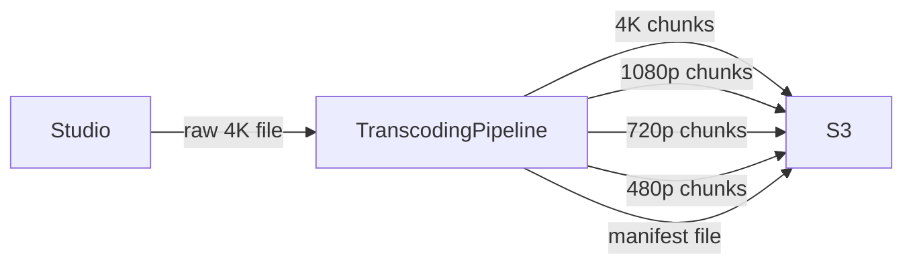

## The Problem — One File Cannot Serve Everyone

Netflix receives a raw movie from a studio — say Inception, 2.5 hours, shot in 4K. One file. One resolution. One format.

Now two users click play at the same time. A user in Mumbai on a 2G phone. A user in New York on a 65-inch 4K TV.

The numbers make the problem obvious:

```
4K stream requires   → 25 Mbps
2G phone can deliver → 0.1–0.5 Mbps

Gap = 50x to 250x — the video freezes instantly on the 2G phone
```

A single 4K file cannot serve both users. The Mumbai user needs 480p at 1 Mbps. The New York user needs 4K at 25 Mbps. One file cannot be both things at the same time.

---

## Naive Fix — Store Multiple Resolutions

The obvious first instinct: store the movie four times, one file per resolution.

```
inception_4k.mp4      → 25 Mbps
inception_1080p.mp4   →  5 Mbps
inception_720p.mp4    →  3 Mbps
inception_480p.mp4    →  1 Mbps
```

Mumbai user gets served `inception_480p.mp4`. New York user gets `inception_4k.mp4`. Seems to work — until the New York user's WiFi drops halfway through the movie and they switch to mobile data.

---

## Why That Still Breaks — Mid-Stream Quality Switch

The New York user is at the 1 hour 15 minute mark, streaming `inception_4k.mp4`. Their WiFi drops. Mobile data kicks in — say 5 Mbps. They need to drop to 1080p.

But they are mid-stream on one continuous file. To switch to `inception_1080p.mp4`, the client has to:

1. Drop the current connection
2. Find the exact timestamp (1h 15m) in the new file
3. Restart streaming from that point

That is a visible freeze — buffering spinner, jarring jump. For a 2.5 hour movie with unpredictable network conditions, this could happen dozens of times. Each switch means a freeze.

The problem is that a continuous file locks the client into the quality it started with. There is no clean way to switch mid-stream.

---

## The Real Fix — Chunks at Every Resolution

The solution is to not store the movie as one continuous file at all. Instead, split the movie into tiny 4-second pieces **before** any user ever clicks play. And produce those pieces at every resolution.

```
chunk_001_4k.ts     chunk_001_1080p.ts     chunk_001_720p.ts    chunk_001_480p.ts

chunk_002_4k.ts     chunk_002_1080p.ts     chunk_002_720p.ts    chunk_002_480p.ts

chunk_047_4k.ts     chunk_047_1080p.ts     chunk_047_720p.ts    chunk_047_480p.ts

chunk_048_4k.ts     chunk_048_1080p.ts     chunk_048_720p.ts    chunk_048_480p.ts
```

Now when the New York user's WiFi drops after chunk 47, the client just fetches chunk 48 from the 1080p row instead of the 4K row. No freeze. No restart. The video keeps playing — quality drops slightly, but playback never stops.

Every chunk is an independent file. Switching quality between any two chunks costs nothing — it is just a different S3 URL for the next fetch.

> [!info] Why 4 seconds per chunk and not 4 MB
> The instinct might be to use a fixed file size — say 4 MB per chunk. But bitrate varies by resolution, so 4 MB means a completely different duration at each quality level:
> ```
> 4K chunk (25 Mbps)  → 4 MB = 4×8/25 = 1.28 seconds of video
> 480p chunk (1 Mbps) → 4 MB = 4×8/1  = 32 seconds of video
> ```
> Chunk 47 at 4K covers timestamp 1:00:24 to 1:00:25. Chunk 47 at 480p covers 1:00:24 to 1:08:36. They represent completely different parts of the movie — you cannot switch between them cleanly.
>
> Time-based chunks fix this. Chunk 47 at 4K and chunk 47 at 480p both cover the exact same 4 seconds of the movie regardless of byte size. The client can switch quality between any two chunks because the timestamps always align. Short enough that quality switches feel instant — at most 4 seconds of the wrong quality before the switch kicks in. Long enough that the client is not making hundreds of requests per minute — a 2.5 hour movie at 4 seconds per chunk is 2250 chunks, not 9000.

---

## The Transcoding Pipeline — How It Works

Someone has to produce all those chunks. That service is called the **Transcoding Pipeline**.

When Netflix receives a raw 4K file from a studio, the transcoding pipeline picks it up and does two things:

1. **Converts** the raw file into 4 resolutions — 4K, 1080p, 720p, 480p
2. **Splits** each resolution into 4-second chunks

All chunks get stored in S3. A manifest file is generated that lists every chunk URL at every resolution. That manifest is what the client receives when it clicks play.



> [!important] Transcoding is a backend pipeline — not a user-facing feature
> Netflix is a closed ingest system. Users never upload content. The raw files arrive from studios via internal processes. Transcoding runs entirely in the background before any title goes live. From a user's perspective it is invisible — they just click play and it works.
