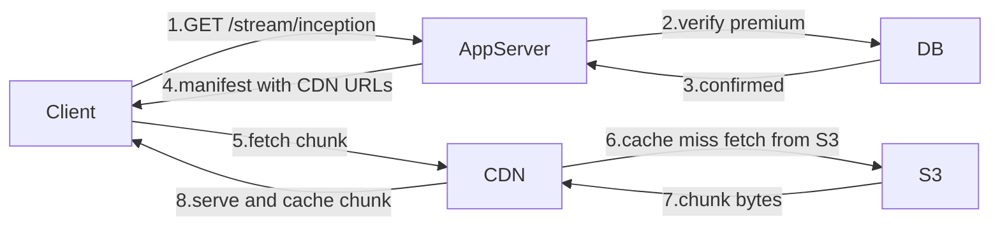
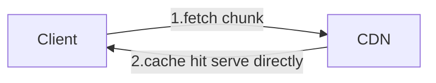
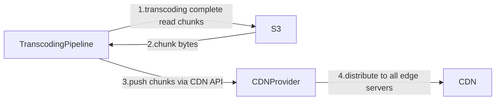
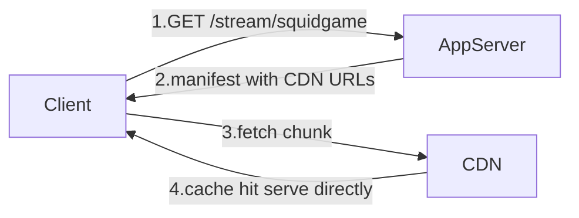

## What Is a CDN

The caching idea — fetch once from S3, serve everyone else from a local copy — is exactly what a **CDN (Content Delivery Network)** does. It is not a new concept Netflix invented. It is a purpose-built global infrastructure that thousands of companies use to solve this exact problem.

> [!info] Content Delivery Network
> Is a global network of cache servers placed in cities all around the world. Each server caches popular content locally. Users always hit the nearest CDN server — not the origin (S3). If the CDN server has the chunk, it serves it directly. If not, it fetches from S3, caches it, and serves it. Every subsequent user in that city gets it from cache.

---

## How a Chunk Request Flows Through the CDN

The manifest file is the key. When the transcoding pipeline generates the manifest, instead of writing S3 URLs for each chunk, it writes **CDN URLs**:

```
Instead of:
https://s3.amazonaws.com/netflix-chunks/inception/chunk_001_480p.ts

Manifest contains:
https://cdn.netflix.com/inception/chunk_001_480p.ts
```

The client reads the manifest and fetches chunks directly from CDN URLs — no redirect, no API gateway, no app server involved.

---

## Origin Configuration — How CDN Knows Where S3 Is

Before any of this works, Netflix has to tell the CDN where to go on a cache miss. This is called **origin configuration** — a one-time setup Netflix does in the CDN provider's dashboard when they first set up the service:

```
CDN domain     → cdn.netflix.com
Origin (S3)    → s3.amazonaws.com/netflix-chunks
Cache duration → how long to keep a chunk before evicting it
```

From that point on, every CDN server in the network knows: if a request comes in for `cdn.netflix.com/inception/chunk_001_480p.ts` and it is a cache miss, go fetch it from `s3.amazonaws.com/netflix-chunks/inception/chunk_001_480p.ts`.

Netflix does not write any code for this. It is a one-time configuration. The CDN handles the S3 fetch entirely on its own.

---

## Pull — How Content Gets Into CDN

CDN starts completely empty. Content only arrives when a user requests it for the first time — the CDN **pulls** it from S3 on demand.

**Cache miss — first user:**



**Cache hit — every user after:**



> [!important] CDN URLs are not presigned
> S3 URLs needed cryptographic signatures because S3 buckets are private by default. CDN chunks are publicly accessible — everyone watching Inception gets the same chunk 1. There is no per-user secret. The manifest simply contains plain CDN URLs with no expiry and no signature.

---

## Downside of Pull — Cache Stampede on Hot Release

Pull works well for content that warms up gradually. But it breaks on hot releases.

Squid Game Season 3 drops at 9pm. 150,000 Indian users all hit play at the exact same moment. The CDN server in Mumbai is completely empty — nothing has been cached yet because no one has requested it before.

All 150,000 requests arrive simultaneously. CDN has nothing. Every single request is a cache miss:

```
9pm — Squid Game drops
150,000 users hit CDN Mumbai simultaneously
CDN is empty → 150,000 cache misses → 150,000 requests hit S3
```

We are back to the exact same thundering herd problem we were trying to solve. And it is not just Mumbai — every CDN server worldwide is empty at the same time. Tokyo, São Paulo, London — all of them stampede S3 simultaneously at the moment of release.

> [!danger] Cache stampede
> When a popular item is missing from cache and a large number of requests arrive simultaneously, every request goes to the origin (S3) at the same time. This is called a **cache stampede**. Pull-based CDN solves the problem for the second user onwards — but at the moment of a hot release, every CDN server worldwide is cold at the same time, and the stampede hits S3 at full force.

---

## Push — Pre-Populate CDN Before Release

Instead of waiting for users to request content, Netflix's transcoding pipeline proactively pushes chunks to the CDN provider's API the moment transcoding finishes — before the release goes live. S3 is just storage — it cannot initiate outbound transfers. The transcoding pipeline reads chunks from S3 and calls the CDN provider's API to distribute them worldwide.



By the time 9pm hits and 150,000 users click play, every CDN server already has all chunks cached. Zero cache misses. S3 is never contacted during playback.



> [!info] Push in practice
> Netflix knows in advance which titles are about to release and which are in the top 10 globally. Before a release goes live, the transcoding pipeline triggers a push job — it reads chunks from S3 and calls the CDN provider's API to distribute them to edge servers worldwide. Users on release night never experience a cold cache.

---

## Downside of Push — Storage Waste on Unpopular Content

Push works for hot releases but breaks if applied to everything. Netflix has **17,000+ titles**. Pushing every title to every CDN server worldwide:

```
17,000 titles × 4 resolutions × 2,250 chunks = 153 million chunks

153 million chunks × 0.5 MB = 76,500 GB = 76 TB per CDN server
```

76 TB per CDN server — for content that may never be requested from that city. A CDN server in Mumbai does not need chunks for a Norwegian documentary that 200 people worldwide will ever watch. CDN servers have limited disk space. Filling them with unpopular content evicts popular content to make room — defeating the entire purpose.

> [!danger] Why push alone fails
> Push wastes CDN storage on the long tail of content nobody watches in that city. At 17,000 titles, blindly pushing everything requires 76 TB per CDN server. That storage is better used caching content users actually request.
