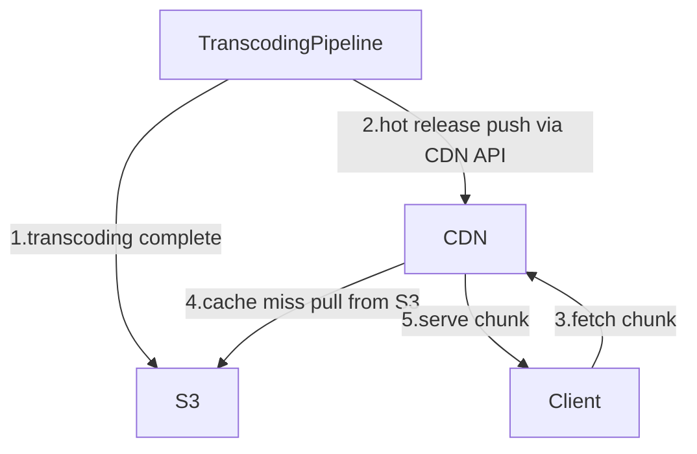

## Hybrid CDN Strategy — Push for Hot, Pull for Everything Else

Neither pull nor push works perfectly on its own:

```
Pull → CDN starts empty, warms up on demand
       Works well for gradual traffic
       Breaks on hot releases — cache stampede hits S3 at full force

Push → CDN pre-populated before release
       Works well for hot releases
       Wastes storage on unpopular content — 76 TB per CDN server for all 17,000 titles
```

Netflix uses both together based on content popularity.

---

## How Push and Pull Work Together



Two paths into CDN — push and pull — but the client always hits CDN the same way regardless of which path populated it.

**Push path** — when transcoding finishes for a new release or top 10 title, the transcoding pipeline calls the CDN provider's API and pre-populates all chunks before the release goes live. By the time users hit play on release night, CDN already has everything. Zero cache misses. S3 is never contacted during playback.

**Pull path** — for older titles and long tail content, CDN starts empty. First user in a city triggers a cache miss — CDN fetches from S3 via origin config, caches it, serves it. Every user after gets it from cache.

```
Push → new releases, top 10 titles, seasonal spikes
Pull → older catalogue, niche content, long tail
```

> [!important] Why hybrid keeps CDN storage lean
> Push is applied selectively — only to titles Netflix knows will be popular. A CDN server in Mumbai never gets pushed a Norwegian documentary nobody in India watches. It only caches it if someone actually requests it. This means CDN storage is used for content users actually watch — not blindly filled with 76 TB of every title in the catalogue.

---

## Cache Eviction — What Gets Removed and When

CDN servers have limited disk space. Two mechanisms decide what stays and what gets evicted.

**LRU — Least Recently Used**

The primary eviction strategy. When the CDN server runs out of space, it evicts the chunk that was accessed least recently. Popular content — Squid Game chunks being requested thousands of times a day — stays in cache. A chunk from a 2009 documentary that nobody has requested in 30 days gets evicted first.

This is self-regulating — popular content naturally survives, cold content naturally falls out.

**TTL — Time To Live**

Every cached chunk also gets a TTL — say 24-48 hours. After the TTL expires, the chunk is evicted regardless of how recently it was accessed.

LRU alone has a problem: if Netflix pulls a title due to a licensing issue or legal takedown, the chunks are deleted from S3 — but CDN servers worldwide still have them cached. Without TTL, those chunks could sit in CDN indefinitely, serving content Netflix is no longer allowed to distribute.

TTL is the safety net. Within 24-48 hours of a takedown, all CDN servers worldwide will have the chunks evicted naturally.

```
LRU → evicts cold content to make room, keeps popular content alive
TTL → forces expiry on all content, handles takedowns and licence expirations
```

> [!important] LRU and TTL serve different purposes
> LRU manages storage efficiency — it keeps the cache filled with relevant content. TTL manages content correctness — it ensures removed or updated content does not linger in CDN after Netflix deletes it from S3. Both are needed. LRU alone cannot handle takedowns. TTL alone would evict Squid Game chunks every 24 hours even while 150,000 users are actively watching.
