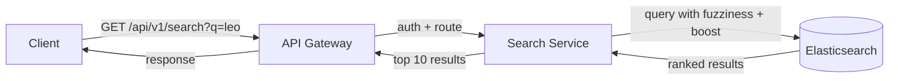
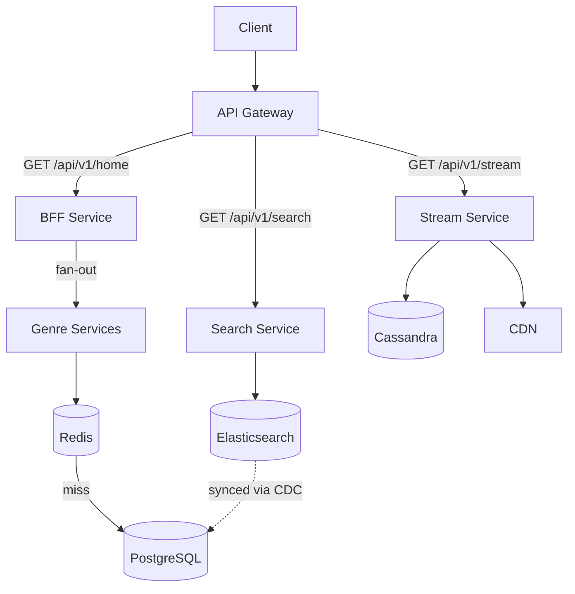
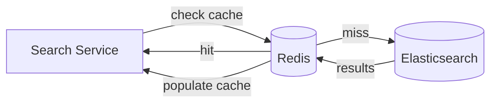

# Search Deep Dive — Search Architecture

## Why Search Gets Its Own Service

The homepage uses a BFF because it needs to fan out to 20+ genre services and aggregate their responses into one payload. Search has no fan-out — one query goes to one Elasticsearch cluster, one ranked list comes back. There is nothing to aggregate.

Search gets its own dedicated **Search Service** for a different reason: isolation. The Search Service is the only component that talks to Elasticsearch. If the Elasticsearch cluster needs to be scaled, reindexed, or swapped for a different search engine, the change is contained to this one service. Nothing else in the system knows Elasticsearch exists.



The API Gateway handles authentication and routing — the same as every other request path. The Search Service receives the query, calls Elasticsearch with the appropriate fuzzy and boost configuration, and returns the top results. No BFF, no fan-out, no aggregation.

---

## What the Search Service Actually Does

The Search Service is thin. Its job is to translate the client's plain text query into an Elasticsearch query, call Elasticsearch, and return the ranked results. It does not contain search logic — Elasticsearch handles ranking, fuzzy matching, and scoring internally.

A simplified version of what the Search Service sends to Elasticsearch:

```json
{
  "query": {
    "multi_match": {
      "query": "leo",
      "fields": ["title^3", "cast^2", "genre^1.5", "description^1"],
      "fuzziness": "AUTO"
    }
  },
  "size": 10
}
```

`title^3` means the title field has a boost of 3. `fuzziness: AUTO` means Elasticsearch automatically allows 1-2 character edits depending on word length. `size: 10` means return the top 10 results by relevance score.

Elasticsearch runs the query against the inverted index, scores every matching document, and returns the top 10 ranked by score. The Search Service maps each result to the response shape the client expects and returns it.

---

## How Search Fits Into the Full Architecture

There are now three completely separate request paths in the Netflix architecture, and they share almost no infrastructure:



- **Homepage path** — API Gateway → BFF → Genre Services → Redis → PostgreSQL
- **Search path** — API Gateway → Search Service → Elasticsearch
- **Stream path** — API Gateway → Stream Service → Cassandra → CDN

A failure in any one path cannot cascade into the others. If Elasticsearch goes down, search breaks — but the homepage still loads from Redis and active streams still pull from CDN. The paths are fully independent.

---

## Caching Search Results

Popular searches are worth caching. If 50,000 users search "squid game" in the same minute, the Search Service doesn't need to call Elasticsearch 50,000 times for an identical query against a catalogue that hasn't changed.

A Redis cache sits in front of Elasticsearch, keyed by the search term:



Cache TTL is short — 60 seconds. Elasticsearch results can change as CDC syncs new titles. Serving 60-second-stale search results is acceptable. Serving week-old results is not.

> [!important] Cache key is the exact search term
> "squid game" and "squid  game" (extra space) are different cache keys. In practice the Search Service normalises the query before caching — lowercase, trim whitespace, collapse multiple spaces — so minor formatting differences don't cause cache misses.

---

## Staleness — The Acceptable Trade-off

The full pipeline from a new title being ingested to it appearing in search results:

```
Transcoding completes
→ INSERT into PostgreSQL     (~0ms)
→ Debezium reads WAL         (~100ms)
→ Kafka event published      (~50ms)
→ ES Sync Worker consumes    (~100ms)
→ Elasticsearch indexed      (~200ms)
→ Title appears in search    (~500ms total end-to-end)
```

Half a second of staleness for a newly ingested title. In practice the Kafka consumer lag can push this to a few seconds under load. This is completely acceptable — Netflix ingests a handful of new titles per day, and nobody searches for a title the exact moment it is added to the catalogue.

> [!info] Elasticsearch is a search replica, not the source of truth
> If Elasticsearch goes down and loses all its data, the entire index can be rebuilt from PostgreSQL. The CDC pipeline replays all events and reconstructs the index from scratch. This is why it is safe to treat Elasticsearch as an eventually-consistent read replica rather than a primary store.
