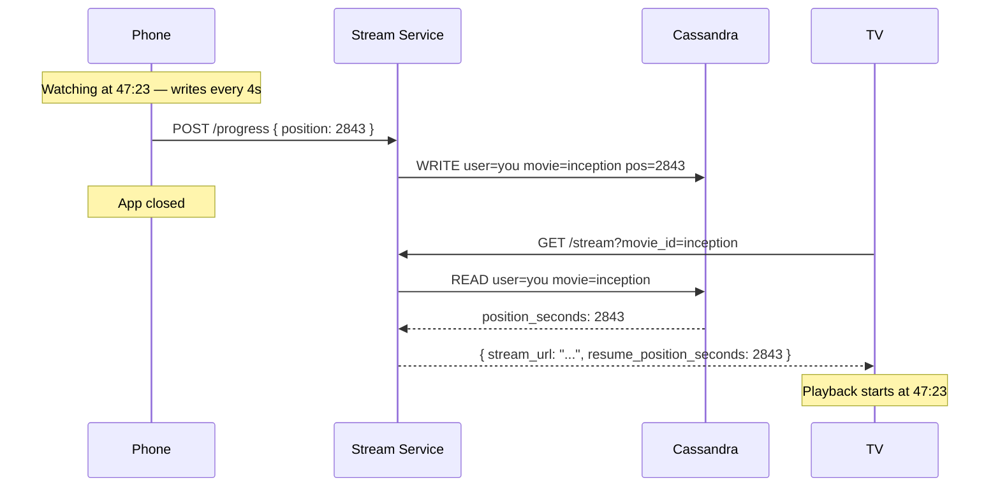
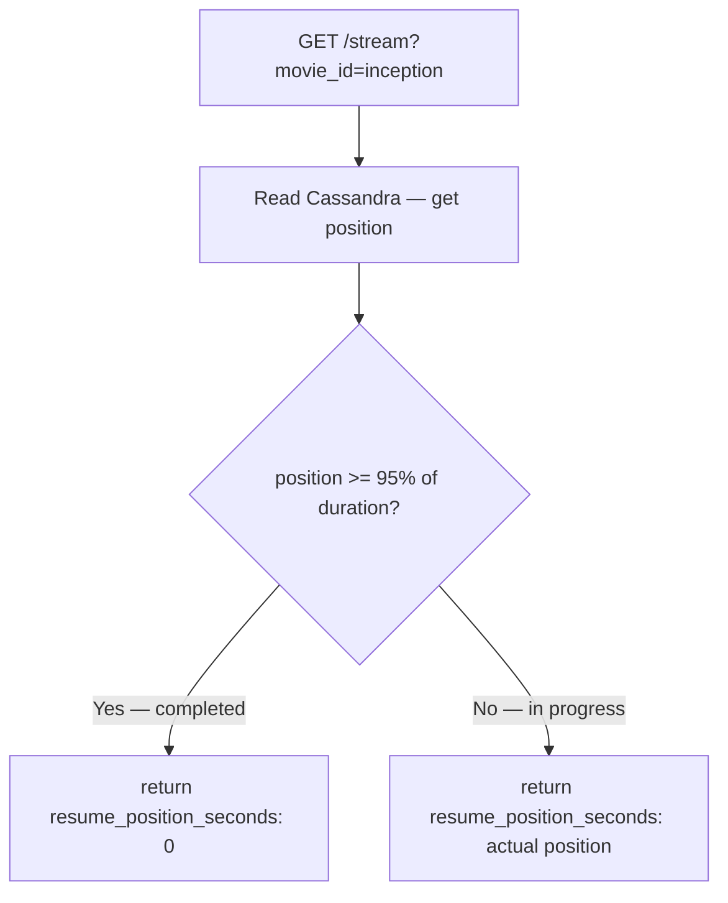

# Resume Playback — Cross-Device Sync

## The Happy Path

You watch Inception on your phone. You pause at 47:23 — that is 2843 seconds. You close the app. The last progress write saved `position_seconds: 2843` to Cassandra.

Next morning you open Netflix on your TV and click Inception. The client fires:

```
GET /api/v1/stream?movie_id=inception
```

The Stream Service reads Cassandra:

```
SELECT position_seconds
FROM resume_positions
WHERE user_id = you AND movie_id = inception
→ 2843
```

The response comes back:

```json
{
  "stream_url": "https://cdn.netflix.com/inception/manifest.m3u8",
  "resume_position_seconds": 2843
}
```

The TV seeks to 47:23 and starts playing. Cross-device sync working exactly as expected.



---

## Simultaneous Devices — The Hard Case

Now the tricky scenario. Your phone is at 47:23 and still running — writing `position: 2843` every 4 seconds. You pick up the TV remote and start Inception from the beginning. The TV is now writing `position: 0`, then `4`, then `8` — also every 4 seconds.

Both devices are hitting the exact same Cassandra row simultaneously:

```
Phone writes: position=2843, timestamp=09:00:00
TV    writes: position=4,    timestamp=09:00:02
Phone writes: position=2847, timestamp=09:00:04
TV    writes: position=8,    timestamp=09:00:06
```

Cassandra resolves this with **last-write-wins** — every write carries a timestamp, and the write with the highest timestamp always wins, regardless of the order writes arrive at the node. The most recent write is what Cassandra keeps.

In this scenario, the TV is writing more recently — so the TV's position wins. If you now open a third device, it resumes from wherever the TV is currently at, not from the phone's 47:23.

This is the correct behaviour. The user picked up the TV remote and started watching — that is the active session. The phone is running in the background unattended. Last-write-wins correctly reflects the user's most recent intent.

> [!important] No merge, no conflict resolution
> Netflix does not try to reconcile two simultaneous positions. There is no "which device is primary" logic, no session management across devices. The answer is always: whoever wrote last wins. Simple, consistent, and correct for this use case.

---

## The Completion Threshold — When Not to Resume

Last-write-wins handles simultaneous devices. But there is one more case: what if the last write was at the very end of the movie?

You finish Inception on your phone. The last position saved is `7790` — 10 seconds before the end of a 7800-second film. You open Netflix on your TV the next day. The server reads Cassandra and gets `position_seconds: 7790`. Should it resume at 2:09:50?

Resuming at the final 10 seconds of a movie is not useful — the user would watch 10 seconds of credits and be done. The correct behaviour is to treat the content as completed and start from the beginning.

The Stream Service applies a **completion threshold** before returning the position to the client:

```
movie_duration    = 7800 seconds
threshold         = 95% of duration = 7410 seconds

position = 7790 → above threshold → content is completed
                 → return resume_position_seconds: 0
```

```
position = 3600 → below threshold → content is in progress
                 → return resume_position_seconds: 3600
```

For TV series, the same rule applies per episode — and if the episode is complete, the Stream Service returns the first position of the next episode rather than zero.



> [!important] This logic lives in the Stream Service, not in Cassandra
> Cassandra stores the raw position — always the last value written, no interpretation. The threshold rule is business logic that belongs in the Stream Service. Cassandra has no concept of video duration or what 95% means. Keeping this logic in the Stream Service means it can be changed without touching the database schema.

---

## What Happens if Cassandra Is Down

If the Stream Service cannot reach Cassandra to read the position, it returns `resume_position_seconds: 0`. The stream starts from the beginning.

This is the correct degradation. Starting a movie from the beginning is a minor inconvenience. Blocking playback entirely because the position store is unavailable is not acceptable — availability matters more than resume accuracy.

> [!info] Cassandra failure does not affect streaming
> Cassandra stores position data only. Video chunks live in CDN and S3 — an entirely separate path. If Cassandra goes down, users lose resume accuracy but can still watch. The streaming path has no dependency on Cassandra at playback time, only at stream start for the position lookup.
