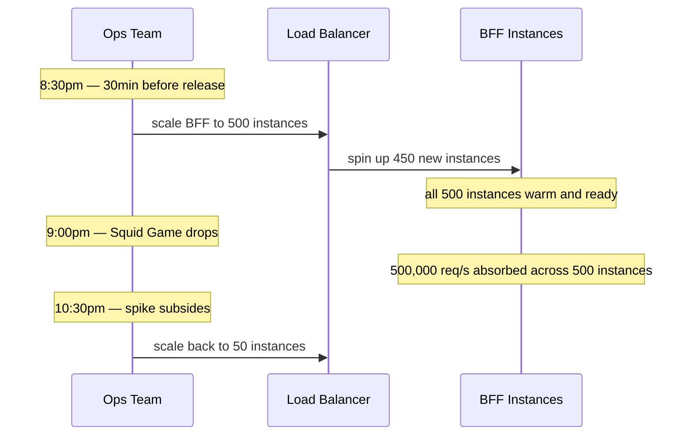
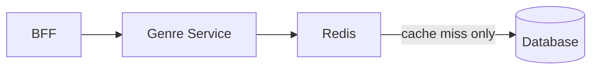
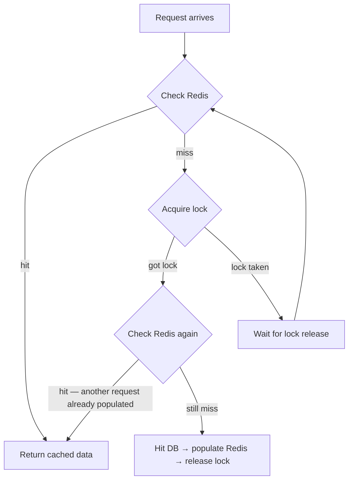
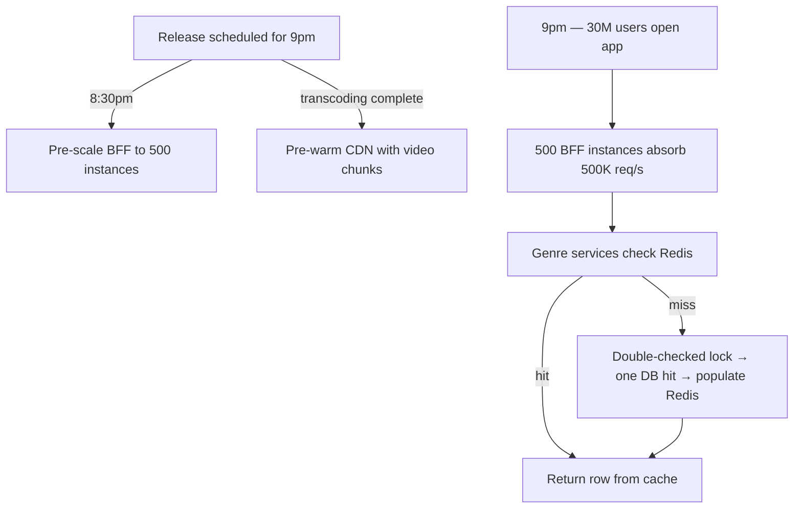

# Peak Traffic — Handling the Squid Game Drop

## The Problem

Netflix has 300M MAU, 150M DAU. On a normal evening the math looks like this:

```
150M DAU × (1 hour watched / 24 hours) = 6.25M average concurrent viewers
Peak multiplier 3×                      = ~20M peak concurrent viewers
```

But Squid Game Season 3 drops at 9pm. This is not normal peak. A major release causes a **synchronized spike** — millions of users who don't normally watch at the same time all open the app within the first 60 seconds. On a release of this scale, you're looking at **30M users** opening the app simultaneously — 1.5× normal peak, concentrated in a 60 second window.

The CDN is pre-warmed — video bytes are already at the edge. That problem is solved. What isn't solved is what happens to your API layer. Every one of those 30M users just fired `GET /api/v1/home` at your BFF.

---

## What Breaks First — Capacity Math

Before reaching for solutions, measure the problem. A single BFF instance handles roughly **1,000 requests/second**.

```
30M users open app within 60 seconds
= 30,000,000 / 60
= 500,000 requests/second

Single instance capacity = 1,000 req/s
Instances needed         = 500,000 / 1,000 = 500 instances
```

One instance is nowhere near enough. You need 500 running simultaneously at the moment the spike hits.

---

## Pre-Scaling — Prepare Before the Spike

The instinct might be to rely on autoscaling — let the system detect high traffic and spin up new instances automatically. This fails at spike events.

Spinning up a new container takes 2–3 minutes: pull the image, start the process, warm the JVM. By the time your 500th instance is ready, the spike has already peaked and the damage is done. Autoscaling reacts — it cannot outrun a synchronized spike.

Netflix knows the release schedule in advance. The fix is **pre-scaling** — spin up the instances 30 minutes before 9pm, not in response to the spike.



Pre-scaling is the same principle as CDN pre-warming — anticipate the load, prepare ahead of time.

```
Normal hours  → 50 BFF instances  (handles average load)
Pre-scaled    → 500 BFF instances (ready 30min before release)
Post-spike    → auto-scale back down as traffic normalises
```

---

## The Database Problem

500 BFF instances absorb the HTTP layer. But each BFF request fans out to genre services, and each genre service hits the database. 30M users × 20 genre rows each = **600M internal DB queries per minute**.

No database survives 600M queries per minute on unindexed reads.

---

## Redis Cache — Serve Millions From One DB Hit

The key insight: on Squid Game drop night, 30M users all want the same thing. The Action row, the Top 10 row, the New Releases row — these rows are **identical for every user**. There is no reason to hit the database 30M times for data that doesn't change between requests.

A Redis cache sits between the genre services and the database:



```
Request 1       → Redis miss → DB → populate Redis → return data
Requests 2–30M  → Redis hit  → return cached data  → DB never contacted
```

The database sees one query. Redis serves 29,999,999 of them.

---

## Cache Stampede — When the Cache Expires at Peak

There is a subtle failure case. Redis TTLs expire. If the Action row cache entry expires at exactly 9:01pm — one minute into the spike — 10,000 simultaneous requests all check Redis, all get a miss, and all race to hit the database at the same time.

This is the **cache stampede** problem. Without a fix, the database gets hit 10,000 times for the same row in the same instant.

The naive fix — let one request win and make the others wait — has a bug. If the waiting requests simply acquire the lock one by one and go straight to the database, you have turned a stampede into a slow queue. Every waiting request still hits the database, just sequentially instead of simultaneously.

The correct fix is **double-checked locking**:



The second Redis check after acquiring the lock is the entire point. By the time request 2 gets the lock, request 1 has already populated Redis. Request 2 checks Redis, finds the data, returns it — never touches the database. Only the very first request that acquired the lock ever hits the database.

```
Without double-check → requests queue up and hit DB one by one
With double-check    → only first request hits DB, all others served from cache
```

> [!important] Why the second Redis check matters
> The lock serialises access. But serialised access to the DB is still DB access — just slower. The second check turns the lock from a traffic throttle into a true deduplication: once any one request has populated the cache, all subsequent requests short-circuit to Redis regardless of whether they held the lock.

> [!danger] Never rely on a single Redis check
> `check cache → miss → lock → go to DB` is the wrong pattern. `check cache → miss → lock → check cache again → only go to DB if still miss` is the correct one. The difference is whether 1 or N requests hit the database on a cache expiry at peak.

---

## Full Peak Traffic Strategy



| Layer | Problem | Fix |
|---|---|---|
| BFF | 500K req/s, single instance dies | Pre-scale to 500 instances 30min before release |
| Database | 600M queries/min on release night | Redis cache — 30M users served from one DB hit |
| Cache expiry at peak | Stampede on TTL expiry | Double-checked locking — only first request hits DB |
| Post-spike waste | 500 idle instances at 3am | Auto-scale back down as traffic normalises |
