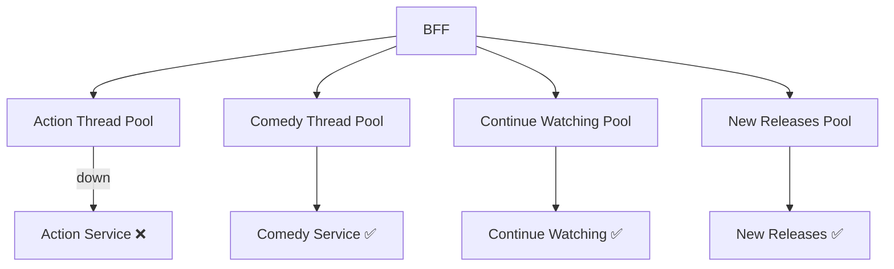
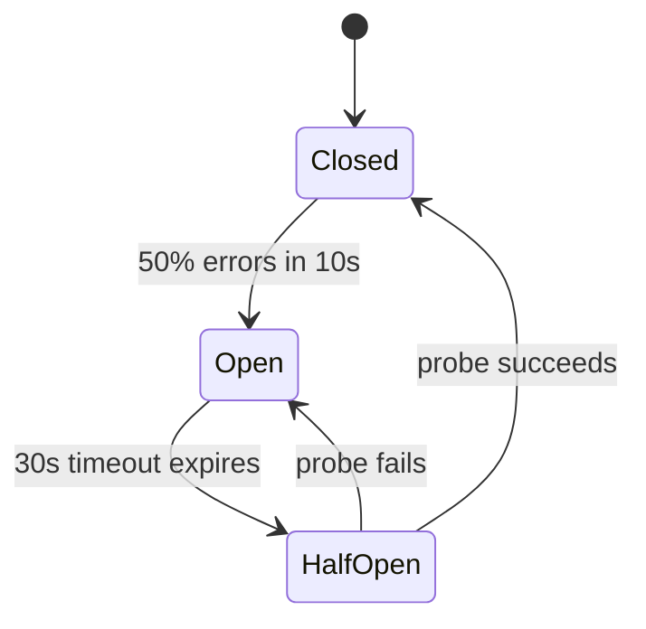
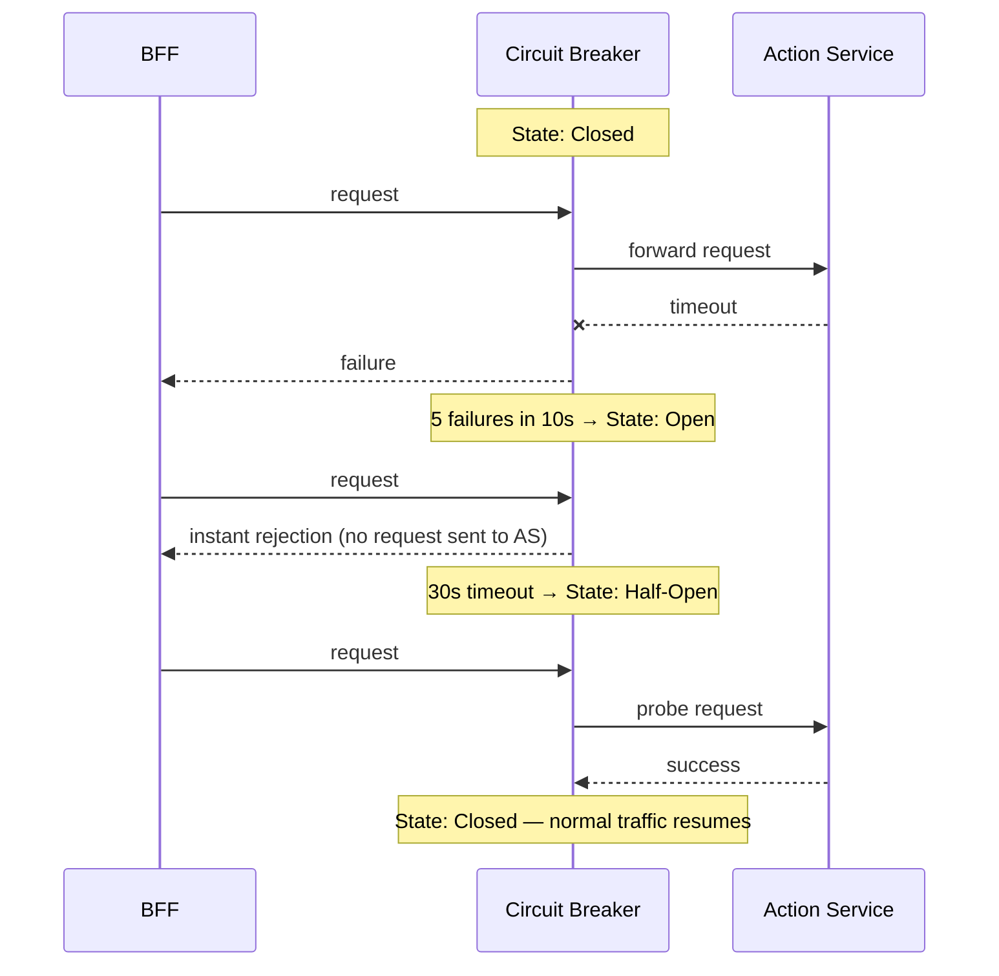
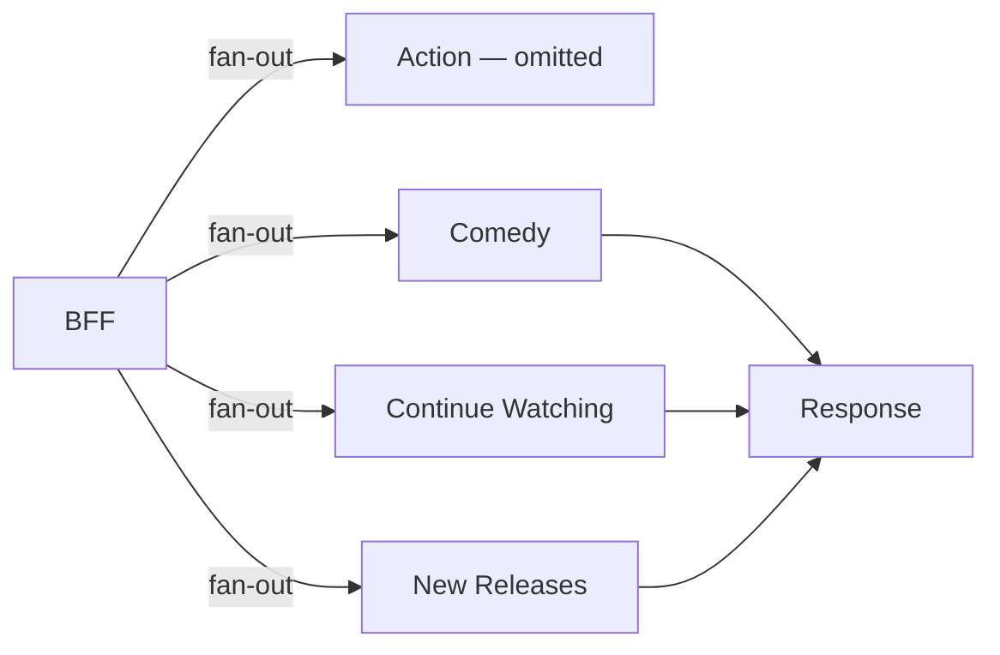

# Fault Isolation — Genre Service Failure

## The Scenario

It is 9pm. Squid Game Season 3 just dropped. Your Action genre service crashes — the pod is down, not responding. Every request the BFF sends to it times out after 30 seconds.

Without any protection, the cascade plays out like this:

```
BFF has 100 worker threads
Each thread waiting on Action service = locked for 30 seconds
At 500,000 req/s: new requests arrive 5,000× faster than threads free up

100 threads × (1 req / 30s) = ~3 req/s handled
Incoming rate                = 500,000 req/s

All 100 threads fill up in milliseconds.
New requests queue → queue fills → requests rejected.
Action service being down has taken down the entire home feed for every user.
```

This is a **cascade failure**. One service dying — even a non-critical one — kills everything upstream of it because it holds threads hostage.

---

## Bulkhead Pattern — Contain the Blast

The first line of defence is the **bulkhead pattern** — isolate each genre service into its own thread pool inside the BFF. The Action service gets its own pool of threads. Comedy gets its own. Continue Watching gets its own.



When the Action service goes down and its thread pool fills up with waiting requests, only those threads are affected. Comedy, Continue Watching, and New Releases are on separate pools — they continue processing normally. The failure is contained to one bulkhead.

---

## Circuit Breaker — Stop Hitting a Dead Service

Bulkheads contain the damage. But the BFF is still sending requests to the Action service, waiting 30 seconds each time, and getting nothing back. This wastes threads and adds latency to every home feed response.

The circuit breaker detects repeated failures and stops sending requests to a dead service entirely.



**Closed** — normal operation. All requests go through. The circuit breaker counts failures in a rolling window — say 50% error rate over 10 seconds. Below that threshold, nothing changes.

**Open** — failure threshold crossed. The circuit breaker stops forwarding requests entirely. No thread is sent to the Action service, no timeout is waited on — every incoming request to the Action thread pool gets an instant rejection. The service gets zero traffic while it recovers. BFF threads are freed immediately.

**Half-Open** — after a fixed timeout (say 30 seconds), the circuit breaker allows exactly one probe request through. If the probe succeeds, the Action service has recovered — circuit moves back to Closed, normal traffic resumes. If the probe fails, the service is still down — circuit moves back to Open for another 30 seconds.



---

## Graceful Degradation — What the User Sees

When the Action service is down and the circuit is Open, the BFF does not return an error to the client. It silently omits the Action row and returns everything else.



The user sees 19 rows instead of 20. No error message. No broken row. No spinner. The home feed loads normally — just without the Action row until the service recovers.

This is **graceful degradation** — the system degrades partially rather than failing completely. A partial home feed is far better than a blank screen.

> [!important] Failure isolation moved server-side
> In Option A of the API design, failure isolation lived on the client — the client made 20 parallel calls and skipped rendering any row that failed. In the BFF approach, the same isolation exists but lives inside the BFF. The client is completely insulated. It makes one call, gets one clean response, and never knows a service was down.

> [!danger] Never let one service timeout kill the whole response
> A 30-second timeout on one genre service, multiplied across 20 genre services, means a home feed that takes 10 minutes to load in the worst case. Circuit breakers and bulkheads exist to prevent this. Without them, a single slow downstream service can make the entire home feed unusable.

---

## What Is NOT Affected

An important boundary: this failure affects the **home feed only**. Users who are already watching a video are completely unaffected — their player is fetching chunks directly from CDN, which has nothing to do with the genre services or the BFF fan-out. The circuit breaker protects homepage loading. Active streams run on an entirely separate path.

```
Genre service down → BFF fan-out fails → homepage row missing
                   → active streams:    unaffected (CDN path, not BFF path)
```

This is why Netflix separates concerns so aggressively. The streaming path and the browse path share almost no infrastructure — a failure in one cannot cascade into the other.
