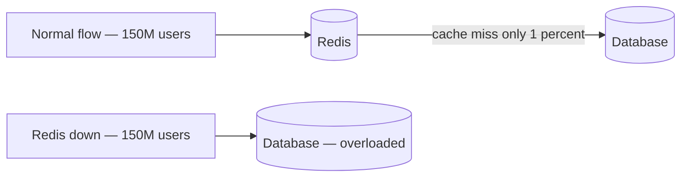
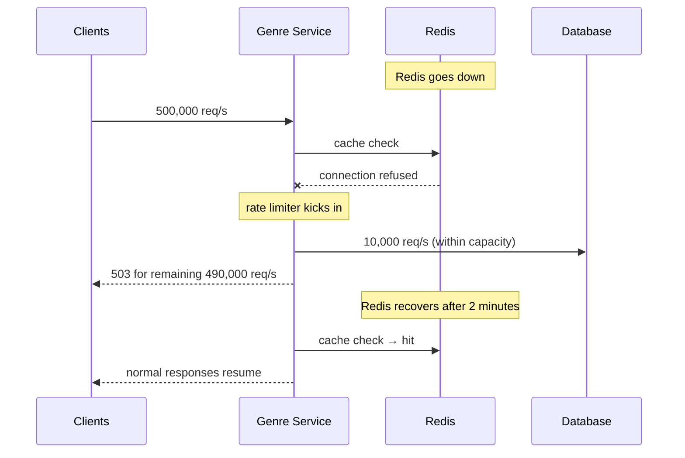
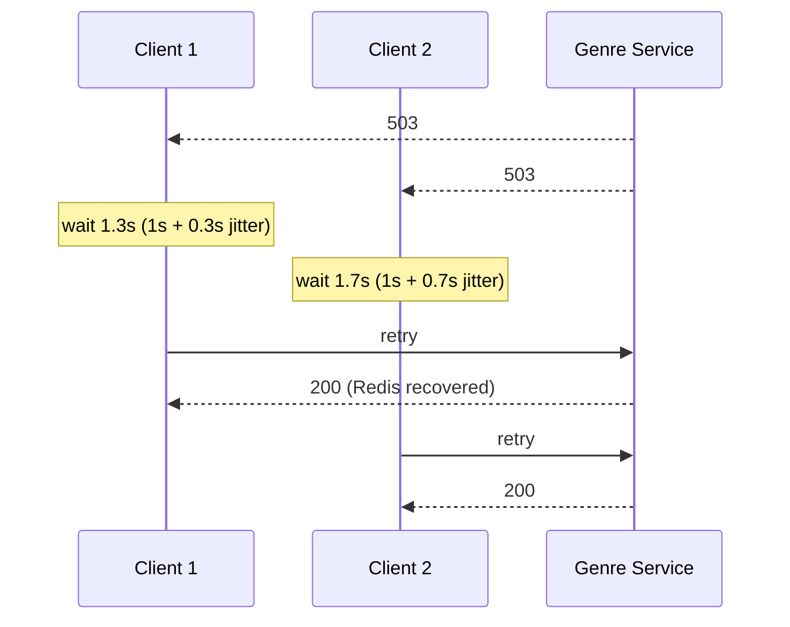

# Fault Isolation — Redis Cache Failure

## The Scenario

Redis goes down. Every request that was being served from cache now falls through to the database directly. On a normal evening that is 150M DAU worth of traffic hitting the database simultaneously — traffic the database was never designed to handle alone.

---

## What Happens Without Protection

In the normal flow, Redis absorbs almost all read traffic. The database sees a small fraction — only cache misses. Redis going down removes that buffer entirely.



The database was sized to handle cache misses — a small percentage of total traffic. It was not sized to handle 100% of traffic. Under full load it collapses, taking down the home feed for every user on the platform.

---

## Load Shedding — Protect the Database

The fix is **load shedding** — deliberately reject requests beyond what the database can safely handle. The database survives. Some users get a 503. But the system stays alive.

```
Redis down → 500,000 req/s hit database directly
Database max safe capacity = 10,000 req/s

Load shed 490,000 req/s → return 503 to those users
Database handles 10,000 req/s → stays alive
Redis recovers → normal traffic resumes
```



A 503 to some users for 2 minutes is a contained, recoverable outage. A dead database is a full platform outage that can take hours to recover from.

> [!important] Partial availability beats total failure
> Load shedding is a deliberate choice to hurt some users in order to protect the system for everyone. Without it, the database dies and Netflix goes down for all 150M users. With it, a fraction of users see errors temporarily while the rest of the platform stays healthy.

---

## Retry — What the Client Does on 503

When a client receives a 503, it should not immediately retry. If every rejected client retries in 1 second, the load doubles instantly and the database collapses anyway.

The correct pattern is **exponential backoff with jitter**:

```
First retry  → wait 1s  + random jitter
Second retry → wait 2s  + random jitter
Third retry  → wait 4s  + random jitter
Fourth retry → wait 8s  + random jitter
```

The jitter is critical. Without it, all clients retry at exactly the same intervals — a synchronised wave of retries that recreates the stampede. Jitter spreads retries randomly across time, smoothing the load curve.



> [!danger] Retry without jitter recreates the stampede
> If 490,000 clients all retry after exactly 1 second, you have replaced one spike with another spike of equal size one second later. Jitter is not optional — it is the mechanism that prevents retries from being just as destructive as the original failure.

---

## What Is NOT Affected

Redis holds the genre row cache — Action rows, Comedy rows, Continue Watching. That is all it holds for the homepage path. Users who are already watching a video are completely unaffected — chunks come from CDN, not from Redis.

```
Redis down → genre service cache miss → DB load spike → homepage 503s
           → active streams:           unaffected (CDN path has no Redis dependency)
```

The load shedding and retry logic above applies only to **new homepage loads**. A user mid-stream on Squid Game notices nothing when Redis goes down. Their player keeps pulling chunks from the nearest CDN edge node as if nothing happened.

This also means the scope of the failure is bounded. Even in the worst case — Redis fully down, DB fully overwhelmed, all homepage loads returning 503 — 20M users who are already watching keep watching. The platform is degraded, not dead.
