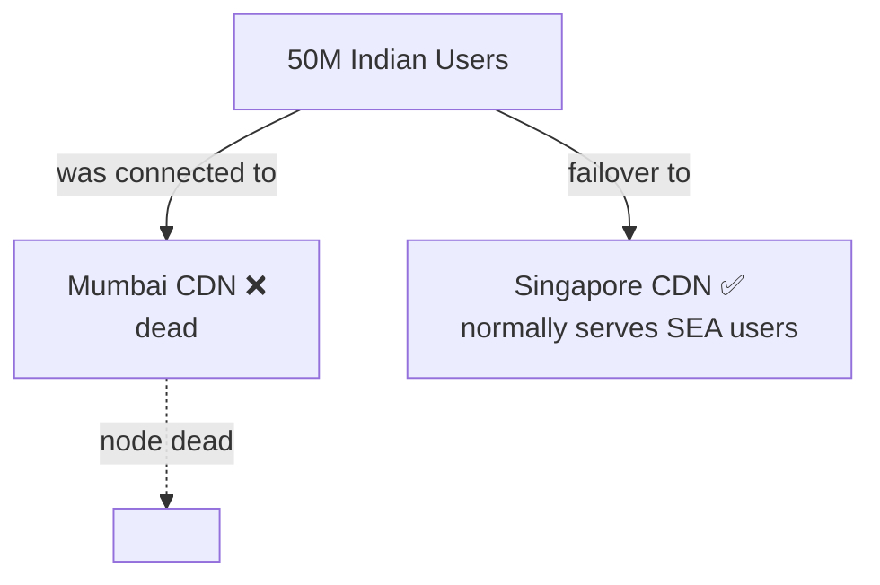
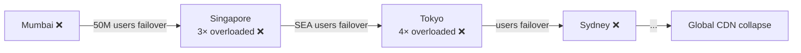
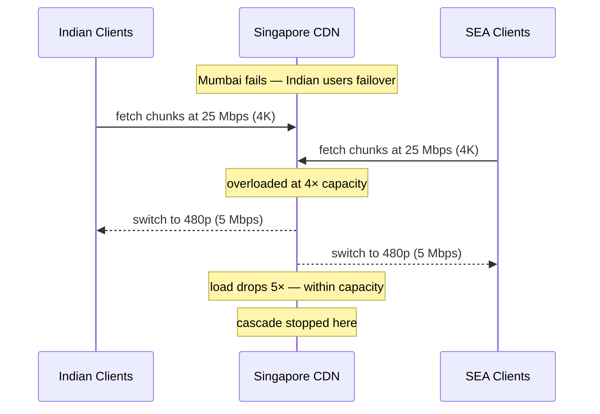
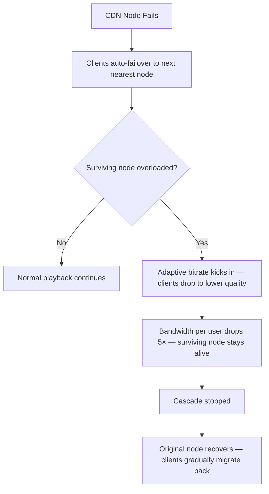

# Fault Isolation — CDN Node Failure and Cascade Prevention

## The Scenario

A CDN node in Mumbai goes down completely. 50 million Indian users were being served video chunks from that node. The node is dead — it cannot serve anyone at any quality. Every Indian user's player loses its chunk source simultaneously.

---

## Automatic Failover — The Client Finds the Next Node

The client does not wait for a human to intervene. When chunk requests to the Mumbai CDN URL start failing, the player automatically fails over to the next nearest CDN node — in this case, Singapore.



From the user's perspective, there is a brief buffering moment — the player detects the failure, switches to Singapore, and resumes. No manual action required.

---

## The Cascade Problem

Failover to Singapore solves Indian users' problem. But it creates a new one.

Singapore was already serving its own Southeast Asian users at full capacity. It now suddenly receives 50 million additional Indian users on top of its existing load. Singapore is at 3× its normal traffic in an instant.

Without intervention, Singapore buckles under the load. Singapore failing pushes its users to the next nearest node. That node gets hit with Southeast Asian + Indian traffic and fails. The failure cascades across the entire CDN.



One node failure, if left unchecked, triggers a global outage. This is the cascade failure pattern.

---

## Adaptive Bitrate as Load Shedding

The fix is **adaptive bitrate as a load shedding mechanism**. But first — how does Singapore know it is overloaded?

Every CDN node continuously monitors its own outbound bandwidth utilisation. When utilisation crosses a threshold — say 90% of its maximum capacity — it signals clients to reduce quality. This signal travels back through the same HTTP response headers that deliver chunks. The client reads a header like `X-CDN-Quality-Cap: 480p` and honours it, fetching all subsequent chunks at that resolution regardless of what ABR would normally choose.

This is different from the client-driven ABR described in the streaming deep dive. Normal ABR is the client measuring its own buffer and speed and choosing quality freely. CDN-enforced quality capping is the server overriding that decision from the outside — the CDN is saying "I don't care what your buffer looks like, serve yourself only at 480p while I'm under pressure."

Singapore detects it is overloaded and instructs all connected clients to switch to a lower quality level.

A user watching at 4K consumes **25 Mbps**. The same stream at 480p consumes **5 Mbps**. Dropping quality by 5× means Singapore can serve 5× as many users on the same bandwidth.

```
Singapore normal load    = 100 Gbps (its own SEA users at 4K)
Indian users failover    = +300 Gbps (50M × 6 Mbps average)
Singapore total demand   = 400 Gbps — 4× capacity

Without bitrate reduction → Singapore collapses
With bitrate reduction (all clients drop to 480p):
  Indian users:     50M × 5 Mbps  = 250 Gbps → drops to 50M × 1 Mbps = 50 Gbps
  SEA users:        100 Gbps      → drops to 20 Gbps
  Total after drop  = 70 Gbps     → within Singapore's capacity
```

Singapore survives. The cascade stops at the first node.



> [!important] Bitrate reduction is not a failure — it is a controlled degradation
> The user sees lower quality video for the duration of the outage. They do not see a buffering spinner, an error screen, or a blank player. Netflix stays watchable. This is graceful degradation at the infrastructure layer — the system partially degrades rather than fully failing.

---

## Recovery — When Mumbai Comes Back

When the Mumbai CDN node recovers, Indian users do not automatically snap back. The client gradually migrates back:

```
Mumbai comes back online
DNS / client routing detects Mumbai is healthy
New Indian connections route to Mumbai
Existing Singapore connections drain gradually as users pause and resume
Singapore load returns to normal over 5–10 minutes
```

Gradual drain prevents a second spike — if all 50M Indian users simultaneously reconnected to Mumbai and simultaneously dropped off Singapore, Singapore's load would swing violently. Gradual migration keeps both nodes stable during the transition.

> [!danger] Simultaneous reconnection is another stampede
> If every client detected Mumbai's recovery at the exact same millisecond and reconnected simultaneously, you would create a spike on Mumbai equal in size to the original failover spike. CDN clients use randomised reconnection delays for the same reason retry logic uses jitter — to spread the load curve.

---

## Summary — Three Layers of CDN Fault Isolation



| Failure | Fix | User Experience |
|---|---|---|
| CDN node down | Auto-failover to next nearest node | Brief buffer, then resumes |
| Surviving node overloaded | Adaptive bitrate — force lower quality | Lower video quality temporarily |
| Recovery | Gradual client migration back | Quality restores as load normalises |
