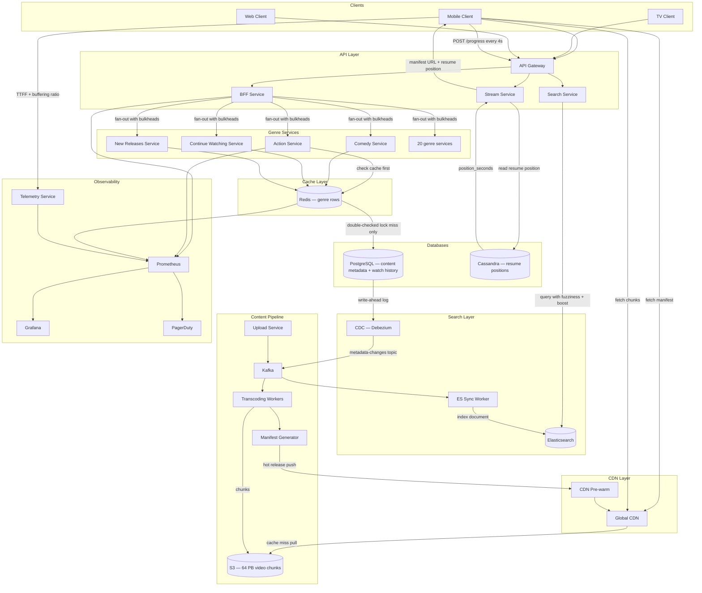
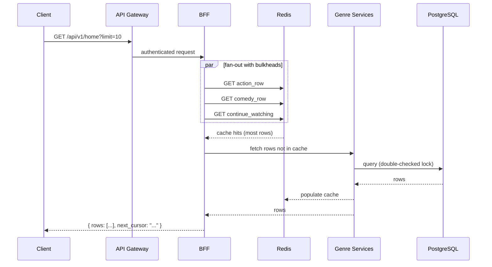
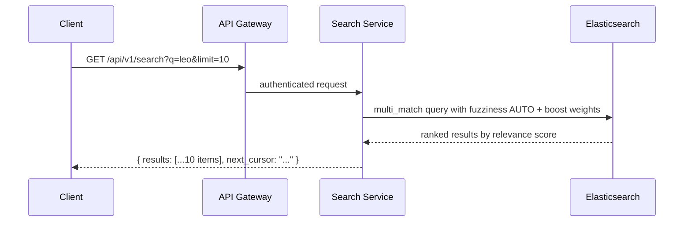
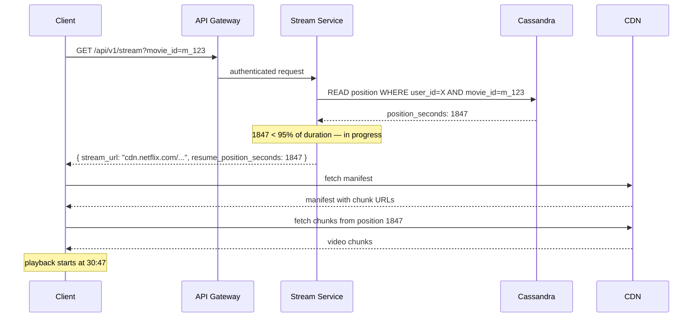
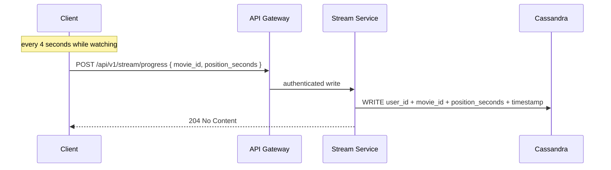
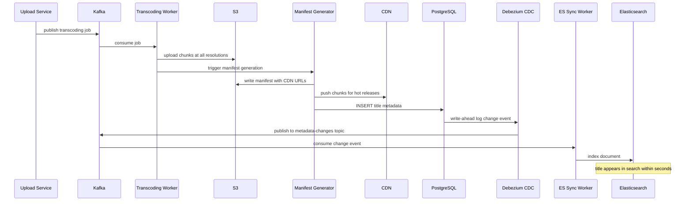

# Final Design — Netflix

> [!info] Final Netflix architecture — all deep dive decisions reflected.
> Every component here was justified through an interview session. Nothing is added speculatively.

---

## What Changed from Base Architecture

The base architecture had a single app server returning a manifest URL, with the client fetching chunks directly from S3. That breaks at scale in three ways: S3 cannot serve 500 Tbps of global traffic, a single server is a SPOF, and there is no failure isolation between services.

Every deep dive added one layer of the final design:

| Deep Dive | What it added |
|---|---|
| Transcoding | Kafka-driven pipeline, S3 chunk storage at multiple resolutions |
| Manifest + HLS | Manifest file with CDN URLs, client-side ABR quality switching |
| Caching | CDN edge layer, push for hot releases, pull + LRU/TTL for catalogue |
| DB | PostgreSQL for content metadata and watch history, Cassandra for resume positions |
| Peak Traffic | BFF pre-scaling, Redis genre cache, double-checked locking on cache miss |
| Fault Isolation | Circuit breakers + bulkheads on BFF fan-out, load shedding on Redis failure, adaptive bitrate as CDN cascade prevention |
| Search | Dedicated Search Service, Elasticsearch with inverted index + fuzzy matching, CDC sync from PostgreSQL via Debezium |
| Resume Playback | Completion threshold logic in Stream Service, last-write-wins resolution in Cassandra |

---

## Full Architecture Diagram

---

## Request Flows

### Home Feed

### Search

### Stream Start + Resume

### Progress Write

### Content Ingestion + Search Sync

---

## Component Summary

| Component | Technology | Purpose |
|---|---|---|
| API Gateway | Kong / AWS API GW | Auth, rate limiting, routing |
| BFF | Node.js / Java | Fan-out to genre services, bulkhead failure isolation |
| Stream Service | Java | Resume position lookup, completion threshold, progress writes |
| Search Service | Java | Translates queries, calls Elasticsearch, returns ranked results |
| Genre Services | Java microservices | Per-genre row fetching |
| Redis | Redis Cluster | Genre row cache, double-checked locking on miss |
| Content DB | PostgreSQL | Titles, metadata, cast, S3 URLs, watch history |
| Resume DB | Cassandra | Resume positions — 7.5M writes/second, partition key: user_id |
| Search Index | Elasticsearch | Inverted index, fuzzy matching, boost-based relevance scoring |
| CDC Pipeline | Debezium + Kafka + ES Sync Worker | Async sync from PostgreSQL to Elasticsearch |
| Object Storage | S3 | 64 PB video chunks |
| CDN | Netflix Open Connect | Global edge, push + pull hybrid, LRU + TTL eviction |
| Transcoding | Kafka + Worker Pool | Parallel encoding to all resolutions and codecs |
| Telemetry | Custom ingest service | Client-side TTFF and buffering ratio |
| Observability | Prometheus + Grafana + PagerDuty | SLI measurement, alerting, dashboards |

---

## Key Design Decisions and Their Justifications

**BFF over client-driven fan-out** — 20+ parallel calls from a mobile client on 3G is brutal. BFF absorbs all fan-out server-side, client makes one call. Bulkheads inside BFF provide the same failure isolation.

**Search Service + Elasticsearch over PostgreSQL LIKE** — `LIKE '%leo%'` is a full table scan across 600,000 rows. At 25,000 search queries per second, this saturates the PostgreSQL instance and degrades every other read on the same DB. Elasticsearch's inverted index makes search a direct lookup, not a scan. Fuzzy matching and boost-based relevance scoring are impossible with LIKE.

**CDC over dual-write for Elasticsearch sync** — writing to PostgreSQL and Elasticsearch simultaneously in the same code path creates distributed failure modes. CDC tails PostgreSQL's write-ahead log passively — the transcoding pipeline writes to one system, Debezium propagates the change asynchronously. A few seconds of search staleness is acceptable.

**Cursor pagination over offset** — Netflix adds content constantly. Offset pagination produces duplicates and gaps under concurrent writes. Cursor is stable regardless of what is added or removed.

**Push + pull hybrid CDN** — pure pull causes cache stampede on hot releases (all CDN nodes cold at 9pm). Pure push wastes 76 TB per CDN server on unpopular content. Hybrid: push for top releases, pull for long tail.

**Double-checked locking on cache miss** — single-check locking allows N waiting requests to all hit DB one by one after the lock is released. Double-check means only the first request ever reaches the DB.

**Adaptive bitrate as load shedding** — when a CDN node fails and users failover to a neighbouring node, that node is at 3× capacity. Dropping all clients to lower quality reduces per-user bandwidth by 5× and stops the cascade.

**PostgreSQL for watch history, Cassandra for resume positions** — watch history is 578 writes/second across 150M DAU, well within PostgreSQL limits. Resume positions are 7.5M writes/second at peak (30M peak streamers each writing every 4 seconds) — 750× PostgreSQL's single-node limit. Same data shape, completely different write frequency, completely different DB choice.

**Completion threshold in Stream Service** — positions ≥ 95% of total duration return 0 instead of the actual position. This logic belongs in the Stream Service, not Cassandra — Cassandra stores raw positions only, business rules live in the service layer.
