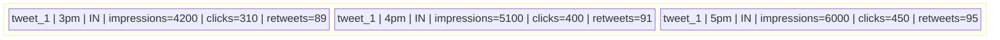
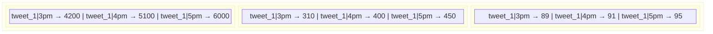
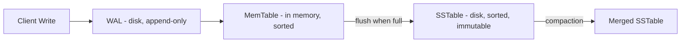

The root cause of SQL's write inefficiency is not a query planner issue or a locking issue — it's a physical storage decision. SQL stores data **row by row**. Column-family stores flip that and store data **column by column**. This one change has massive consequences for both write performance and read efficiency.

---

## How row-oriented storage works

In SQL, every row is stored as a complete unit on disk. All fields for a single record sit together in the same disk block:



When an impression event arrives and you need to increment `impressions` by 1 for the 3pm row, the database must:

1. Load the entire disk block containing that row into memory
2. Find the `impressions` field within that row
3. Increment it by 1
4. Write the entire block back to disk — including `clicks` and `retweets` that never changed

At 58,000 writes/second, you're hauling `clicks` and `retweets` back and forth to disk on every single write. They're passengers — they contribute nothing but I/O cost.

---

## How column-oriented storage works

Column-family stores split the data differently. Each column (or group of columns) lives in its own dedicated section of disk:



Now when an impression event arrives:
1. Load **Block 1** (impressions only) into memory
2. Increment the value
3. Write **Block 1** back

Block 2 and Block 3 are never touched. The I/O cost is proportional to the column you're updating — not the entire row.

> [!important] The core win
> Column-oriented storage means a write to one column never touches other columns on disk. At billions of writes/day, this difference in I/O is the difference between a system that works and one that melts.

---

## The key-value analogy

When you look at column-oriented storage, it behaves a lot like a key-value store — each column block is essentially its own mini key-value store:

```
Block 1 (impressions):
  tweet_1|3pm → 4200
  tweet_1|4pm → 5100

Block 2 (clicks):
  tweet_1|3pm → 310
  tweet_1|4pm → 400
```

Each entry is a key (tweet + time) mapping to a value (the metric). The "column-family" layer on top is what gives you structure and the ability to query across these entries — something a raw KV store can't do.

---

## The connection to LSM trees

Column-family stores don't just change the layout on disk — they also change *how* writes reach disk. Underneath Cassandra and HBase, writes flow through an **LSM tree**:



Every write first goes to the **Write-Ahead Log (WAL)** — an append-only file on disk. This is a sequential write, which is extremely fast. It's also what protects against crashes: if the server dies before the MemTable is flushed to an SSTable, the WAL survives and the MemTable can be rebuilt from it on restart.

After the WAL, the write lands in the **MemTable** — an in-memory sorted buffer. Fast. When the MemTable fills up, it's flushed to disk as an **SSTable** — a sorted, immutable file.

The result: writes are always sequential (fast), never random (slow). This is why column-family stores handle write volumes that would destroy a SQL node.

> [!info] Why sequential writes matter
> Hard disks and SSDs both handle sequential writes far faster than random writes. A random write requires seeking to the right location on disk. A sequential write just appends to the end. LSM trees turn all writes into appends — that's the core of their write performance.

> [!danger] What about crashes mid-MemTable?
> If the server crashes, the MemTable (in memory) is lost. The WAL (on disk) is not. On restart, the database replays the WAL to rebuild the MemTable. This is the same pattern used in PostgreSQL, Kafka, and virtually every database that takes durability seriously.
