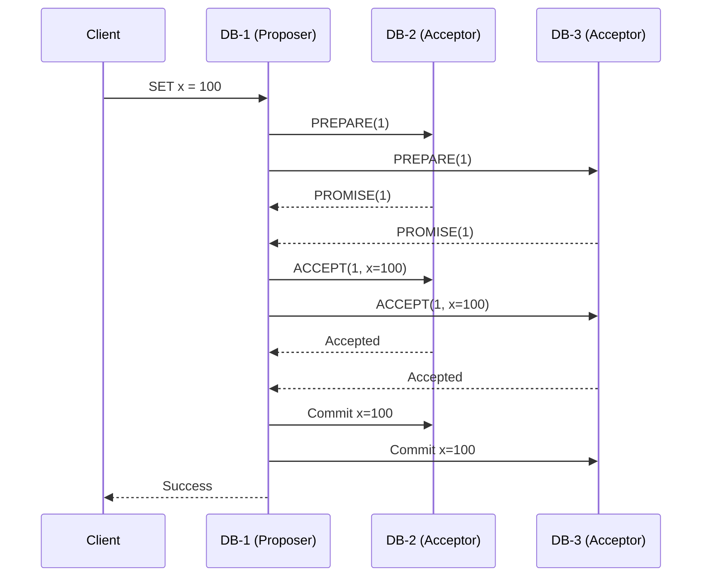
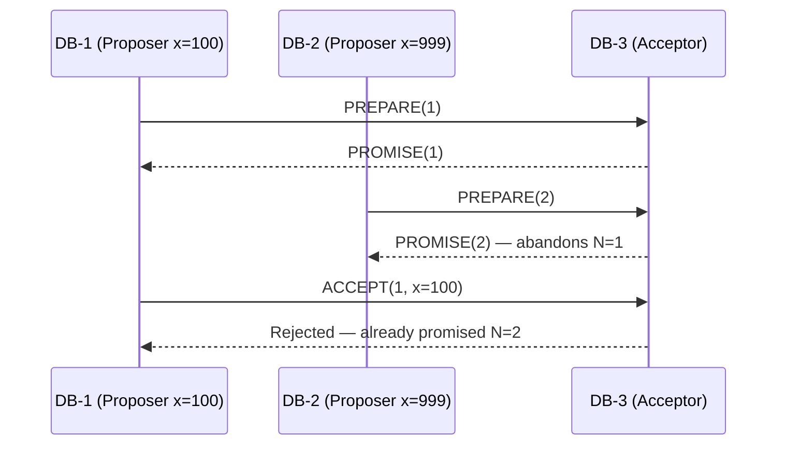

> [!info] The core idea
> Paxos uses two phases for every write. Phase 1 establishes "I am in charge for this round." Phase 2 proposes the actual value. You cannot skip Phase 1 — without it, two proposers could commit conflicting values.

---

## Why two phases?

When any node can propose a value at any time, you need to first establish majority permission before sending the actual value. If you just sent the value directly, two proposers could both get majority acks for different values — split brain.

Phase 1 solves this by making each proposer stake a claim first. Only after majority has promised to follow you can you proceed to Phase 2.

---

## Phase 1 — Prepare

A client write hits DB-1. DB-1 becomes the proposer. It picks proposal number **N=1** (first proposal it has ever made) and sends `PREPARE(1)` to all acceptors.

```
DB-1 → PREPARE(1) → DB-2
DB-1 → PREPARE(1) → DB-3
```

Each acceptor checks: "Have I seen a proposal number higher than 1 before?" Neither has. So both reply with `PROMISE(1)`.

A PROMISE means two things:
1. "I acknowledge you as the current proposer"
2. "I will reject any proposal with a number lower than N from now on"

```
DB-2 → PROMISE(1) → DB-1
DB-3 → PROMISE(1) → DB-1
```

DB-1 now has majority (itself + DB-2 + DB-3). It has permission to proceed to Phase 2.

> [!important] DB-3 being down is fine
> If DB-3 was crashed and never replied, DB-1 still has majority — itself + DB-2 = 2 out of 3. Majority, not unanimity, is all that's needed.

---

## Phase 2 — Accept

DB-1 now sends the actual value: `ACCEPT(1, x=100)` — proposal number plus the value.

```
DB-1 → ACCEPT(1, x=100) → DB-2
DB-1 → ACCEPT(1, x=100) → DB-3
```

DB-2 checks: "Is 1 still the highest proposal number I've promised?" Yes. It writes `x=100` to its log and replies `Accepted`.

DB-1 itself also writes `x=100`. Majority confirmed. DB-1 broadcasts to everyone: **commit `x=100`**.



---

## Simultaneous writes — the interesting case

While DB-1 is in Phase 1 with N=1 for `x=100`, a second client hits DB-2 with `SET x=999`. DB-2 picks N=2 and sends `PREPARE(2)`.

DB-1 and DB-3 check — "Is 2 higher than 1?" Yes. They promise N=2 to DB-2, abandoning their promise to DB-1.

DB-1 eventually sends `ACCEPT(1, x=100)` — but acceptors already promised N=2. They reject N=1. DB-1's proposal is dead.



DB-1 retries with a higher number — say N=3 — and goes back to Phase 1.


---

## The rule that prevents data loss

When DB-1 collects promises in its retry (N=3), acceptors don't just say "I promise." They also report any value they already accepted:

```
DB-2 → PROMISE(3) + "I accepted (N=2, x=999)"
DB-3 → PROMISE(3) + "I accepted nothing"
```

Now DB-1 is in Phase 2 — but Paxos has a strict rule:

**If any acceptor already accepted a value, the proposer must use the value with the highest proposal number among all the promises it received.**

DB-1 wanted to propose `x=100`. But DB-2 already accepted `x=999` at N=2. DB-1 must use `x=999` instead.

Why? Because `x=999` might already be committed on majority. If DB-1 overwrites it with `x=100`, it destroys a value that majority already agreed on. DB-1 has no way of knowing whether it was committed or not — so the safe choice is always to preserve the highest accepted value.

```
DB-1 wanted: x=100
DB-2 already accepted: x=999 at N=2
DB-3 accepted nothing

Highest accepted value = x=999 (N=2 is the only accepted value)
DB-1 must propose: ACCEPT(3, x=999)
```

DB-1 becomes the messenger that helps `x=999` get committed — even though it originally wanted `x=100`. The client that sent `x=100` gets no response and retries.

> [!important] Always use the highest proposal number among accepted values
> If multiple acceptors report different accepted values, always go with the one that has the highest proposal number — that's the most recently agreed-upon value and the one most likely to have already been committed on some nodes.

---

## Log replay for nodes that missed writes

If a node was down during several writes and comes back, it does **log replay** — it communicates with other nodes and fills in the missing entries sequentially. If it's a brand new node, it gets a full snapshot of the existing log first, then replays from there.

---

