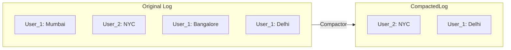

> [!info] Kafka is a persistent log, but it's not "infinite." Since Google processes 100k ad clicks per second, we'd need petabytes of storage every year just to keep them all. We must have a "Cleaning Crew" (the Retention policy) that automatically deletes old data.

---

## The problem: 3.1 Petabytes of Trash

Every ad-click in Kafka takes up space. If you never delete anything, your system will eventually crash because the hard drives are 100% full. 

**But you have two very different kinds of data:**
1.  **Events:** Like "Ad Click #12345." You care about these right now for billing, but you probably don't care about them 6 months from now.
2.  **State:** Like "User_42's Wallet Balance: $50." You *must* keep this forever, or you'll lose the user's money.

Kafka gives us two different cleaning methods for these two scenarios.

---

## 1. Retention: The "Trash Can with a Timer"

This is how Kafka handles **Events** (like ad-clicks). You treat Kafka like a trash can that automatically empties itself on a timer.

### Time-based Retention (The default)

You tell Kafka: *"I only care about the last 7 days."*
- After 7 days, Kafka just deletes the oldest files. 
- **The Reasoning:** If your **Billing Service** crashes, you have a full week to fix it and "replay" those 7 days of data to catch up. After that, we assume the data is no longer useful for daily operations.

### Size-based Retention

You tell Kafka: *"I only have 500 GB of disk space on this server. Never go above that."*
- Once you hit 500 GB, Kafka deletes the oldest data to make room for the new stuff. 
- **The Goal:** This is a "Safety Switch." You're choosing "Server Stability" over "History."

> [!important] **The "Hybrid" Guardrail:** In a real interview, explain that you'd use **BOTH**. You delete data after 30 days (History), *but* if a massive traffic spike happens and your disk fills up in 3 days, the Size-based rule kicks in and deletes the oldest data to keep the server alive. **Better to lose 3-day-old history than to crash the entire cluster.**

---

## 2. Log Compaction: The "Permanent Filing Cabinet"

This is how Kafka handles **State** (like Wallet Balances or User Profiles). 

Imagine you are building a **User Profile Service**.
- **10:01 AM:** User_123 updates their city to **Mumbai**.
- **10:05 AM:** User_123 updates their city to **Bangalore**.
- **10:10 AM:** User_123 updates their city to **Delhi**.

If you use normal "Retention," Kafka would store all 3 messages. But you only care about the *latest* city (**Delhi**). 

### The Solution: Compact by Key

You tell Kafka: *"I only care about the **LATEST** message for each unique Key (`user_id`)."*

The Kafka **Compactor** (the cleaning crew) walks through the log and deletes the "old news."

**Why this is "Genius" for Scale:**
1.  **Infinite Retention:** Because you only keep one message per user, the topic stays small! You can keep it forever.
2.  **No SQL Database Needed:** If your Billing Service crashes and loses its RAM, it doesn't call a DB. It just reads the **Compacted Topic** from the beginning. It "re-learns" every user's latest balance in seconds and it's back in business.

---

## What it guarantees / What it doesn't guarantee

**What it guarantees:**
- You will always have the **LATEST** message for any key.
- The log size only grows with the number of *unique keys*, not the total number of events.

**What it doesn't guarantee:**
- You might lose the "History." If you need to know what city the user lived in *before* Delhi, compaction has already deleted that information. 

> [!tip] **Interview framing:** "I'd use a 30-day retention for our raw ad-click topic—this gives us a buffer to fix processing bugs. But for our 'Advertiser Balances' topic, I'd use **Log Compaction**. This makes Kafka our 'Source of Truth'—it stays small enough to keep forever, and we can quickly replay it to fill up our RAM cache whenever our service restarts."
