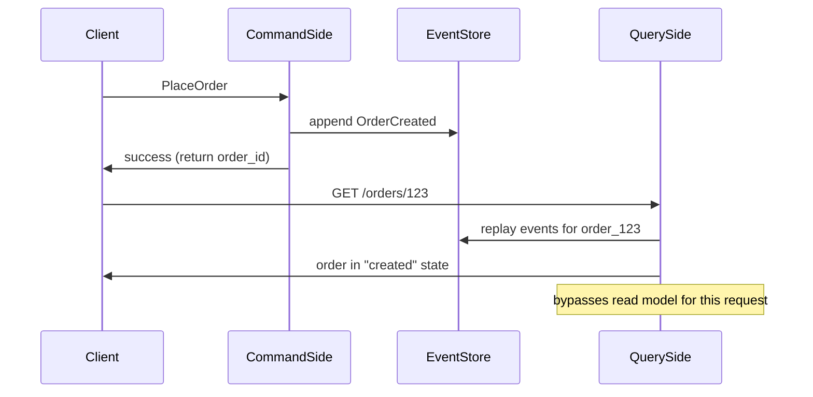
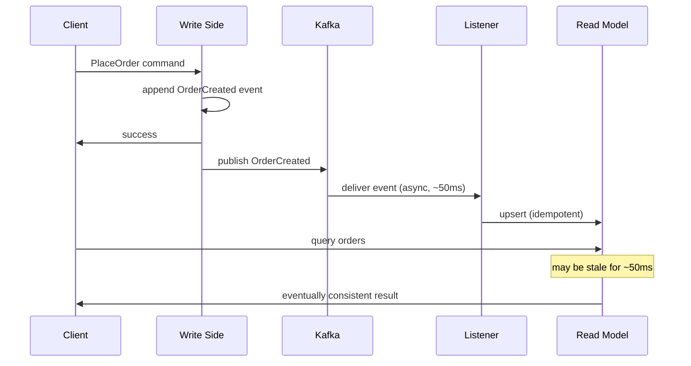

## The Consistency Problem in CQRS

In CQRS,write side and read side are updated **asynchronously** After a command succeeds, the read model is not immediately updated — the event has to travel through Kafka and be processed by the listener first.

```
t=0ms:  OrderShipped event appended to event store ✓
t=0ms:  Command returns success to client ✓
t=50ms: Kafka delivers event to listener
t=51ms: Read model updated ✓

Gap: 0ms → 51ms — read model is STALE
```

During this window, if a user queries the read model, they'll see the old status.

---

## This is Eventual Consistency

CQRS is **eventually consistent** by design. The read model will catch up, but not instantly.

This is acceptable for most use cases:
- Order list page — slight staleness is fine
- Analytics dashboards — eventual consistency is expected
- Admin panels — usually fine

But not for all use cases:
- Right after placing an order, user expects to see it immediately
- Payment confirmation page — must show updated status

---

## Fix 1: Read Your Own Writes

After a write, bypass the read model and read directly from the event store for that specific entity.



**Trade-off**: Slightly slower for the immediate read (replay vs read model). But guarantees the user sees their own write.

---

## Fix 2: Version Numbers

Client tracks the version (event count) it expects. Read model includes a version number. If the read model's version is behind what the client expects, wait briefly.

```
Write returns: { order_id: 123, version: 5 }
Client reads:  GET /orders/123?min_version=5

Read model at version 4 → wait up to 500ms for version 5
Read model at version 5 → return immediately
Timeout → return stale data with warning
```

---

## Fix 3: Synchronous Read Model Update (rare)

For critical paths, update the read model **synchronously** in the same transaction as the event write. Sacrifices the scalability benefits of CQRS but guarantees consistency.

Only use this for very specific high-value flows (e.g., payment confirmation).

---

## Idempotency on Read Model Updates

Because Kafka delivers at-least-once, the listener may process the same event multiple times (e.g., crash before committing offset). The read model update must be idempotent.

```sql
-- Wrong: applying twice doubles the amount
UPDATE order_read_model SET amount = amount + 49.99 WHERE order_id = 123

-- Right: applying twice produces same result
UPDATE order_read_model SET amount = 49.99 WHERE order_id = 123

-- Right: upsert pattern
INSERT INTO order_read_model (order_id, status, amount)
VALUES (123, 'shipped', 49.99)
ON CONFLICT (order_id)
DO UPDATE SET status = EXCLUDED.status
```

---

## Full CQRS Consistency Diagram



---

## Key Insight

> Eventual consistency in CQRS is a feature, not a bug — it's what enables independent scaling of reads and writes. The key is knowing **which flows need strong consistency** and handling those explicitly with read-your-own-writes or version checks. Everything else can tolerate the lag.
