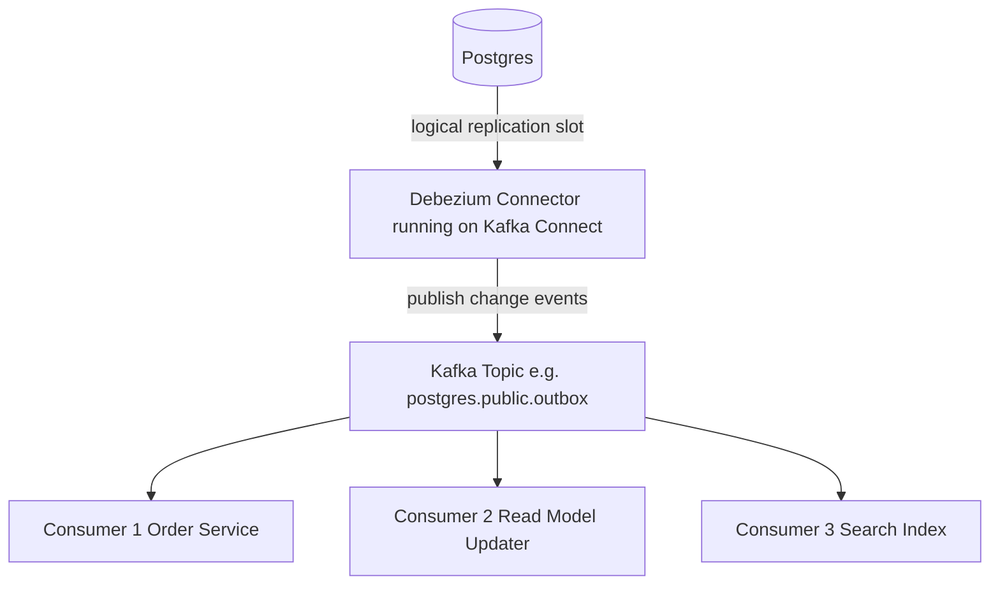
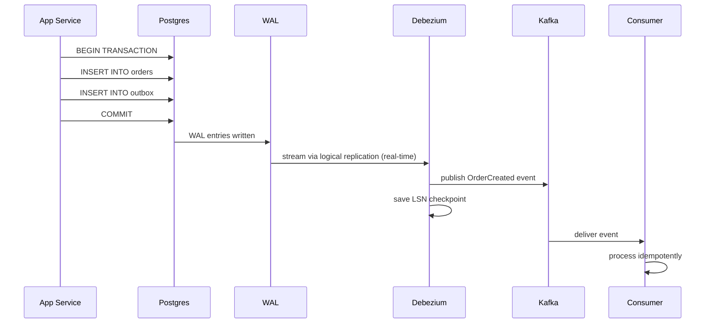

## What is Debezium?

Debezium is an open-source CDC tool that connects to Postgres (and other DBs) via logical replication, reads the WAL, and publishes changes to Kafka in real-time.

It is the most widely used CDC tool in production systems.

---

## Debezium Architecture



### Components

**Logical Replication Slot** — a Postgres construct that tracks how far a subscriber has read the WAL. Postgres keeps WAL segments until all replication slots have consumed them.

**Debezium Connector** — runs as a Kafka Connect plugin. Connects to the replication slot and streams changes.

**Kafka Topic** — Debezium publishes each table's changes to a dedicated topic (e.g., `postgres.public.outbox`).

---

## How Debezium Connects to Postgres

Debezium uses Postgres logical replication — the same protocol read replicas use:

```sql
-- Postgres side: create a replication slot for Debezium
SELECT pg_create_logical_replication_slot('debezium_slot', 'pgoutput');
```

Postgres now streams all WAL changes to this slot. Debezium reads from it continuously.

---

## LSN — Log Sequence Number

Every WAL entry in Postgres has an **LSN (Log Sequence Number)** — a monotonically increasing identifier for its position in the WAL.

```
WAL entry 1: LSN 0/1A00000 — INSERT orders (123, created)
WAL entry 2: LSN 0/1A00100 — INSERT outbox (1, OrderCreated)
WAL entry 3: LSN 0/1A00200 — UPDATE outbox SET published=true
```

Debezium tracks the last LSN it successfully processed and stores it in Kafka (in a **dedicated internal topic**).

---

## Crash Recovery

If Debezium crashes mid-stream:

```
Debezium processes LSN 0/1A00100 → publishes to Kafka ✓
Debezium crashes before saving LSN
Debezium restarts → reads last saved LSN: 0/1A00000
Debezium re-processes LSN 0/1A00100 → publishes to Kafka again
```

**Result**: duplicate event in Kafka. Same as the poller — at-least-once delivery.

Consumers must be idempotent:
```sql
INSERT INTO order_read_model (order_id, status)
VALUES (123, 'created')
ON CONFLICT (order_id) DO UPDATE SET status = EXCLUDED.status
```

---

## Debezium + Outbox Pattern (The Full Stack)

Debezium replaces the outbox poller entirely:



No polling. No extra DB queries. Events published within milliseconds of the transaction commit.

---

## Outbox Table No Longer Needs `published` Column

With Debezium, you don't need to mark rows as published — Debezium tracks its position via LSN. You can simplify the outbox table:

```sql
-- Simple outbox table (Debezium version)
CREATE TABLE outbox (
    id UUID PRIMARY KEY DEFAULT gen_random_uuid(),
    event_type VARCHAR NOT NULL,
    payload JSONB NOT NULL,
    created_at TIMESTAMP DEFAULT NOW()
);

-- No published column needed
-- Debezium reads inserts via WAL
-- Old rows can be cleaned up periodically
```

---

## WAL Retention Warning

Postgres keeps WAL segments until all replication slots have consumed them. If Debezium goes down for a long time:

- WAL segments accumulate on disk
- Postgres disk can fill up
- **Risk**: DB crashes due to full disk

**Fix**: monitor replication slot lag. **If Debezium is down too long, drop the slot to let Postgres clean up WAL** — and accept that you'll need to replay from a snapshot when Debezium comes back.

---

## Debezium vs Poller Comparison

| | Outbox Poller | Debezium CDC |
|---|---|---|
| Latency | Up to polling interval (seconds) | Milliseconds |
| DB overhead | Queries every N seconds | Near zero |
| Complexity | Simple (just a loop) | Requires Kafka Connect setup |
| Crash recovery | Re-reads unpublished rows | Re-reads from LSN checkpoint |
| Delivery guarantee | At-least-once | At-least-once |
| Missed events | Possible with bugs | None (WAL is complete) |

---

## Key Insight

> Debezium turns your Postgres WAL into a real-time event stream with zero application code changes. Paired with the outbox pattern, it gives you atomic writes + guaranteed event delivery + real-time publishing — the gold standard for event-driven systems.
