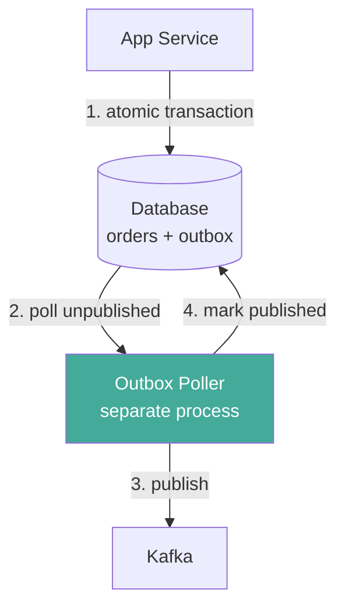
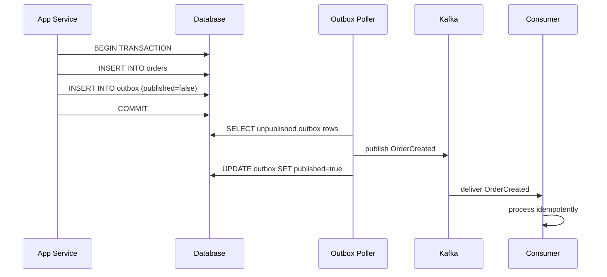

## The Fix: Write Events Inside the Same Transaction

Instead of publishing directly to Kafka, write the event to a special **outbox table** inside the same DB transaction as your business write.

```sql
BEGIN TRANSACTION
  INSERT INTO orders (order_id, status, amount)
  VALUES (123, 'created', 49.99);

  INSERT INTO outbox (event_type, payload, published)
  VALUES ('OrderCreated', '{"order_id": 123, "amount": 49.99}', false);
COMMIT
```

Either both rows are written or neither. The event is now durably stored inside the DB — atomically with the business data.

---

## The Outbox Table

```
outbox table:

| id | event_type   | payload                          | published | created_at |

| 1  | OrderCreated | { order_id: 123, amount: 49.99 } | false     | 10:00:00   |
| 2  | OrderShipped | { order_id: 456, tracking: UPS } | true      | 10:01:00   |
| 3  | OrderCreated | { order_id: 789, amount: 29.99 } | false     | 10:02:00   |
```

---

## The Outbox Poller

A separate process — the **outbox poller** — runs independently and:
1. Reads unpublished rows from the outbox table
2. Publishes each event to Kafka
3. Marks the row as published

```python
while True:
    events = db.query("SELECT * FROM outbox WHERE published = false LIMIT 100")
    for event in events:
        kafka.publish(event.event_type, event.payload)
        db.execute("UPDATE outbox SET published = true WHERE id = ?", event.id)
    sleep(5)
```



---

## Failure Scenarios

### App crashes after DB write
- Both orders and outbox rows are written (transaction committed)
- Poller will eventually pick up the outbox row and publish
- ✓ Event will be delivered

### Poller crashes after publishing, before marking published
- On restart, poller sees the row still marked `published = false`
- Publishes to Kafka again → **duplicate event**
- Consumer must be idempotent to handle this

### Poller crashes before publishing
- Row still unpublished, poller retries on restart
- ✓ No data loss

---

## This Gives You At-Least-Once Delivery

The outbox pattern guarantees the event **will** be published — but may be published more than once.

Consumers must handle duplicates:

```sql
-- Consumer processes OrderCreated
INSERT INTO order_read_model (order_id, status, amount)
VALUES (123, 'created', 49.99)
ON CONFLICT (order_id) DO NOTHING  -- safe to apply twice
```

---

## Poller Limitations

The polling approach works but has two problems:

1. **Wasted queries** — polling every 5 seconds hits the DB even when outbox is empty
2. **Latency** — up to 5 seconds between event written and published to Kafka

For high-throughput or latency-sensitive systems, polling is not ideal. The solution is **CDC (Change Data Capture)** — covered next.

---

## Full Flow Diagram



---

## Key Insight

> The outbox pattern solves the dual write problem by keeping both writes inside the same DB transaction. The cost is an extra table and a separate poller process. The guarantee is that events are never lost — at the expense of possible duplicates, which consumers handle via idempotency.
