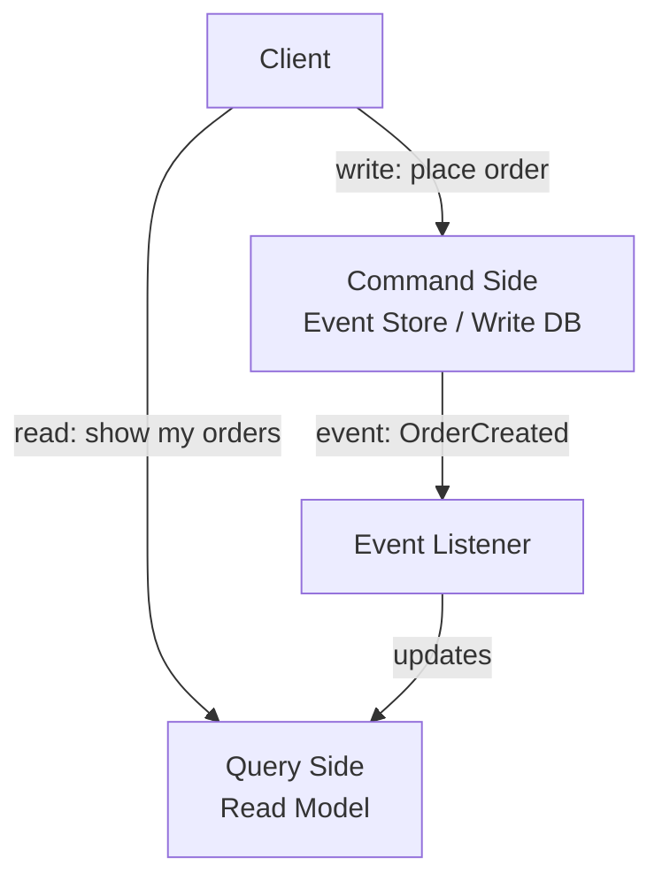

> [!info] Command Query Responsibility Segregation 
> separates your write model from your read model.
> - Writes go to one place optimized for consistency and event ordering. 
> - Reads come from a different place optimized for fast queries. They're kept in sync by an event listener that reacts to every write and updates the read model accordingly.

---

## The problem that forces CQRS

In a normal system, the same database handles reads and writes. This works at low scale. As systems grow, it breaks in two specific ways.

**Problem 1 — With event sourcing:**

If you're using event sourcing, there's no `status` column at all. Only raw events. Want to answer "show all orders in `payment_pending` for users in California, sorted by amount"? You'd need to replay every order's events for every user in California. That's not a query — that's a batch job.

**Problem 2 — Write model isn't shaped for reading:**

Even without event sourcing, the write model is normalized for consistency — no duplication, proper foreign keys, structured for ACID transactions. That's the right shape for writes. But complex reads need denormalized data, pre-joined tables, and indexes optimized for specific queries. The same schema can't be perfect for both.

---

## The CQRS approach

Maintain two separate models. One for writing, one for reading.



**Command side (write)** — handles state changes. Appends events to the event store. Optimized for correctness: ACID guarantees, event ordering, consistency. Does not serve read queries.

**Query side (read)** — handles all read queries. Maintains pre-computed, denormalized read models. Optimized for query speed. Does not handle writes.

---

## What the read model looks like

The event store contains raw events:

```
order_events:
| order_id | event            | ts    |
| 123      | OrderCreated     | 10:00 |
| 123      | PaymentConfirmed | 10:02 |
| 123      | OrderShipped     | 10:05 |
```

The read model projects those events into a query-friendly shape:

```
orders_read_model:
| order_id | current_status | amount | user_state  | user_id |
| 123      | shipped        | $49.99 | California  | u1      |
```

Every time a new event is appended to the event store, the event listener fires, reads the event, and updates the read model. The read model is always pre-computed and ready — no replay needed at query time.

```
Query: "orders in payment_pending for users in California, sorted by amount"
→ SELECT * FROM orders_read_model
  WHERE current_status = 'payment_pending'
  AND user_state = 'California'
  ORDER BY amount DESC

→ Direct table scan. Milliseconds. Done.
```

---

## Different read models for different query patterns

One of the real powers of CQRS is that you can maintain multiple read models — each one shaped for a different kind of query.

```
Write side: one event store (source of truth)
      ↓
Event listeners:
  → PostgreSQL read model  (for relational queries: orders, users, joins)
  
  → Elasticsearch index    (for full-text search: search orders by description)
  
  → Redis cache            (for fast key lookups: user's current order status)
  
  → Cassandra table        (for time-series: user's order history per month)
```

The same event — `OrderCreated` — flows to all four listeners, each updating their own read model. Different services query whichever store fits their access pattern.

---

## The trade-off — eventual consistency

The write side and read side are not in sync at the exact moment of a write. There is a small lag — the time it takes for the event to flow through the listener and update the read model.

```
User places order → event appended to write DB at 10:00:00.000
Event listener fires → read model updated at 10:00:00.050

Between 10:00:00.000 and 10:00:00.050:
→ The order exists in the write DB
→ The order does NOT yet appear in the read model
→ A read query during this window misses the order
```

This is usually acceptable — 50ms lag is invisible to users. But it's a design choice you need to acknowledge.

> [!danger] CQRS introduces eventual consistency between the write side and read side. If your read query immediately follows a write (e.g., "place order, then immediately show order status"), you may read stale data. Design the UX to account for this — or use a short-circuiting technique like reading directly from the write model for the just-created entity.

---

## CQRS without event sourcing

You don't need event sourcing to use CQRS. Even with a normal mutable database, you can apply the pattern:

```
Write: normal UPDATE/INSERT to PostgreSQL (no event store)
Read: maintain a separate denormalized read table or cache
Event mechanism: DB triggers, CDC, or application-level dual writes
```

The separation of read and write models is the pattern. Event sourcing is one way to implement the write side — not a requirement.

> [!important] CQRS and event sourcing are separate patterns that pair naturally. Event sourcing handles "how you write state." CQRS handles "how you serve reads from that state efficiently." You can use either without the other, but together they solve write complexity (event sourcing) and read complexity (CQRS) as a package.

> [!tip] **Interview framing:** "I'd separate the write model — which just appends events for consistency — from the read model, which projects those events into denormalized tables for fast queries. The read model can be in Postgres, Elasticsearch, or Redis depending on what each consumer needs. The trade-off is eventual consistency between writes and reads, which is acceptable here because a 50ms lag is invisible to users."
