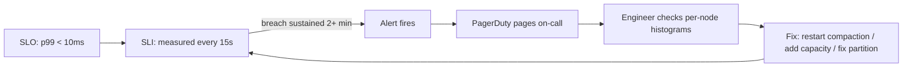

> [!info] Knowing your SLI is breached is useless if nobody finds out for an hour
> With 1,200 nodes, things break constantly. Alerting closes the loop — when SLI diverges from SLO, a human gets paged immediately. But alert on everything and you drown in noise. Alert on nothing and you miss real incidents.

---

## The alert rules for our KV store

Each SLO maps to an alert rule. The rule fires when the SLI breaches the SLO for a sustained period:

```
IF p99_ec_read_latency > 10ms
FOR more than 2 minutes
→ page on-call engineer (CRITICAL)

IF p99_sc_read_latency > 50ms
FOR more than 2 minutes
→ page on-call engineer (CRITICAL)

IF p99_write_latency > 20ms
FOR more than 2 minutes
→ page on-call engineer (CRITICAL)

IF availability < 99.99%
FOR more than 2 minutes
→ page on-call engineer (CRITICAL)
```

---

## Why you need a sustained breach window

Without the "for more than 2 minutes" condition, every transient spike triggers a page. At 1,200 nodes with constant background processes, transient spikes are inevitable:

```
Causes of transient latency spikes (self-resolving):
  → Compaction kicks in on a node → disk I/O spikes for 30 seconds → finishes
  → Memtable flush on a node → brief write pause → resumes
  → GC pause on a JVM-based node → 200ms stall → recovers
  → One replica slow to respond → quorum met by faster replicas → no client impact
  → Gossip briefly marks a node as suspected → indirect probes clear it
```

All of these cause a momentary SLI dip that resolves within seconds. Paging an engineer at 3am for a compaction-induced blip that lasted 15 seconds is **alert fatigue** — engineers start ignoring pages, and when the real incident happens, the page gets dismissed.

The 2-minute window filters out transient self-resolving events while catching real sustained degradation fast enough to act on.

```
Compaction spike (30 seconds):     alert condition met but not sustained → no page
Partition causing quorum failures: condition sustained for 5 minutes     → page fires at 2 minutes
```

---

## Warning alerts vs critical alerts

Not everything needs to wake someone up. Some metrics are **leading indicators** — they signal that something is drifting toward an SLO breach, but hasn't crossed the line yet.

```
CRITICAL (page immediately):
  → SLO breach sustained for 2+ minutes
  → Any of the 4 SLO alert rules above

WARNING (send to Slack, don't page):
  → p99 EC read > 7ms for 5 minutes       (approaching 10ms SLO)
  → Compaction backlog > 50 SSTables       (reads will slow down soon)
  → Hinted handoff queue > 10,000 hints    (nodes are staying down too long)
  → Disk usage > 80% on any node           (approaching full, compaction at risk)
  → Read repair rate > 5% of reads         (replicas are diverging unusually)
  → Bloom filter false positive rate > 2%  (read amplification increasing)
  → Tombstone ratio > 30% of reads         (too many uncompacted deletes)

INFORMATIONAL (dashboard only, no notification):
  → Anti-entropy differences found per cycle
  → SSTable count per node
  → Memtable flush frequency
  → Gossip message rate
```

The warning alerts give the team time to investigate and fix before it becomes a critical incident. If compaction backlog is growing, an engineer can investigate during business hours instead of being woken up at 3am when p99 finally breaches SLO.

---

## The full loop — SLO → SLI → Alert → Action

```
SLO:     p99 EC read latency < 10ms              ← the promise
SLI:     actual p99 measured every 15 seconds     ← the reality
Alert:   fires when SLI > SLO for > 2 minutes    ← the notification
Action:  on-call engineer investigates             ← the response
```

Every 15 seconds, Prometheus computes cluster-wide p99 for each operation type. If EC read p99 stays below 10ms, nothing happens. If it crosses 10ms and stays there for 2 minutes, the alert fires — PagerDuty pages the on-call engineer.

The engineer gets:
- Which SLO is breaching (EC read latency)
- The current value (p99 = 15ms)
- A link to the latency dashboard showing the spike
- Per-node breakdown to identify the outlier



---

## Prometheus vs managed services for 1,200 nodes

**Prometheus (self-hosted):**
- Scraping 1,200 nodes every 15 seconds = 80 scrapes/sec — well within Prometheus capacity
- Pairs with Grafana for dashboards and Alertmanager for routing pages
- More control over retention, alert rules, and custom metrics
- You manage the Prometheus infrastructure (storage, HA, federation)

**Datadog / Grafana Cloud (managed):**
- Send metrics from 1,200 nodes to their service
- No ops burden — no Prometheus servers to manage
- Built-in dashboards, alerting, anomaly detection
- Cost: at 1,200 nodes with dozens of metrics each, the bill gets significant

For infrastructure as critical as a KV store, many teams run **both** — Prometheus for real-time operational metrics and alerting, plus a managed service for long-term storage and cross-team dashboards.

---

> [!tip] Interview framing
> "We have four critical alert rules — one per SLO. Each fires when the SLI breaches the threshold for more than 2 minutes, filtering out transient spikes from compaction or GC pauses. Below critical alerts, we have warning alerts on leading indicators — compaction backlog, hinted handoff queue depth, disk usage, Bloom filter false positive rate. These give us time to fix problems before they become SLO breaches. The full loop: Prometheus scrapes all 1,200 nodes every 15 seconds, computes cluster-wide SLIs, alerts fire when SLI diverges from SLO, PagerDuty pages on-call with the exact metric and per-node breakdown."
