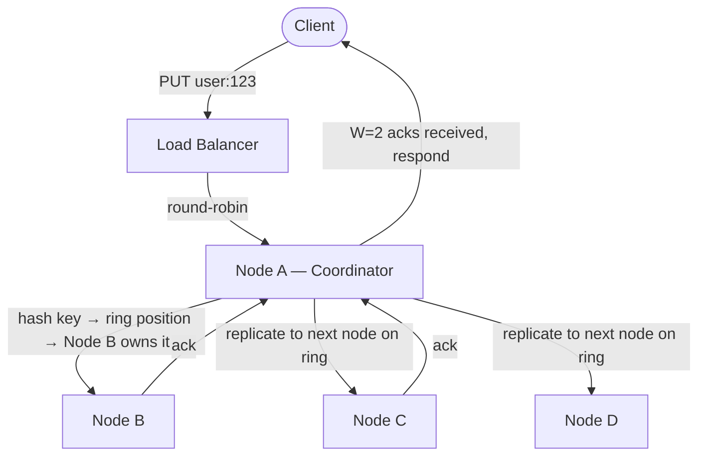
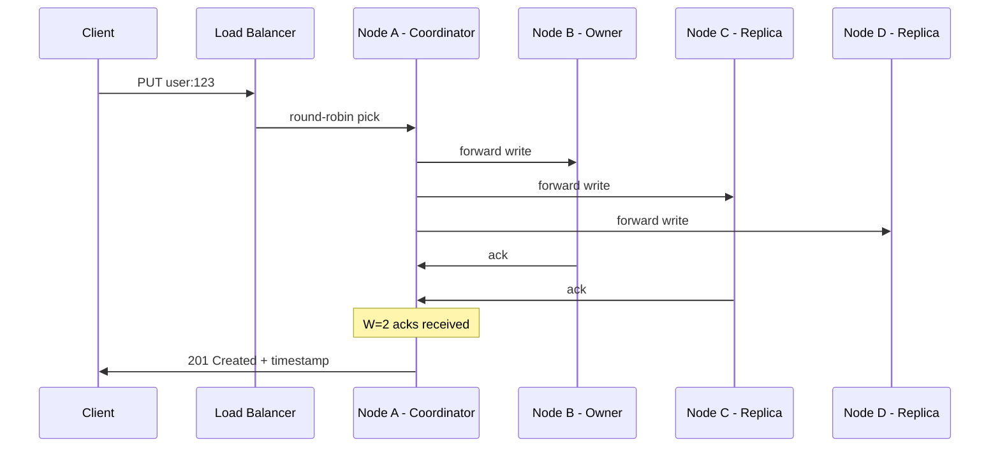
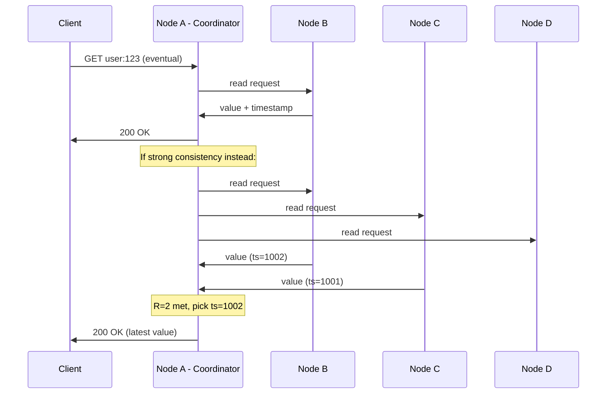

# Key-Value Store Base Architecture

## Components

```
Client              — any service using our KV store (WhatsApp backend, profile service, etc.)
Load Balancer       — picks any healthy node in the cluster, round-robin
Cluster Nodes       — every node is identical, any node can coordinate any request
Consistent Hashing  — determines which nodes own which keys (ring with vnodes)
```

This is a **leaderless architecture**. There's no single primary that handles all writes. Every node in the cluster can accept reads and writes for any key. The node that receives the request becomes the **coordinator** for that request — it hashes the key, finds the owning nodes on the ring, and forwards the request to them.

---

## Architecture Diagram



---

## Write Flow — put(key, value)

```
1. Client sends POST /api/v1/item
   Body: { "key": "user:123", "value": "base64...", "ttl": 86400 }

2. Load balancer picks any healthy node (round-robin)
   → Node A receives the request

3. Node A becomes the coordinator for this request:
   a. Hashes "user:123" → lands at position 4500 on the consistent hashing ring
   b. Looks up the ring → Node B owns the range containing position 4500
   c. Node C and Node D are the next two nodes on the ring (replicas)

4. Coordinator forwards the write to Node B, Node C, and Node D (N=3)
   Each node:
   a. Appends to WAL (Write-Ahead Log) on disk — sequential write, fast
   b. Writes to in-memory memtable
   c. Acks back to coordinator

5. Coordinator waits for W=2 acks (quorum write)
   → 2 of 3 nodes have confirmed → write is durable

6. Coordinator responds to client:
   201 Created { "key": "user:123", "timestamp": 1713400000000 }
```



---

## Read Flow — get(key)

```
1. Client sends GET /api/v1/item?key=user:123&consistency=eventual

2. Load balancer picks any healthy node → Node A becomes coordinator

3. Node A hashes "user:123" → same ring position → Node B, C, D own replicas

4a. If consistency=eventual:
    → Coordinator sends read to ANY ONE of Node B, C, or D
    → First response back → return to client
    → Fast: one network hop

4b. If consistency=strong:
    → Coordinator sends read to ALL THREE: Node B, C, D
    → Waits for R=2 responses (quorum)
    → Returns the value with the highest timestamp
    → Slower: must wait for 2 responses

5. Coordinator responds to client:
   200 OK { "key": "user:123", "value": "base64...", "timestamp": ... }
```



---

## Delete Flow — delete(key)

```
1. Client sends DELETE /api/v1/item?key=user:123

2. Coordinator hashes key → finds owning nodes

3. Coordinator sends a TOMBSTONE write to Node B, C, D
   (a tombstone is a special marker: "this key is deleted")

4. Waits for W=2 acks — same as a normal write

5. Future reads that hit the tombstone return 404

6. Background compaction later cleans up tombstones from disk

7. Coordinator responds: 200 OK { "deleted": true }
```

Delete is just a write — a write of a tombstone. Same replication, same quorum, same flow. The key isn't physically erased until compaction runs later.

---

## What This Design Does NOT Have Yet

```
No deep dive on consistent hashing  → how the ring works, vnodes, rebalancing
No storage engine detail             → LSM Tree internals, memtable, SSTables
No failure handling                  → what if a replica is down during write?
No read repair                       → what if replicas disagree on a read?
No anti-entropy                      → how do replicas sync in the background?
No cluster membership                → how do nodes discover each other?
No TTL implementation                → how does expiry actually work?
No caching layer                     → every read goes to the storage node
```

These are all deep dive topics. The base architecture establishes the core flow: client → LB → any node as coordinator → hash key → forward to owning nodes on the ring → quorum ack → respond. Everything else builds on this skeleton.

---

> [!tip] Interview framing
> "Leaderless architecture — any node can coordinate any request. Client hits a load balancer, which round-robins to any healthy node. That node becomes the coordinator: hashes the key, finds the owning nodes on the consistent hashing ring, forwards the write to N=3 replicas, waits for W=2 quorum acks, responds. Reads are the same — coordinator finds replicas, sends read to one node for eventual consistency or quorum for strong. Deletes are tombstone writes. No single point of failure — if any node dies, another coordinates."
