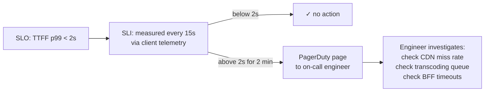

# Observability — Alerting

> [!info] Knowing your SLI is breached is useless if nobody finds out for an hour. Alerting closes the loop — when SLI diverges from SLO, a human gets paged immediately.

---

## The Alert Rules

```
IF API latency p99 > 200ms
FOR more than 2 minutes
→ page on-call engineer

IF TTFF p99 > 2000ms
FOR more than 2 minutes
→ page on-call engineer

IF stream start availability < 99.99%
FOR more than 2 minutes
→ page on-call engineer

IF buffering ratio > 0.1%
FOR more than 2 minutes
→ page on-call engineer
```

---

## Why You Need a Sustained Breach Window

Without the duration condition, a single spiky second triggers a page. At 500,000 API requests/second, occasional spikes happen — a GC pause on one BFF instance, a brief Redis connection reset, a CDN node rebalancing. These self-resolve in seconds.

If you alert on every spike, you wake engineers at 3am for events that resolved before anyone could respond. This is **alert fatigue** — engineers start ignoring pages because most are false alarms. When the real incident happens, the page gets ignored too.

The 2-minute window filters out transient spikes while still catching real degradation fast enough to act.

```
CDN brief hiccup (10 seconds):        condition met but not sustained → no page, self-resolved
Redis connection reset (20 seconds):  same → no page
Actual CDN node failure (30 minutes): condition met for > 2 minutes → page fires
```

---

## Leading Indicator Alerts — Act Before SLO Breaches

SLO-based alerts tell you when you've already failed users. Leading indicator alerts tell you something is degrading before the SLO is breached.

```
IF Redis cache hit ratio < 90%
FOR more than 3 minutes
→ warning alert
Reason: cache miss spike means more DB reads → API latency climbing

IF CDN cache miss rate > 5%
FOR more than 3 minutes
→ warning alert
Reason: CDN misses mean more S3 fetches → TTFF climbing on stream starts

IF BFF fan-out timeout rate > 1%
FOR more than 2 minutes
→ warning alert
Reason: genre services timing out → home feed rows being dropped

IF CDN bandwidth utilisation > 80% on any node
→ warning alert
Reason: node approaching saturation → buffering ratio about to spike

IF circuit breaker state = OPEN on any genre service
→ page immediately (no sustained window needed)
Reason: service confirmed down — graceful degradation already active, needs attention

IF transcoding queue depth > 10,000 jobs
FOR more than 5 minutes
→ warning alert
Reason: backlog growing → new content not ready → TTFF spikes on launch night
```

Circuit breaker alerts are exceptions to the sustained window rule. A circuit breaker opening means a service has already failed — not a transient spike. Every second it stays open, some users see a missing row. Immediate page is warranted.

---

## The Full Alerting Loop



Every 15 seconds Prometheus computes fleet-wide p99 TTFF from the telemetry histograms. If it stays below 2 seconds, nothing happens. If it crosses 2 seconds and stays there for 2 minutes, PagerDuty pages the on-call engineer with the exact metric, current value, and a graph showing when it started.

---

## Tooling

**Prometheus + Grafana + Alertmanager** — Prometheus scrapes metrics from BFF instances and ingests telemetry histograms, Grafana renders dashboards per component (BFF, CDN, genre services, transcoding), Alertmanager routes pages to PagerDuty.

**Client telemetry pipeline** — a separate ingestion service receives TTFF and buffering ratio events from player SDKs globally. These feed into the same Prometheus histograms as server-side metrics so all four SLIs land in one alerting system.

> [!tip] Interview framing
> "Alert rule: if TTFF p99 exceeds 2 seconds for more than 2 minutes, page on-call. 2-minute window prevents alert fatigue from transient CDN hiccups. Leading indicators: Redis cache hit ratio and CDN miss rate warn before SLO breaches. Circuit breaker state is an immediate page — no sustained window needed, that's a confirmed service failure."
