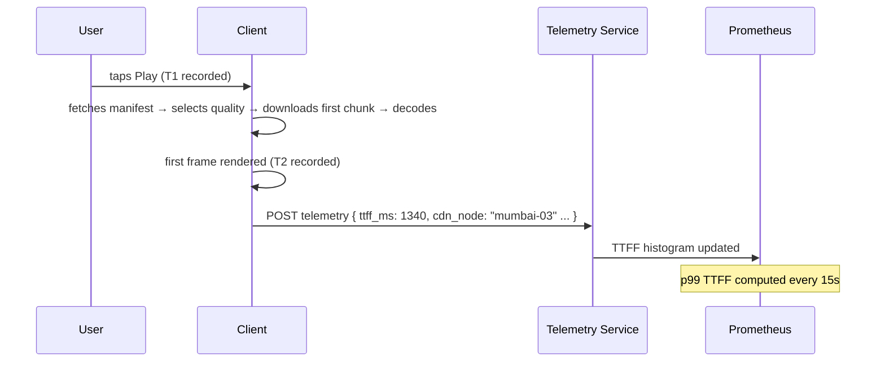

# Observability — Measuring Latency

> [!info] Netflix has two completely different latency problems. API latency is measured server-side. Time to First Frame is measured client-side. Confusing them produces wrong SLOs and wrong alerts.

---

## API Latency — Server-Side Measurement

API latency is the time from when the BFF receives a request to when it sends back a response. This is measured entirely on the server — no client clock involved, no network jitter included.

```
T1: BFF receives GET /api/v1/home → records timestamp
T2: BFF sends response → records timestamp
API latency = T2 - T1
```

At peak, the BFF processes 500,000 requests/second across 500 instances. Storing every individual latency measurement is not viable:

```
500,000 req/s × 86,400 seconds/day = 43.2 billion data points per day
At 8 bytes each = ~346 GB of raw latency data per day
```

Instead, each BFF instance maintains a **latency histogram** — bucket counters updated on every request:

```
Bucket          Counter
0-50ms:         310,000
50-100ms:       140,000
100-200ms:       38,000
200-500ms:        9,500
500ms-1s:         2,100
1s+:                400
─────────────────────────
Total:          500,000
```

Six integers instead of 500,000 measurements. Prometheus scrapes all BFF instances every 15 seconds and adds bucket counts to compute fleet-wide p99.

**Computing p99 from the histogram:**

With 500,000 requests, p99 means the bottom 495,000. Walk the buckets:

```
0-50ms:    310,000 → running total: 310,000
50-100ms:  140,000 → running total: 450,000
100-200ms:  38,000 → running total: 488,000
200-500ms:   9,500 → running total: 497,500 ← 495,000 falls here
```

p99 lands in the 100-200ms bucket. SLO says < 200ms. **Passing.**

---

## Time to First Frame — Client-Side Measurement

TTFF cannot be measured server-side. The server's job ends when it sends the manifest URL. What happens next — chunk download, decode, first frame render — happens entirely on the client.

```
T1: user taps Play → client records timestamp
T2: first video frame rendered on screen → client records timestamp
TTFF = T2 - T1
```

The client SDK reports TTFF to Netflix's telemetry service after each stream start. This telemetry event contains:

```json
{
  "event": "stream_start",
  "movie_id": "m_123",
  "ttff_ms": 1340,
  "device_type": "mobile",
  "network_type": "4G",
  "cdn_node": "mumbai-03",
  "quality_selected": "720p"
}
```

The extra fields matter. A TTFF of 1340ms on 4G in Mumbai is healthy. The same 1340ms on a fibre connection in London with a nearby CDN node is a sign the CDN is underperforming.



---

## Buffering Ratio — Measuring Smooth Playback

Buffering ratio is the most Netflix-specific metric. It measures what fraction of a user's viewing time was spent staring at a spinner rather than watching video.

```
Buffering ratio = total buffering time / total playback time
Target: < 0.1%
```

The client SDK tracks both continuously during playback and reports them to telemetry in periodic heartbeats every 30 seconds:

```json
{
  "event": "playback_heartbeat",
  "movie_id": "m_123",
  "playback_seconds": 180,
  "buffering_seconds": 0.4,
  "current_quality": "1080p",
  "cdn_node": "mumbai-03"
}
```

```
Buffering ratio = 0.4s / 180s = 0.22% → breaching SLO
```

A single user's 0.22% might be noise. But if 50,000 users connected to `mumbai-03` are all reporting buffering ratios above 0.1%, `mumbai-03` is degraded.

---

## Leading Indicators for Latency

SLI metrics tell you when you have already failed users. Leading indicators warn you before the SLO breaches.

```
BFF fan-out timeout rate        — rising timeouts predict p99 API latency spike
Redis cache hit ratio           — drop here means more DB reads → latency climbs
CDN cache miss rate             — spike here means more S3 fetches → TTFF climbs
CDN bandwidth utilisation       — approaching saturation → buffering ratio about to spike
Transcoding queue depth         — growing backlog → new releases not ready → TTFF spikes on launch
```

> [!tip] Interview framing
> "API latency is measured server-side using histograms — six bucket counters per BFF instance, Prometheus merges fleet-wide. TTFF and buffering ratio are measured client-side via the player SDK, reported to a telemetry service. Leading indicators: Redis cache hit ratio and CDN miss rate predict latency degradation before the SLO breaches."
