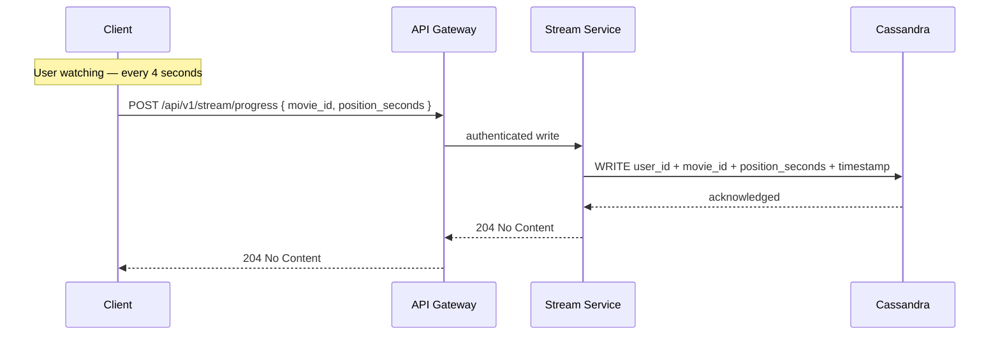
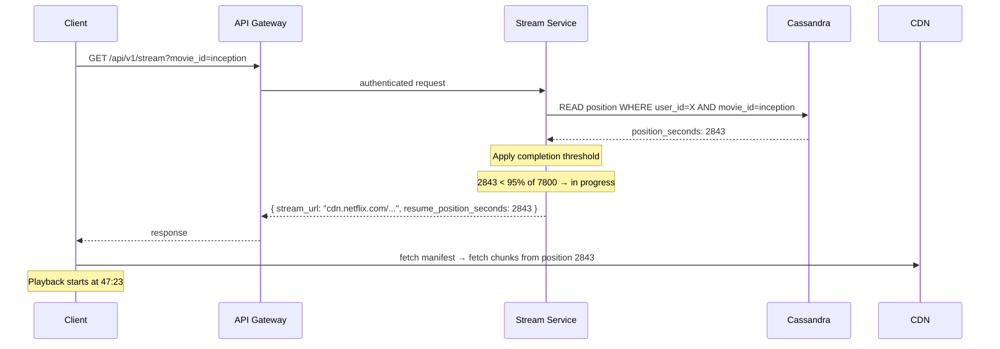
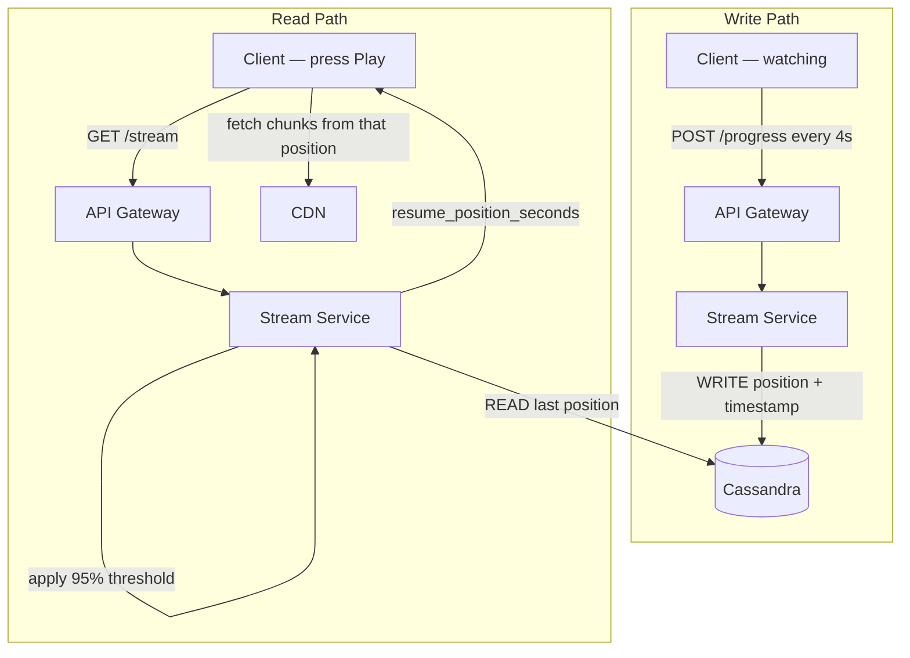

# Resume Playback — Flow Architecture

## The Two Paths

Resume playback has two distinct flows — the write path (continuous position saving during playback) and the read path (position lookup when a new stream starts). They are independent and hit different endpoints.

---

## Write Path — Saving Position During Playback

Every 4 seconds while a user is watching, the client fires a progress update. This goes through the API Gateway for auth and lands at the Stream Service, which writes directly to Cassandra.

The response is `204 No Content` — there is nothing meaningful to return. The client fires and forgets, continuing playback without waiting.

---

## Read Path — Resuming on Stream Start

When a user clicks Play, the Stream Service reads the last saved position from Cassandra, applies the completion threshold, and returns the position alongside the stream URL.

---

## How the Two Paths Fit Together

---

## Component Responsibilities

| Component | Role in Resume Playback |
|---|---|
| Client | Fires progress write every 4 seconds during playback |
| API Gateway | Auth on both read and write paths |
| Stream Service | Writes position to Cassandra, reads position on stream start, applies completion threshold |
| Cassandra | Stores raw position — last-write-wins by timestamp, no business logic |
| CDN | Serves video chunks from the resumed position — no knowledge of Cassandra |

The CDN has no involvement in resume logic. Once the client knows the position, it uses it to seek to the right chunk in the manifest and start fetching from there. Resume playback and chunk delivery are fully independent concerns.
