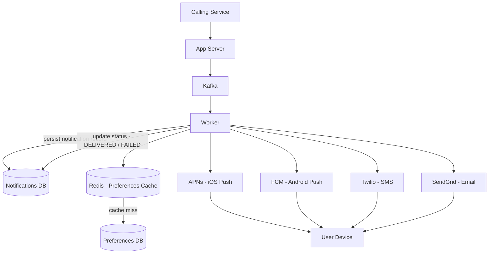

# Notification System Base Architecture

## The Naive First Attempt

The first instinct is straightforward:

```
Calling Service → App Server → DB
```

The calling service (say, Instagram's like service) hits your app server with a send request. The app server writes the notification to a DB. The notification service reads from the DB and sends it to the user.

This is actually a good start — **writing to DB before processing is the right instinct**. If the app server crashes mid-flight, you haven't lost the notification. The job is persisted and can be retried. This is the durability guarantee from the NFR: persist before you acknowledge the caller.

But there's a problem hiding in the next step.

---

## The Polling Problem

If the notification service is polling the DB for new rows — scanning for unprocessed notifications and then sending them — you've reintroduced the exact problem you were trying to avoid.

At peak we have **5M sends/sec**. If every send requires a DB read to discover the job, that's 5M DB reads/sec just to find work. DBs don't handle that. Connection pools saturate, query latency spikes, and the whole thing collapses under its own weight.

The fix is to stop polling entirely. Instead of the notification service pulling from DB, have the app server **push the job to a queue** the moment it's persisted.

---

## Introducing Kafka

```
Calling Service → App Server → DB (persist) + Kafka (enqueue) → Worker → User's Device
```

The app server publishes the job to Kafka. Kafka itself is durable — messages are replicated across brokers and persisted to disk, so a crash doesn't lose the job. The worker then writes to DB once it consumes the message, before attempting delivery.

Now the worker doesn't poll. Kafka pushes. The worker consumes messages as fast as they arrive, processes them, and sends to the external provider (APNs for iOS push, FCM for Android push, Twilio for SMS, SendGrid for email).

Once sent, the worker marks the notification status as `DELIVERED` (or `FAILED`) back in the DB.

---

## The Preference Check Problem

The worker needs to check user preferences before sending — if a user has opted out of SMS, you must not send SMS even if the calling service requested it. So the worker queries the preferences DB on every notification.

At 5M/sec, that's 5M preference DB reads/sec. Same problem as before — the DB dies.

The fix: **cache preferences in Redis**.

User preferences are read-heavy and write-rarely (users don't change notification settings every second). Redis serves them from memory in sub-millisecond latency. The worker checks Redis first; only on a cache miss does it fall back to the preferences DB and then re-populate the cache.

---

## The Full Base Architecture



**Step by step:**

1. Calling service sends `POST /notifications/send` to the App Server.
2. App Server publishes the job to Kafka (Kafka is durable — replicated, persisted to disk).
3. Worker consumes from Kafka.
4. Worker writes the notification record to DB (persist before processing — crash safety).
5. Worker checks Redis for user preferences (opted-out channels, notification type settings).
6. Worker filters channels based on preferences.
7. Worker dispatches to the appropriate external provider per channel.
8. External provider delivers to user's device.
9. Worker updates notification status in DB (`DELIVERED` or `FAILED`).

---

## What This Architecture Gets Right

- **Durability**: DB write happens before Kafka publish and before acknowledging the caller. A crash at any point after step 2 doesn't lose the job.
- **Scalability**: Kafka decouples ingestion from processing. The app server can accept at 5M/sec without being blocked by slow external providers.
- **Preference safety**: Redis cache keeps preference checks fast without hammering the preferences DB.
- **Separation of concerns**: The app server handles intake and persistence. The worker handles delivery logic. External providers handle actual transport.

---

## What This Architecture Doesn't Handle Yet

This is the base — it's intentionally naive. The deep dives will address:

- **Fan-out at scale**: one event triggering millions of notifications (celebrity post → 10M users)
- **Per-channel workers**: push, SMS, and email have wildly different throughput, cost, and latency characteristics — one unified worker is a bottleneck
- **Retry and DLQ**: what happens when APNs rejects a token or Twilio is down
- **Scheduling**: notifications with a `scheduled_at` in the future need a separate timer/scheduler component
- **Rate limiting**: SMS carriers cap sends per second — you need a throttle layer per channel
- **Deduplication**: at-least-once delivery means the worker may process the same Kafka message twice — idempotency keys prevent double sends

> [!info] Base Architecture in One Sentence
> Accept the job durably (DB), fan it out fast (Kafka), filter by preferences cheaply (Redis), and dispatch to the right external provider (APNs / FCM / Twilio / SendGrid).
