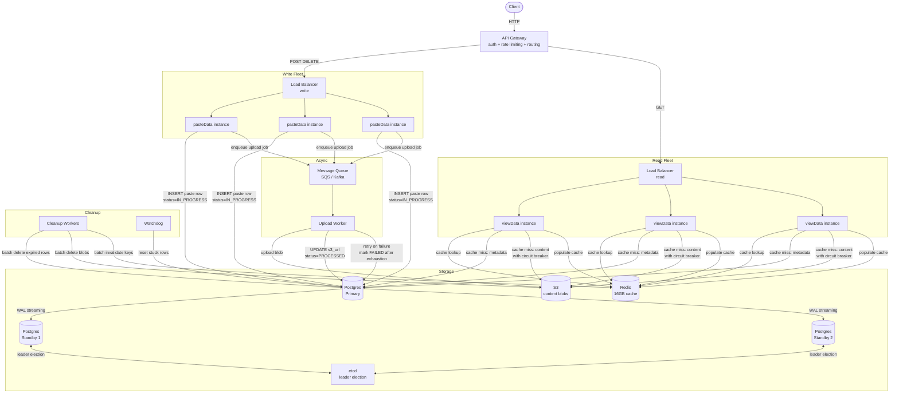

# Pastebin Architecture

> [!info] The updated architecture reflects all deep dive decisions. Every component added here was justified by a specific problem — not added speculatively.

---

## What changed from the base architecture

```
Base architecture:
  Client → LB → App Server → Postgres + S3

Updated architecture adds:
  API Gateway          — routes by request type, handles auth + rate limiting
  pasteData service    — owns all writes (POST, DELETE)
  viewData service     — owns all reads (GET)
  Separate LBs         — one per service fleet, fault isolation
  Redis                — cache layer in front of Postgres + S3 for reads
  Postgres standbys    — 2 synchronous replicas + etcd for failover
  Upload worker        — async S3 upload with message queue
  Expiry cleanup workers — batch delete expired pastes nightly
  Watchdog             — resets stuck DELETION_IN_PROGRESS rows
  Circuit breaker      — protects viewData from S3 outages
```

Each addition maps directly to a deep dive decision. Nothing was added speculatively.

---

## Full Architecture Diagram



---

## Write Flow — Create Paste

```
1. Client → POST /api/v1/pastes
2. API Gateway: validate JWT, rate limit, route to write LB
3. LB → pasteData instance
4. pasteData:
   a. Compute content_hash = SHA-256(content)
   b. Check Postgres: content_hash exists?
      → EXISTS:     increment ref_count
      → NOT EXISTS: INSERT content row (s3_url = NULL)
   c. Generate shortCode (Redis counter → Base62)
   d. INSERT paste row (status = IN_PROGRESS)
   e. Enqueue { shortCode, contentBytes } to message queue
   f. Return 201 Created + shortCode
5. Upload worker (async):
   a. Dequeue job
   b. Upload to S3
   c. UPDATE paste: s3_url = ..., status = PROCESSED
   d. On failure: retry with exponential backoff + jitter
   e. On exhaustion: UPDATE paste: status = FAILED
```

---

## Read Flow — View Paste

```
1. Client → GET /api/v1/pastes/:shortCode
2. API Gateway: route to read LB (no auth required)
3. LB → viewData instance
4. viewData:
   a. Redis lookup: key = shortCode
      → HIT:  return cached content → 200 OK
      → MISS: continue
   b. Postgres lookup: SELECT paste WHERE short_code = ?
      → status = IN_PROGRESS → 503 + Retry-After: 30
      → status = FAILED      → 404
      → expired or deleted   → 404
      → status = PROCESSED   → continue
   c. Fetch content from S3 (circuit breaker wraps this call)
      → circuit OPEN → 503 "content temporarily unavailable"
      → circuit CLOSED → fetch blob → populate Redis (TTL = expires_at - now())
   d. Return 200 OK + content
```

---

## Delete Flow — Remove Paste

```
1. Client → DELETE /api/v1/pastes/:shortCode
2. API Gateway: validate JWT, route to write LB
3. LB → pasteData instance
4. pasteData:
   a. Validate JWT → extract caller_user_id
   b. Lookup paste row
      → not found or already deleted → 204 (idempotent)
   c. Check paste.user_id == caller_user_id → else 403
   d. In one transaction:
      - Soft delete: set deleted_at = now()
      - Decrement content.ref_count
      - If ref_count = 0: delete content row, delete S3 blob
   e. Synchronous Redis DEL shortCode
      → on failure: retry with exponential backoff
   f. Return 204
```

---

## Expiry Cleanup Flow — Nightly Job

```
Runs nightly from midnight:

1. Multiple cleanup workers start
2. Each worker loop:
   a. Acquire Redis distributed lock
   b. SELECT expired rows WHERE expires_at < now() AND status = NOT_EXPIRED LIMIT 1000
   c. Mark batch: UPDATE status = DELETION_IN_PROGRESS, deletion_initiated_at = now()
   d. Release lock
   e. For each row: decrement ref_count
   f. Collect content_hashes where ref_count = 0
   g. S3 batch delete (up to 1000 objects per API call)
   h. DELETE from content table (ref_count = 0 rows)
   i. DELETE from pastes table (batch)
   j. Redis pipeline DEL (batch)
   k. Repeat until no NOT_EXPIRED rows remain

Watchdog (runs continuously):
  SELECT rows WHERE status = DELETION_IN_PROGRESS
  AND deletion_initiated_at < now() - 2 hours
  → UPDATE status = NOT_EXPIRED (reset for re-processing)
```

---

## Fault Isolation Summary

```
pasteData fleet down   → viewData unaffected, reads continue
viewData fleet down    → pasteData unaffected, writes continue
S3 outage              → circuit breaker opens, viewData returns 503
                          cache hits unaffected (never touch S3)
Postgres primary down  → etcd elects standby, failover in 10–30s
                          reads from Redis continue during window
Upload worker failure  → paste marked FAILED after retries, 404 on read
Cleanup worker crash   → watchdog resets stuck rows, next run picks them up
Redis down             → cache miss path: reads hit Postgres + S3 directly
                          higher latency but system still functional
```

---

> [!tip] Interview framing
> "Starting from a monolith, each deep dive added one component to solve one specific problem. Service split for fault isolation. Redis for read latency. Async upload queue for write latency and durability. Standby nodes + etcd for DB availability. Circuit breaker for S3 outage protection. Cleanup workers + watchdog for storage reclamation. Every component earns its place — nothing was added speculatively."
