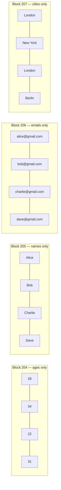
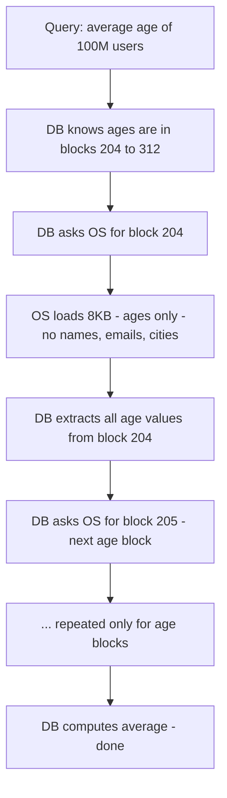
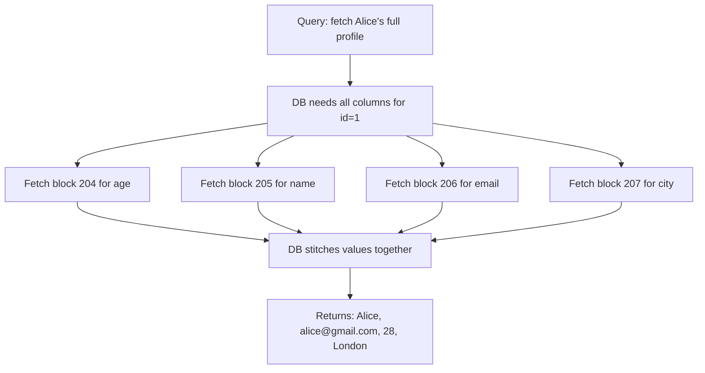
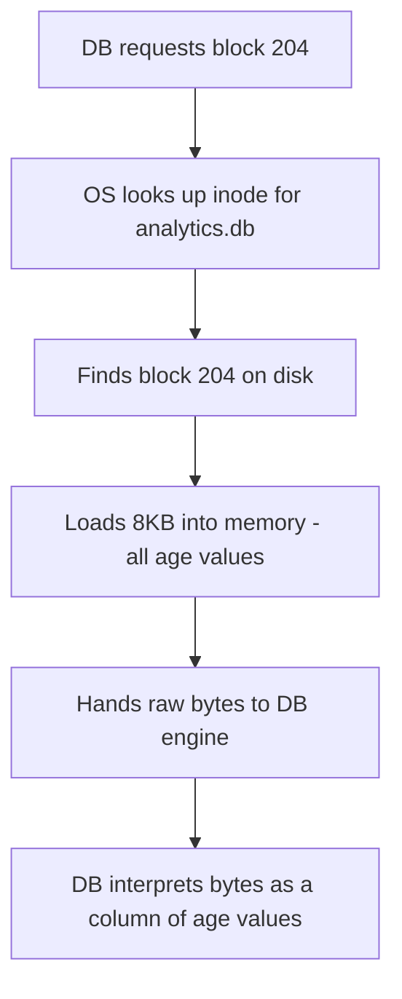
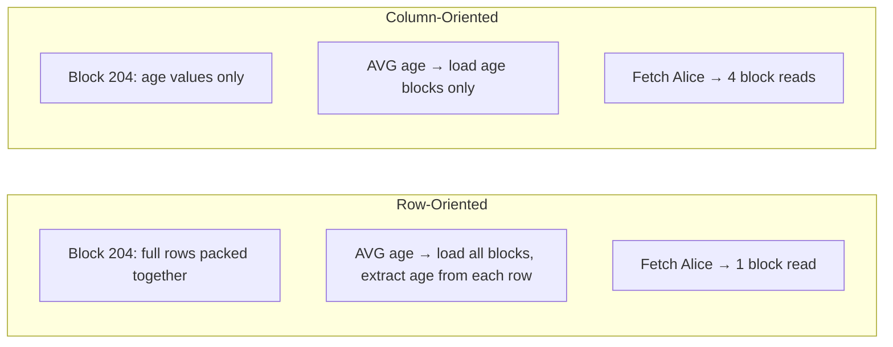

# Column-Oriented Storage

> [!info] Column-oriented storage — used by Redshift, BigQuery, Snowflake — packs one column's values together into each page instead of one row's values. This single layout decision is what makes aggregations across millions of rows fast and full record lookups expensive.

---

## How data is packed into pages

Instead of packing full rows together, the DB packs all values for a single column into each page:



Each block contains values from only one column, for many rows. The OS still sees 8KB of bytes — it has no idea a column boundary exists. The DB engine is the one that decided what to pack where.

---

## What happens when you run an aggregation

```sql
SELECT AVG(age) FROM users;
```



The DB only requests the age blocks. Names are on block 205. Emails on block 206. Cities on block 207. None of those blocks are ever touched. At 100 million users, this is the difference between reading 1GB of age data versus reading 10GB of mixed row data.

> [!important] The OS fetches exactly what the DB asks for. Because the DB only asks for age blocks, the OS only loads age blocks. The layout decision made at write time determines how much I/O you pay at read time.

---

## What happens when you fetch a full profile

```sql
SELECT * FROM users WHERE id = 1;
```



Alice's data is now spread across four different blocks. Four separate OS reads to reconstruct one record. In row-oriented storage this was one read. This is the cost of column-oriented layout for OLTP-style queries.

> [!danger] Column-oriented storage is not a production database replacement. Running transactional workloads — individual inserts, updates, single-record reads — against a columnar store is slow. It is built for analytics, not transactions.

---

## The OS perspective

The OS behaves identically in both cases. It fetches blocks on demand, hands raw bytes to the DB, and steps back:



The OS does not know it is fetching a column instead of rows. It just fetches bytes. All the intelligence — what went into block 204, why only block 204 was requested — lives entirely in the DB engine.

---

## Row vs Column — side by side



```
Workload                        Row-Oriented        Column-Oriented
─────────────────────────────────────────────────────────────────────
Fetch one full record           1 block read        N block reads (one per column)
AVG/SUM across all rows         All blocks loaded   Only target column blocks loaded
INSERT one row                  Append to one page  Must update N column pages
Best for                        OLTP, transactions  OLAP, analytics, dashboards
Examples                        PostgreSQL, MySQL    Redshift, BigQuery, Snowflake
```

> [!important] The layout is a write-time decision with read-time consequences. Pack rows together if your queries are about individual records. Pack columns together if your queries aggregate across millions of rows.
