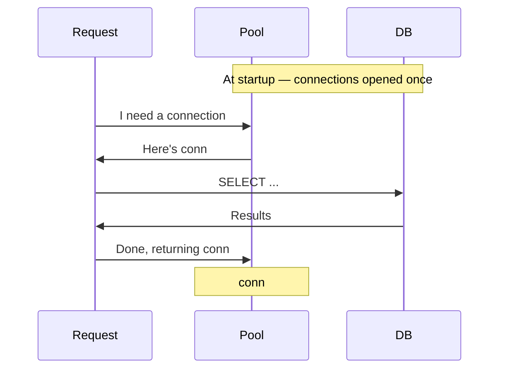

## The cost of a fresh connection

```
TCP handshake:    ~3ms   (3 round trips: SYN → SYN-ACK → ACK)
TLS handshake:    ~2ms   (agree on encryption algorithm + session key)
DB auth:          ~1ms   (username/password check, permissions lookup)
Memory (Postgres): ~8MB  (dedicated OS process per connection)
─────────────────────────────────────────────────────────────────
Total per connection: 6-10ms + 5-10MB RAM
```

> [!question] Why is opening a DB connection on every request a problem at scale?

> [!success]-
> Each connection requires TCP handshake (~3ms), TLS negotiation (~2ms), DB auth (~1ms), and Postgres allocates ~8MB RAM for a dedicated process. At 10,000 RPS, that's 80GB RAM just for connection overhead, plus constant context-switching between thousands of OS processes — the DB never gets to run actual queries.
>
> > [!tip] Interview framing
> > "Raw connections are expensive — TCP, TLS, auth, and Postgres spawns a full OS process per connection consuming ~8MB RAM. At 10k RPS that's 80GB RAM just for overhead. A connection pool opens a fixed set of connections at startup and reuses them — the setup cost is paid once, not per request."

---

> [!question] How do you decide how many connections to put in the pool?

> [!success]-
> Pool size ≈ DB CPU cores × 2. A DB with 4 cores can run 4 queries in parallel. Beyond ~8-10 connections, extra processes just context-switch against each other — throughput drops. The `×2` accounts for queries waiting on disk I/O, freeing up a core for another query.
>
> More connections is NOT always better. At 1,000 connections on a 4-core DB, the OS spends more time context-switching between 1,000 processes than actually running queries.
>
> > [!tip] Interview framing
> > "Pool size ≈ DB CPU cores × 2. Beyond that, extra connections add context-switching overhead without adding throughput — you have 4 cores regardless of how many processes are waiting."

---

## Too small vs too large

```
Too small → requests queue → response times spike → timeouts → user errors
Too large → context-switching overhead → DB throughput drops → same result
Sweet spot → CPU cores × 2 per app server
```

---

## Tools

```
PgBouncer   → Postgres, infrastructure-level proxy pooler
HikariCP    → Java apps, library-level pooler
RDS Proxy   → AWS managed, sits in front of RDS/Aurora
```

---

## When to mention in interviews

- "How do you handle 10,000 concurrent users hitting the DB?"
- Any time DB becomes a bottleneck under high concurrency
- Alongside: read replicas (offload reads), caching (avoid DB entirely for hot data)

---

## Quick flow


