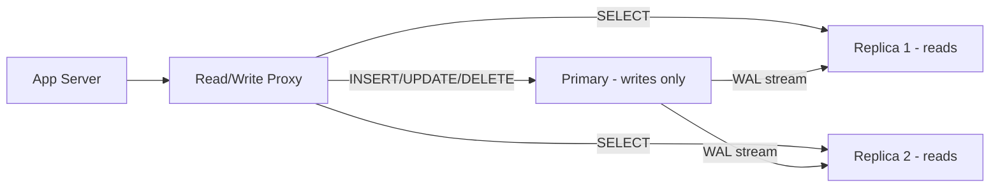

## The pattern

```
All writes → Primary node
All reads  → Replica nodes
Primary replicates to replicas via WAL streaming (async, continuous)
```

---

## Why

```
Reads : Writes = 100 : 1 in most systems
→ reads and writes compete for connections, locks, CPU on a single node
→ separate them → each scales independently
→ add replicas → read throughput scales linearly
```

---

> [!question] How do replicas stay in sync with the primary?

> [!success]-
> WAL streaming. Every write to the primary is first recorded in the Write-Ahead Log. Replicas open a persistent streaming connection to the primary and receive WAL entries continuously as they're written — not via polling. Each replica applies the entries locally in order. The delay between write on primary and apply on replica is replication lag — typically 10-100ms.
>
> > [!tip] Interview framing
> > "Replicas tail the primary's WAL via a persistent streaming connection. Changes flow continuously as they happen — not polled. The delay between primary write and replica apply is replication lag, typically 10-100ms."

---

> [!question] A user posts a tweet and immediately refreshes their feed — the tweet is missing. What happened and how do you fix it?

> [!success]-
> Replication lag. The write hit the primary but the replica serving the read hasn't caught up yet. This is a read-your-own-writes violation.
>
> Fix: after a user writes something, route their reads to the primary for a short window (30-60 seconds). By then replication has caught up and they go back to replicas. Only that user's reads are affected — everyone else continues reading from replicas.
>
> > [!tip] Interview framing
> > "Reads go to replicas by default — eventually consistent due to lag. After a write, I route that specific user's reads to the primary for 60 seconds to guarantee they see their own write. After the window, back to replicas."

---

## Quick flow



---

## Decision map

```
Read-heavy system (social feed, catalog, dashboard) → add read replicas
Write-heavy system (event logging, IoT)             → replicas help less, consider Cassandra
Need strong read consistency                        → route reads to primary (costly)
User needs to see their own writes                  → primary for 60s after write
```

---

## Tools

```
ProxySQL        → MySQL read/write splitting proxy
PgBouncer       → Postgres connection pooler, can be configured for splitting
AWS RDS Proxy   → managed, handles routing automatically
Aurora          → built-in read replicas with automatic routing
```
