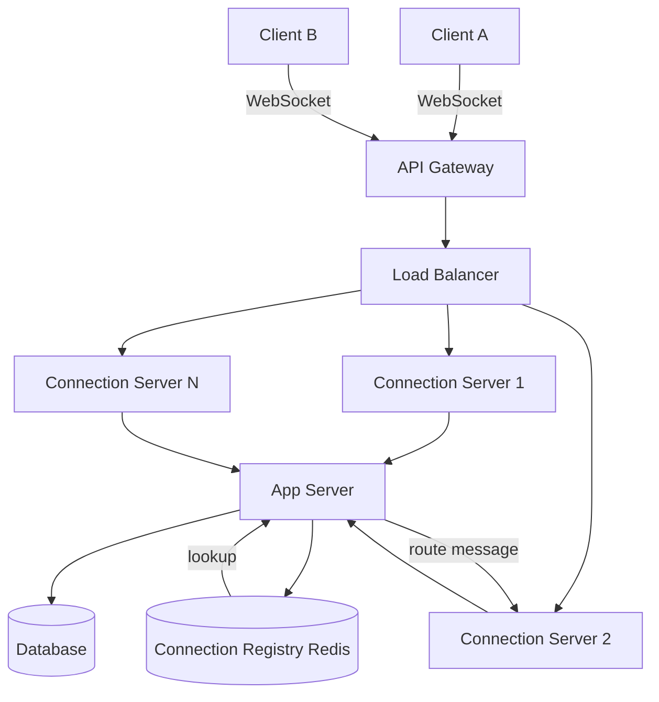

# WhatsApp Base Architecture

> [!info] The simplest system that works end to end
> Base architecture is not the final design. It is the minimum set of components needed to handle the three core flows: send a message, receive a message, load chat history. Every deep dive later will improve on one part of this. The goal here is to get something working correctly before optimising anything.

---

## Components

```
Clients
  ↕ WebSocket (persistent, full-duplex)
API Gateway
  ↕
Load Balancer
  ↕
Connection Servers  (fleet of WebSocket servers)
  ↕
App Servers         (business logic — store message, route delivery)
  ↕
Database            (message storage, persistent)
  ↕
Connection Registry (Redis — maps user_id → connection server)
```

---

## Component responsibilities

**API Gateway**
Sits at the edge. Handles authentication and rate limiting before a WebSocket connection is established. Validates the user's token on the HTTP upgrade request. Once the connection upgrades to WebSocket, the API GW is no longer in the hot path — it cannot inspect raw WebSocket frames the same way it inspects HTTP requests.

For REST calls (chat history, inbox), the API GW is in every request as normal.

**Load Balancer**
Distributes incoming WebSocket connections across the connection server fleet. Uses sticky sessions — once a client is assigned to a connection server, all frames from that client go to the same server for the lifetime of the connection.

**Connection Servers**
Hold open WebSocket connections — one per online user. Their only job is connection management: receive frames from clients, forward to app servers for processing, push outgoing frames to clients. Stateless in terms of business logic — they don't store messages or make routing decisions beyond looking up the registry.

At 20M concurrent users, 100k connections per server:
```
Servers needed = 20M / 100k = 200 connection servers
```

**App Servers**
Handle business logic: validate the message, write to the database, look up the recipient's connection server in the registry, forward the message for delivery. Stateless — can be scaled horizontally without coordination.

**Database**
Persistent message storage. Every message is written here before delivery is attempted. This is the durability guarantee — if a message is in the DB, it will eventually be delivered even if the recipient is temporarily offline.

**Connection Registry (Redis)**
A key-value store mapping every online user to the connection server they're currently on:
```
user_alice_001 → ws-server-3
user_bob_002   → ws-server-7
```

At 50 bytes per entry × 20M concurrent users = **~1 GB** — fits comfortably in a single Redis instance. Lookups are O(1). Every message delivery does exactly one lookup here.

---

## The three flows at a glance

```
Flow 1 — Send & Receive:
  Alice → ws-server-3 → App Server → DB (write)
                                   → Redis (lookup Bob → ws-server-7)
                                   → ws-server-7 → Bob

Flow 2 — Chat History:
  Client → API GW → LB → App Server → DB (read, paginated)
                                     → response to client

Flow 3 — Inbox:
  Client → API GW → LB → App Server → DB (read recent conversations)
                                     → response to client
```

Each flow is covered in detail in the files that follow.

---

## Architecture diagram


