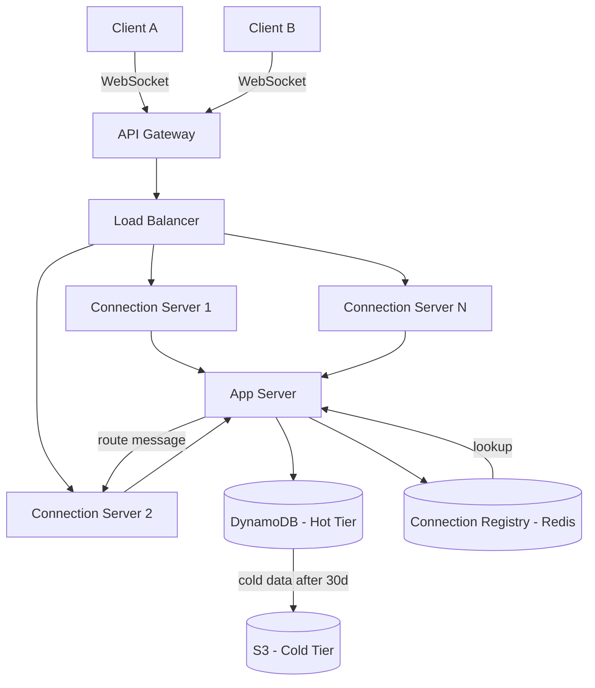

> [!info] Architecture after DB deep dive
> DB choice, schema, tiered storage, and sharding all change or add to the base architecture.

---

## What changed from base architecture

The base architecture had a generic "Database" box. After the DB deep dive, that box becomes concrete.

---

## Changes

**1. Database — DynamoDB (Cassandra-compatible)**

The base had an unnamed database. We now know it is DynamoDB (or Cassandra at self-hosted scale):
- Write-heavy workload → LSM tree is the right engine
- Messages are immutable → append-only fits perfectly
- No complex joins needed → wide-column is sufficient
- Auto-sharding at scale → no manual shard management

**2. Schema — messages table**

```
messages table:
  PK = conversation_id
  SK = seq_number (per-conversation sequence, monotonically increasing)
  Attributes: message_id, sender_id, content, timestamp, type
```

The base architecture stored "messages." Now we know the exact key structure that enables efficient chat history pagination.

**3. Tiered Storage — S3 for cold messages**

Messages older than 30 days move from DynamoDB to S3. The base had a single DB layer. Now there are two:

```
Hot tier:   DynamoDB  → messages < 30 days → fast reads, expensive
Cold tier:  S3        → messages > 30 days → slow reads, cheap
```

App server checks DynamoDB first. On miss, falls back to S3.

**4. Sharding — conversation_id as partition key**

The base had no sharding strategy. DynamoDB partitions automatically by `conversation_id` (PK). This distributes load across nodes — no single node owns all of Alice's messages. Hot partitions are handled by DynamoDB's adaptive capacity.

---

## Updated architecture diagram


